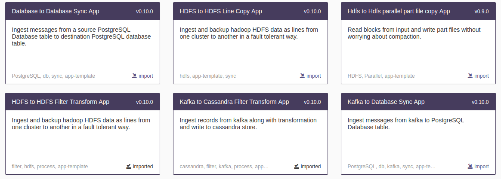
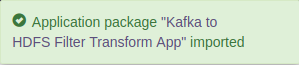
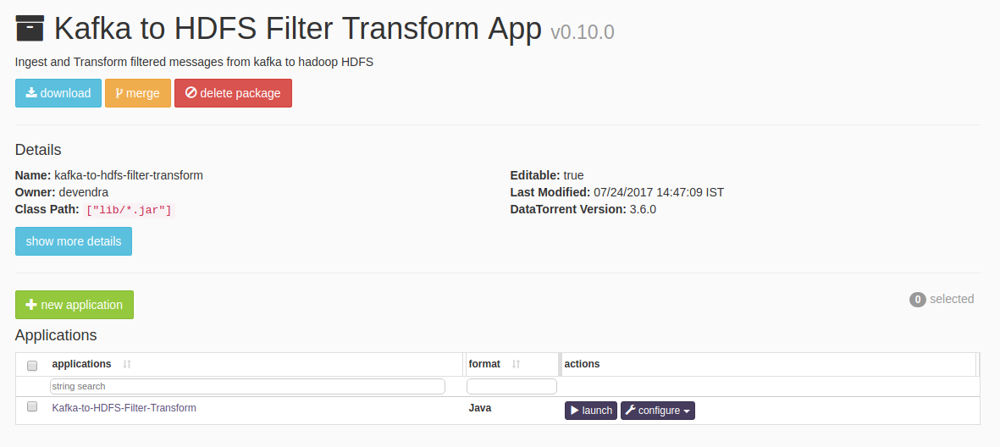
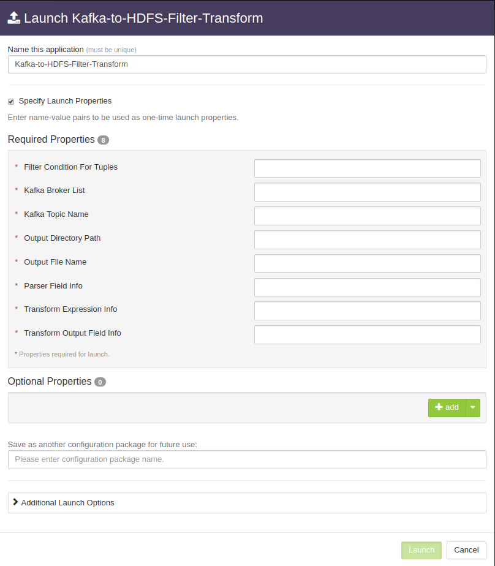
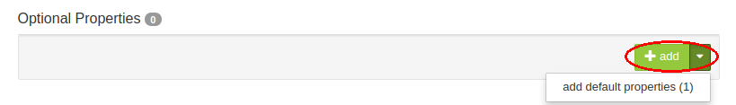
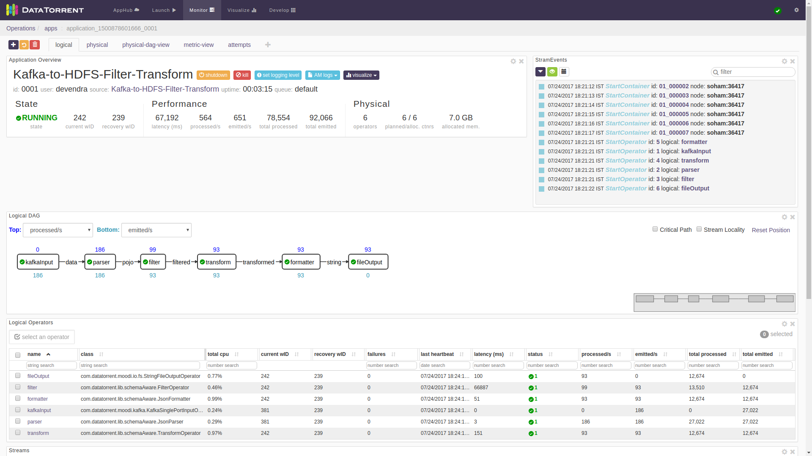
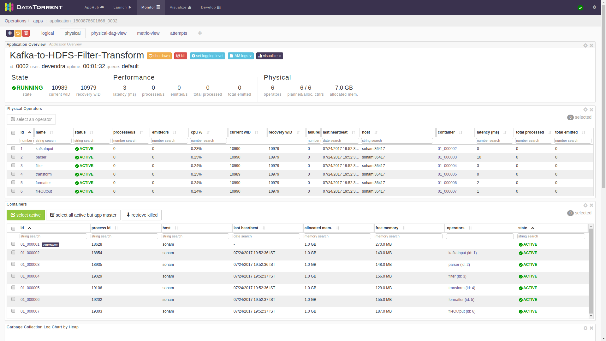
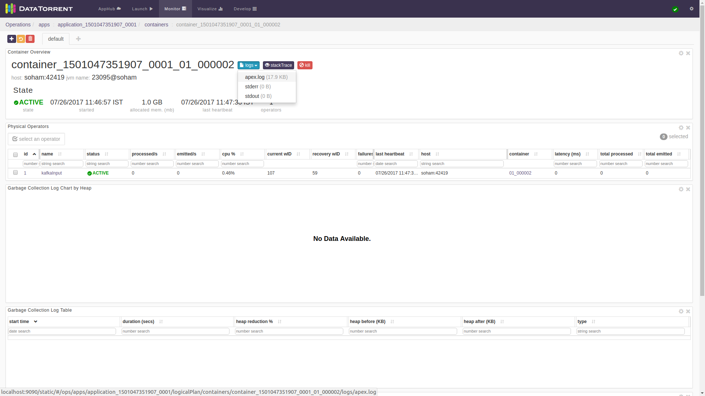

# How to import and launch an app-template

This document has step-by-step guide on how to import and launch app-template.

## <a name="steps_to_launch">Steps to launch application</a>

1. Click on the AppFactory tab from the top navigation bar.
   

1. Page listing the verticals for different use-cases is displayed. Navigating to the desired vertical shows available suites of applications for that vertical.

1. Navigating to the desired suite shows available applications in the suite.

   

   Click on `import` link for the desired application.

1. Notification is displayed on the top right corner after application package is successfully
   imported.
   

1. Click on the link in the notification which navigates to the page for this application package.
   
   Detailed information about the application package like version, last modified time, and short description is available on this page. Applications in this application package will be displayed in the table. Click on the `launch` button for the desired application.

1. Launch dialogue for the application is displayed.  
    Fill in the required properties for the application. For more details, please refer to properties section in the documentation for the respective app.

1. Advanced properties for the application have preset default values. Thus, changing these values is optional. But, if required you can change these properties for fine tuning the application.  
   Under optional properties section, click on down arrow button and then click on `add default properties`.

1. Click on the `Launch` button on lower right corner of the dialog to launch the application.
A notification is displayed on the top right corner after application is launched successfully and includes the Application ID which can be used to monitor this instance and find its logs.
   

1. Click on the `Monitor` tab from the top navigation bar.
   

1. A page listing all running applications is displayed. Search for current application based on name or application id or any other relevant field. Click on the application name or id to navigate to application instance details page.
   

1. Application instance details page shows key metrics for monitoring the application status.
   `logical` tab shows application DAG, Stram events, operator status based on logical operators, stream status, and a chart with key metrics.
   

1. `physical` tab shows the status of physical instances of the operator, containers etc.
   

1. To look at the details of specific container and to monitor logs, stout, stderr etc. container details page can be reached from the container link in the physical tab.
      
