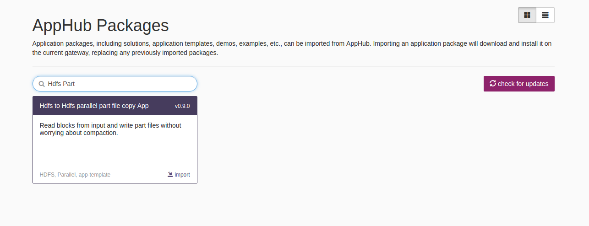
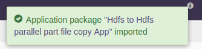
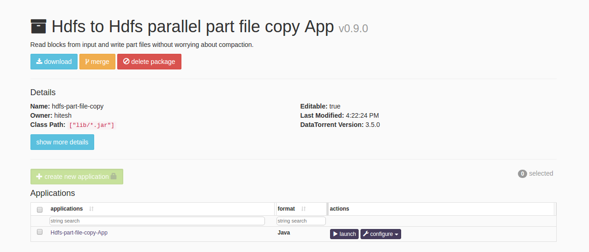
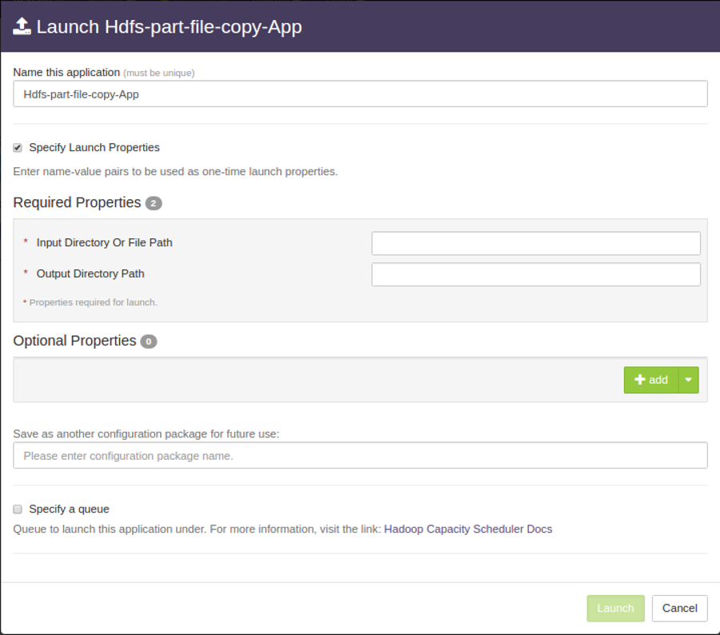
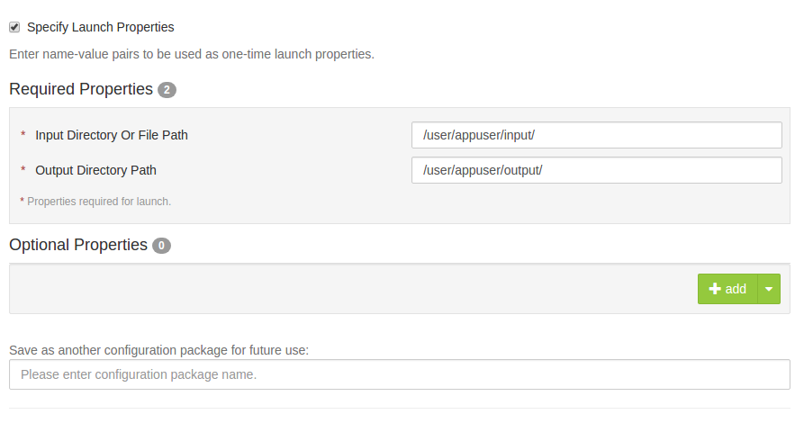
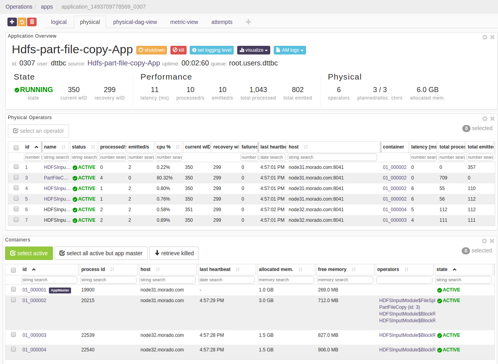

# HDFS to HDFS Part File Copy Application

## Summary
Continuously ingest files as blocks from one cluster to another for backup or further processing without worrying about the compaction.
Suppose, the size of input file (f1.txt) is 10 MB and the block size is 1 MB then this application will split the file into 10 blocks and it copies the file in destination as f1.txt.part1, f1.txt.part2, ..., f1.txt.part10.
The source code is available at: [https://github.com/DataTorrent/app-templates/tree/master/hdfs-part-file-copy.](https://github.com/DataTorrent/app-templates/tree/master/hdfs-part-file-copy)

## <a name="steps_to_launch">Steps to launch application</a>

1. Click on the AppHub tab from the top navigation bar.
   

1. Page listing the applications available on AppHub is displayed.
Search for Hdfs Part to see all applications related to Part.
   
   Click on `import` button for `Hdfs to Hdfs parallel part file copy App`.

1. Notification is displayed on the top right corner after application package is successfully
   imported.
   

1. Click on the link in the notification which navigates to the page for this application package.
   
   Detailed information about the application package like version, last modified time, and short description is available on this page. Click on `launch` button for `hdfs-part-file-copy` application.

1. <a name="launch-dialogue"></a>`Launch hdfs-part-file-copy-App` dialogue is displayed. One can configure name of this instance of the application from this dialogue.
   

1. Specify the mandatory properties under `Specify Launch Properties`
   
   <a name="property-editor"></a>
   For example, suppose we wish to continuously ingest files from `/user/appuser/input/` 
      and write them to `/user/appuser/output/` on HDFS as blocks. Properties should be set as follows:

    |name|value|
    |---|---|
    |Input Directory Or File Path|/user/appuser/input/|
    |Output Directory Path|/user/appuser/output/|

    Details about configuration options are available in [Configuration options](#configuration_options) section.

1. Click on the `Launch` button on lower right corner of the dialog to launch the application.
A notification is displayed on the top right corner after application is launched successfully and includes the Application ID which can be used to monitor this instance and find its logs.
   

1. Click on the `Monitor` tab from the top navigation bar.
   

1. A page listing all running applications is displayed. Search for current application based on name or application id or any other relevant field. Click on the application name or id to navigate to application instance details page.
   

1. Application instance details page shows key metrics for monitoring the application status.
   `logical` tab shows application DAG, Stram events, operator status based on logical operators, stream status, and a chart with key metrics.
   

1. Click on the `physical` tab to look at the status of physical instances of the operator, containers etc.
   

## <a name="configuration_options">Configuration options</a>

### Mandatory properties
End user must specify the values for these properties.

|Property|Description|Type|Example|
|---|---|---|-----|
|Input Directory Or File Path|Indicates the input path of directories or files in comma separated list. E.g: hdfs://source-namenode-service/user/dtuser/path-to-input-directory|String|/user/appuser/input/|
|Output Directory Path|Indicates the path of output director.|String|/user/appuser/output/|

## Steps to customize the application

1. Make sure you have following utilities installed on your machine and available on `PATH` in environment variables
    - [Java](https://www.java.com/en/download/manual.jsp) : 1.7.x
    - [maven](http://maven.apache.org/download.cgi) : 3.0 +
    - [git](https://git-scm.com/book/en/v2/Getting-Started-Installing-Git) : 1.7 +
    - [Hadoop]( http://www.michael-noll.com/tutorials/running-hadoop-on-ubuntu-linux-single-node-cluster/) (Apache-2.2)+

1.  Use following command to clone the examples repository:

     ```
     git clone git@github.com:DataTorrent/app-templates.git
     ```

1. Change directory to 'examples/tutorials/hdfs-part-file-copy':

    ```
    cd examples/tutorials/hdfs-part-file-copy
    ```

1. Import this maven project in your favorite IDE (e.g. eclipse).

1. Change the source code as per your requirements. Some tips are given as commented blocks in the `Application.java` for this project

1. Make respective changes in the test case and `properties.xml` based on your environment.

1. Compile this project using maven:

    ```
    mvn clean package
    ```

    This will generate the application package with `.apa` extension in the `target` directory.

1. Go to DataTorrent UI Management console on web browser. Click on the `Develop` tab from the top navigation bar.
   

1. Click on `upload package` button and upload the generated `.apa` file.
   

1. Application package page is shown with the listing of all packages.
Click on the `Launch` button for the uploaded application package.    
Follow the [steps](#launch-dialogue) for launching an application.


Please send feedback or feature requests to: [feedback@datatorrent.com](mailto:feedback@datatorrent.com)
