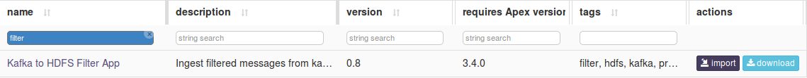
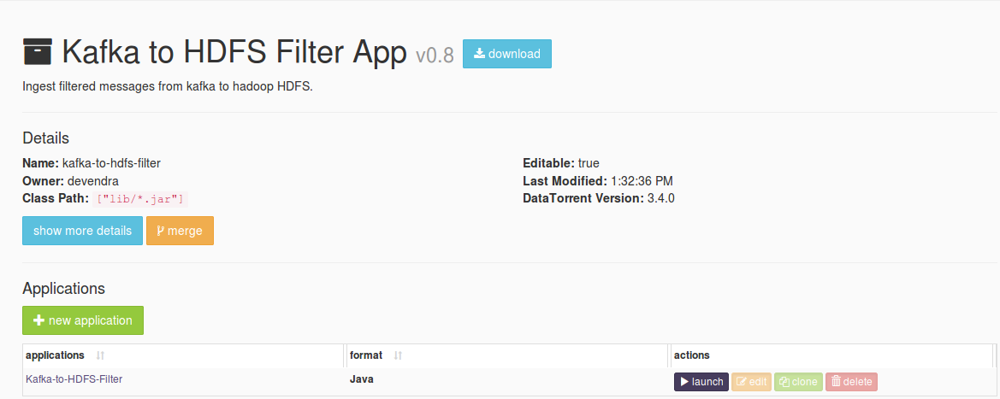
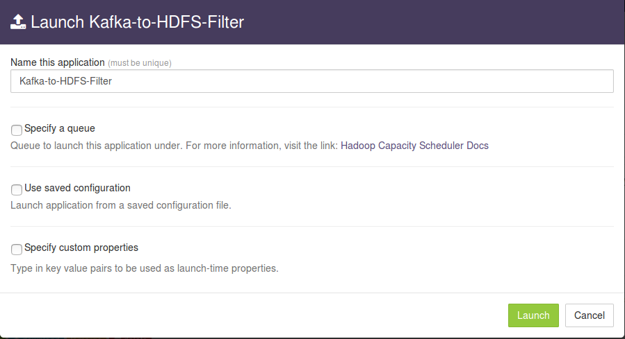
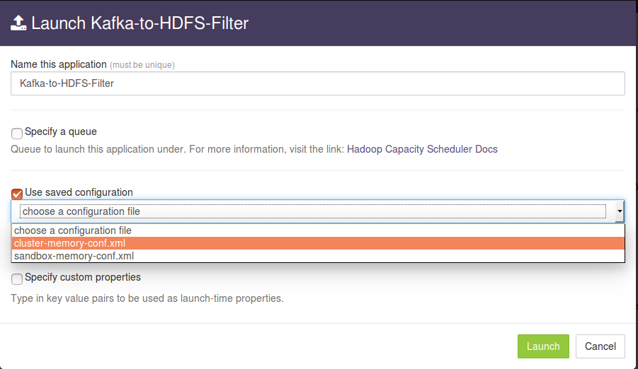
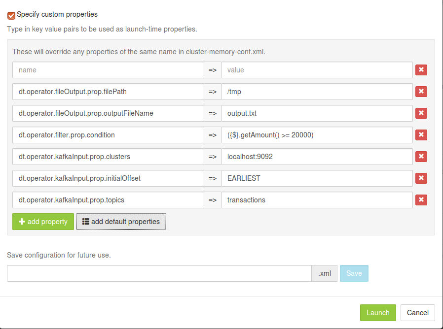
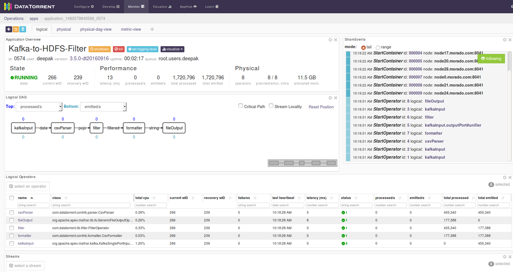

# Kafka to HDFS Filter Application

## Summary
Ingest filtered messages from kafka to hadoop HDFS for continuous ingestion to hadoop.
The source code is available at: [https://github.com/DataTorrent/app-templates/tree/master/kafka-to-hdfs-sync.](https://github.com/DataTorrent/app-templates/tree/master/kafka-to-hdfs-filter)

Please send feedback or feature requests to: [feedback@datatorrent.com](mailto:feedback@datatorrent.com)

This document has a step-by-step guide to configure, customize, and launch this application.

## <a name="steps_to_launch">Steps to launch application</a>

1. Click on the AppHub tab from the top navigation bar.
   

1. Page listing the applications available on AppHub is displayed.
Search for Kafka to see all applications related to Kafka.
   
   Click on import button for `Kafka to HDFS Filter App`.

1. Notification is displayed on the top right corner after application package is successfully
   imported.
   

1. Click on the link in the notification which navigates to the page for this application package.
   
   Detailed information about the application package like version, last modified time, and short description is available on this page. Click on launch button for `Kafka-to-HDFS-Filter` application.

1. <a name="launch-dialogue"></a>`Launch Kafka-to-HDFS-Filter` dialogue is displayed. One can configure name of this instance of the application from this dialogue.
   

1. Select `Use saved configuration` option. This displays list of pre-saved configurations.
Please select `sandbox-memory-conf.xml` or `cluster-memory-conf.xml` depending on whether
your environment is the DataTorrent sandbox, or other cluster.
   

1. Select `Specify custom properties` option. Click on `add default properties` button.
   

1. This expands a key-value editor pre-populated with mandatory properties for this application. Change values as needed.
   
   <a name="property-editor"></a>
   For example, suppose we wish to process all messages seperated by '|' from topic `transactions` at the kafka server running on `kafka-source.node.com` with port `9092`, filters the messages based on the filter criteria `({$}.getAmount() >= 20000)` and write them to `output.txt` under `/user/appuser/output` on HDFS.
   Properties should be set as follows:

    |name|value|
    |---|---|
    |dt.operator.fileOutput.prop.filePath|/user/appuser/output|
    |dt.operator.fileOutput.prop.outputFileName|output.txt|
    |dt.operator.filter.prop.condition|Filter condition|({$}.getAmount() >= 20000)|
    |dt.operator.kafkaInput.prop.clusters|kafka-source.node.com:9092|
    |dt.operator.kafkaInput.prop.initialOffset|EARLIEST|
    |dt.operator.kafkaInput.prop.topics|transactions|

    Details about configuration options are available in [Configuration options](#configuration_options) section.

1. Click on the `Launch` button on lower right corner of the dialog to launch the application.
A notification is displayed on the top right corner after application is launched successfully and includes the Application ID which can be used to monitor this instance and find its logs.
   

1. Click on the `Monitor` tab from the top navigation bar.
   

1. A page listing all running applications is displayed. Search for current application based on name or application id or any other relevant field. Click on the application name or id to navigate to application instance details page.
   

1. Application instance details page shows key metrics for monitoring the application status.
   `logical` tab shows application DAG, Stram events, operator status based on logical operators, stream status, and a chart with key metrics.
   

1. Click on the `physical` tab to look at the status of physical instances of the operator, containers etc.
   

## <a name="configuration_options">Configuration options</a>

### Prerequistes
Kafka configured with version 0.9.

### Mandatory properties
End user must specify the values for these properties.

|Property|Description|Type|Example|
|---|---|---|-----|
|dt.operator.fileOutput.prop.filePath|Output path for HDFS|String|/user/appuser/output|
|dt.operator.fileOutput.prop.outputFileName|Output file name |String|output.txt|
|dt.operator.filter.prop.condition|Filter condition|Condition|({$}.getAmount() >= 20000)|
|dt.operator.kafkaInput.prop.clusters|Comma separated list of kafka-brokers |String|node1.company.com:9098, node2.company.com:9098, node3.company.com:9098|
|dt.operator.kafkaInput.prop.initialOffset|Initial offset to read from Kafka |String|<ul><li>EARLIEST</li><li>LATEST</li><li>APPLICATION_OR_EARLIEST</li><li>APPLICATION_OR_LATEST</li></ul>|
|dt.operator.kafkaInput.prop.topics|Topics to read from Kafka |String|event_data|


### Advanced properties
There are pre-saved configurations based on the application environment. Recommended settings for [datatorrent sandbox edition](https://www.datatorrent.com/download/datatorrent-rts-sandbox-edition-download/) are in `sandbox-memory-conf.xml` and for a cluster environment in `cluster-memory-conf.xml`.
The messages or records emitted are specified by the value of the `TUPLE_CLASS` attribute in the configuration file namely `PojoEvent` in this case.

|Property|Description|Type|Default for<br/> cluster-<br/>memory<br/>- conf.xml|Default for<br/> sandbox-<br/>memory<br/> -conf.xml|
|---|---|---|---|---|
|dt.operator.fileOutput.prop.maxLength|Maximum length for output file after which file is rotated|long|Long.MAX_VALUE|Long.MAX_VALUE|
|dt.operator.csvParser.prop.schema|Schema for CSV Parser|Schema|{"separator": "&#124;",<br/>"quoteChar": "\"",<br/>"lineDelimiter": "", "fields": [<br/>{<br/>"name": "accountNumber", <br/>"type": "Integer"<br/>},<br/> {<br/>"name": "name",<br/>"type": "String"<br/>},<br/>{<br/>"name": "amount",<br/>"type": "Integer"<br/>}<br/>]}|{"separator": "&#124;",<br/>"quoteChar": "\"",<br/>"lineDelimiter": "", "fields": [<br/>{<br/>"name": "accountNumber", <br/>"type": "Integer"<br/>},<br/> {<br/>"name": "name",<br/>"type": "String"<br/>},<br/>{<br/>"name": "amount",<br/>"type": "Integer"<br/>}<br/>]}|
|dt.operator.formatter.prop.schema|Schema for CSV formatter|Schema|{"separator": "&#124;",<br/>"quoteChar": "\"",<br/>"lineDelimiter": "", "fields": [<br/>{<br/>"name": "accountNumber", <br/>"type": "Integer"<br/>},<br/> {<br/>"name": "name",<br/>"type": "String"<br/>},<br/>{<br/>"name": "amount",<br/>"type": "Integer"<br/>}<br/>]}|{"separator": "&#124;",<br/>"quoteChar": "\"",<br/>"lineDelimiter": "", "fields": [<br/>{<br/>"name": "accountNumber", <br/>"type": "Integer"<br/>},<br/> {<br/>"name": "name",<br/>"type": "String"<br/>},<br/>{<br/>"name": "amount",<br/>"type": "Integer"<br/>}<br/>]}|
|dt.operator.formatter. port.in.attr.TUPLE_CLASS|Fully qualified class name for the tuple class POJO(Plain old java objects) input to CSV formatter|POJO|com.datatorrent.apps.PojoEvent|com.datatorrent.apps.PojoEvent|
|dt.operator.filter.port.input.attr.TUPLE_CLASS|Fully qualified class name for the tuple class POJO(Plain old java objects) input to Filter|POJO|com.datatorrent.apps.PojoEvent|com.datatorrent.apps.PojoEvent|

You can override default values for advanced properties by specifying custom values for these properties in the step [specify custom property](#property-editor) step mentioned in [steps](#steps_to_launch) to launch an application.

## Steps to customize the application

1. Make sure you have following utilities installed on your machine and available on `PATH` in environment variables
    - [Java](https://www.java.com/en/download/manual.jsp) : 1.7.x
    - [maven](http://maven.apache.org/download.cgi) : 3.0 +
    - [git](https://git-scm.com/book/en/v2/Getting-Started-Installing-Git) : 1.7 +
    - [Hadoop]( http://www.michael-noll.com/tutorials/running-hadoop-on-ubuntu-linux-single-node-cluster/) (Apache-2.2)+

1.  Use following command to clone the examples repository:

     ```
     git clone git@github.com:DataTorrent/app-templates.git
     ```

1. Change directory to 'examples/tutorials/kafka-to-hdfs-filter':

    ```
    cd examples/tutorials/kafka-to-hdfs-filter
    ```

1. Import this maven project in your favorite IDE (e.g. eclipse).

1. Change the source code as per your requirements. Some tips are given as commented blocks in the Application.java for this project

1. Make respective changes in the test case and `properties.xml` based on your environment.

1. Compile this project using maven:

    ```
    mvn clean package
    ```

    This will generate the application package with `.apa` extension in the `target` directory.

1. Go to DataTorrent UI Management console on web browser. Click on the `Develop` tab from the top navigation bar.
   

1. Click on `upload package` button and upload the generated `.apa` file.
   

1. Application package page is shown with the listing of all packages.
Click on the `Launch` button for the uploaded application package.    
Follow the [steps](#launch-dialogue) for launching an application.
