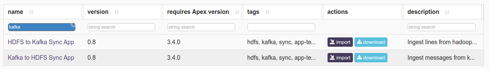
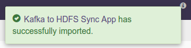
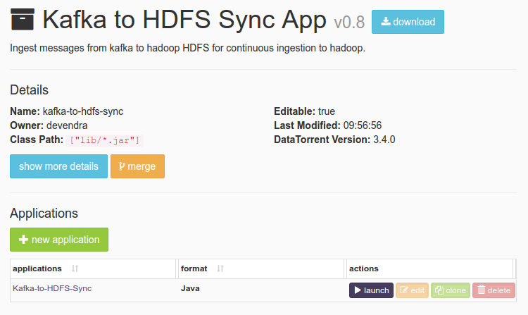
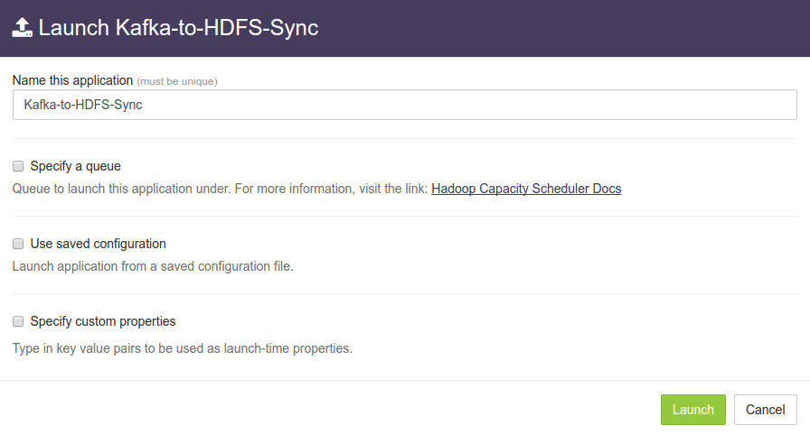
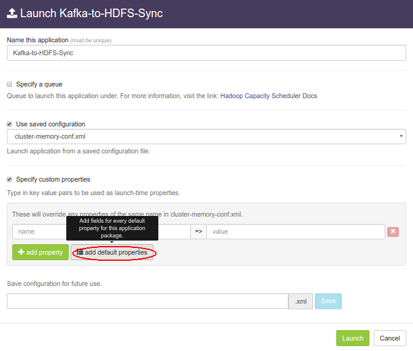
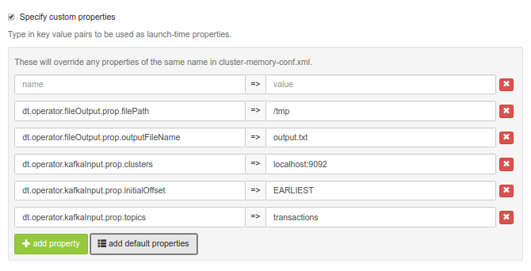
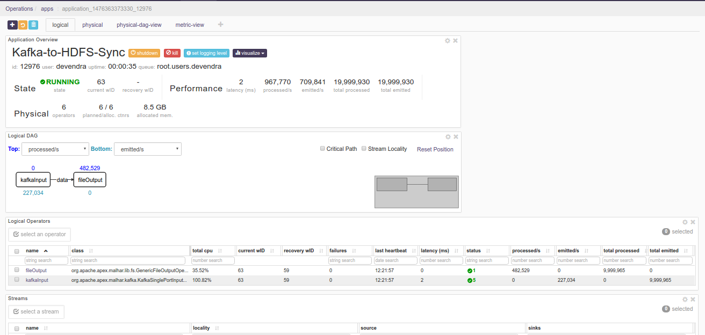

# Kafka to HDFS Sync Application

## Summary

Ingest messages from kafka to hadoop HDFS for continuous ingestion to hadoop. The source code is available at: [https://github.com/DataTorrent/app-templates/tree/master/kafka-to-hdfs-sync.](https://github.com/DataTorrent/app-templates/tree/master/kafka-to-hdfs-sync)

Send feedback or feature requests to: [feedback@datatorrent.com](mailto:feedback@datatorrent.com)

This document illustrates step by step guide to launch, configure, customize
this application.

## <a name="steps_to_launch">Steps to launch application</a>

1. Click on the AppHub tab from the top navigation bar.
   

1. Page listing the applications available on AppHub is displayed.
Search for Kafka to see all applications related to Kafka.
   
   Click on import button for "Kafka to HDFS Sync App"

1. Notification is displayed on the top right corner after application package is successfully
   

1. Click on the link in the notification which navigates to the page for this application package.
   
   Detailed information about the application package like version, last modified time, short description is available on this page. Click on launch button for "Kafka-to-HDFS-Sync" application.

1. <a name="launch-dialogue"></a>"Launch Kafka-to-HDFS-Sync" dialogue is displayed. One can configure name of the instance of the application after from this launch dialogue.
   

1. Select "Use saved configuration" option. This displays list of pre-saved configurations. If the application is being run in datatorrent sandbox edition, please select sandbox-memory-conf.xml. If the application is being run in cluster environment, please select cluster-memory-conf.xml.
   

1. Select “Specify custom properties” option. Click on “add default properties” button.
   

1. This expands key-value editor with mandatory properties for this application. Change the values for these properties based on your need.
   
   <a name="property-editor"></a>
   For example,  If one wishes to process all messages from topic `transactions` from kafka server running on localhost port 9092
   and write them to `output.txt` under `/user/appuser/output` on HDFS:

    |name|value|
    |---|---|
    |dt.operator.fileOutput. prop.filePath|/user/appuser/output|
    |dt.operator.fileOutput.prop.outputFileName|output.txt|
    |dt.operator.kafkaInput.prop.clusters|localhost:9092|
    |dt.operator.kafkaInput.prop.initialOffset|EARLIEST|
    |dt.operator.kafkaInput.prop.topics|transactions|

    Details about configuration options are available in [Configuration options](#configuration_options) section.

1. Click on ‘Launch’ button on bottom right corner to launch the application.
Notification is displayed on the top right corner after application is launched successfully. It also specifies Application ID which can be used to monitor the application and finding application logs.
   

1. Click on the “Monitor” tab from the top navigation bar.
   

1. Page with listing of all running applications is displayed. Search for launched application based on name or application id or any other relevant field. Click on the application name or id to navigate to application instance details page.
   

1. Application instance details page shows key metrics for monitoring the application status.
   "Logical" tab shows application DAG, Stram events, operator status based on logical operators, stream status, key metrics chart.
   

1. Click on the “Physical” tab to look at the status of physical instances of the operator, containers etc.
   

## <a name="configuration_options">Configuration options</a>

### Mandatory properties
End user must specify the values for these properties.

|Property|Description|Type|Example|
|---|---|---|---|
|dt.operator.fileOutput. prop.filePath|Output path for HDFS|String|/user/appuser/output|
|dt.operator.fileOutput. prop.outputFileName|Output file name |String|output.txt|
|dt.operator.kafkaInput. prop.clusters|Comma separated list of kafka-brokers |String|node1.company.com:9098, node2.company  .com:9098, node3.company.com:9098|
|dt.operator.kafkaInput. prop.initialOffset|Initial offset to read from Kafka |String|<ul><li>EARLIEST</li><li>LATEST</li><li>APPLICATION_OR_EARLIEST</li><li>APPLICATION_OR_LATEST</li></ul>|
|dt.operator.kafkaInput. prop.topics|Topics to read from Kafka |String|event_data|


### Advanced properties
There are pre-saved configurations based on the application environment. Recommended settings for [datatorrent sandbox edition](https://www.datatorrent.com/download/datatorrent-rts-sandbox-edition-download/) are saved under sandbox-memory-conf.xml. Recommended settings for cluster environment are saved under cluster-memory-conf.xml.

|Property|Description|Type|Default for<br/> cluster-<br/>memory<br/>- conf.xml|Default for<br/> sandbox-<br/>memory<br/> -conf.xml|
|---|---|---|---|---|
|dt.operator.fileOutput. prop.maxLength|Maximum length for output file after which file is rotated|long|Long.MAX_VALUE|Long.MAX_VALUE|

You can override default values for advanced properties by specifying custom values for these properties in the step [specify custom property](#property-editor) step mentioned in [steps](#steps_to_launch) to launch an application.

## Steps to customize the application

1. Make sure you have following utilities installed on your machine and available on `PATH` in environment variables
    - [Java](https://www.java.com/en/download/manual.jsp) : 1.7.x
    - [maven](http://maven.apache.org/download.cgi) : 3.0 +
    - [git](https://git-scm.com/book/en/v2/Getting-Started-Installing-Git) : 1.7 +
    - [Hadoop]( http://www.michael-noll.com/tutorials/running-hadoop-on-ubuntu-linux-single-node-cluster/) (Apache-2.2)+

1.  Use following command to clone the examples repository

     ```
     git clone git@github.com:DataTorrent/app-templates.git
     ```

1. Change directory to 'examples/tutorials/kafka-to-hdfs-sync'

    ```
    cd examples/tutorials/kafka-to-hdfs-sync
    ```

1. Import this maven in your favorite IDE (e.g. eclipse)

1. Change the source code as per your requirements. Some tips are given as commented blocks in the Application.java for this project

1. Make respective changes in the test case, properties.xml based on your environment.

1. Compile this project using maven

    ```
    mvn clean package
    ```

    This will generate application package with `.apa` extension inside target directory.

1. Go to DataTorrent UI Management console on web browser. Click on the "Develop" tab from the top navigation bar.
   

1. Click on upload package button and upload the generated `.apa` file.
   

1. Application package page is shown with the listing of all packages.
Click on Launch button for the uploaded application package.    
Follow the [steps](#launch-dialogue) for launching an application.
