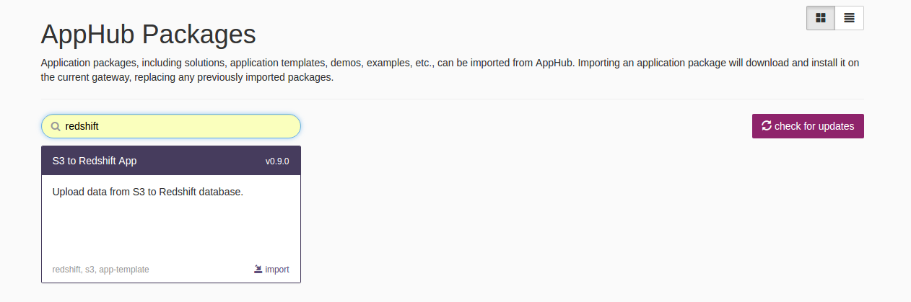
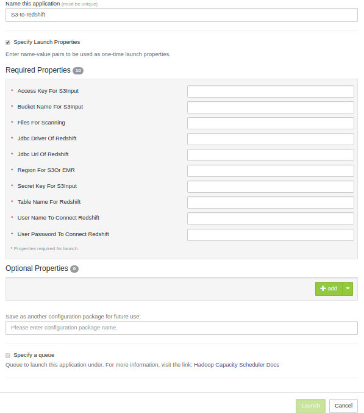
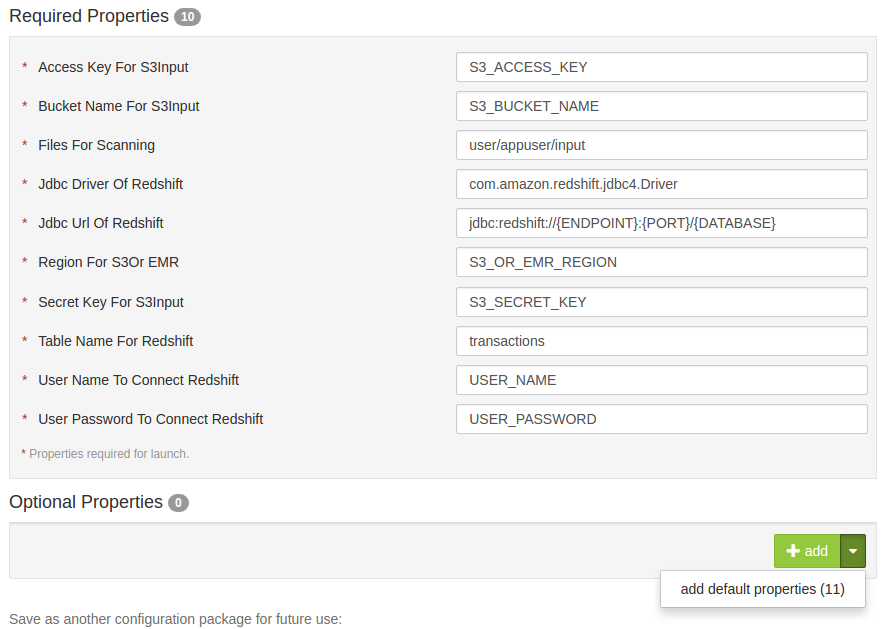
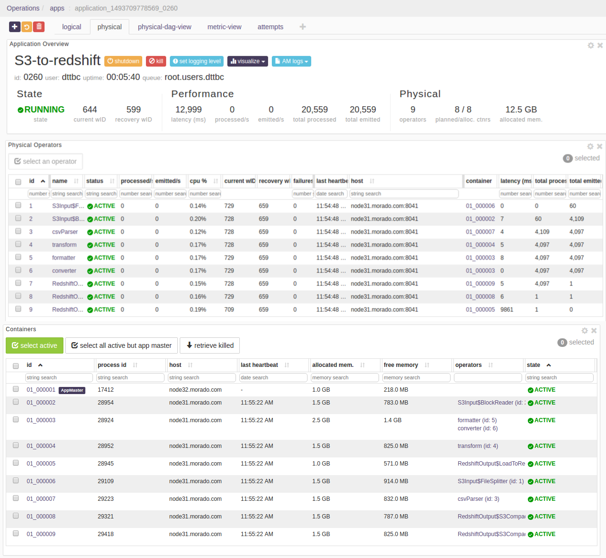

# S3 to Redshift Application

## Summary
Continuously scans the S3 directory and imports the data from S3 to redshift database.
The source code is available at: [https://github.com/DataTorrent/app-templates/tree/master/s3-to-redshift.](https://github.com/DataTorrent/app-templates/tree/master/s3-to-redshift)

Please send feedback or feature requests to: [feedback@datatorrent.com](mailto:feedback@datatorrent.com)

This document has a step-by-step guide to configure, customize, and launch this application.

## <a name="steps_to_launch">Steps to launch application</a>

1. Click on the AppHub tab from the top navigation bar.
   

1. Page listing the applications available on AppHub is displayed.
Search for redshift to see all applications related to redshift.
   
   Click on import button for `S3 to Redshift App`.

1. Notification is displayed on the top right corner after application package is successfully
   imported.
   

1. Click on the link in the notification which navigates to the page for this application package.
   
   Detailed information about the application package like version, last modified time, and short description is available on this page. Click on launch button for `s3-to-redshift` application.

1. <a name="launch-dialogue"></a>`Launch s3-to-redshift` dialogue is displayed. One can configure name of this instance of the application from this dialogue.
   

1. Specify the mandatory properties under `Specify Launch Properties`
   
   <a name="property-editor"></a>
   For example, suppose we wish to scan the directory `user/appuser/input` which is in S3 bucket `S3_BUCKET_NAME` and 
   import data from S3 to redshift database under `transactions` table. Properties should be set as follows:

    |name|value|
    |---|---|
    |Access Key For S3Input|S3_ACCESS_KEY|
    |Bucket Name For S3Input|S3_BUCKET_NAME|
    |Files For Scanning|user/appuser/input|
    |Jdbc Driver Of Redshift|com.amazon.redshift.jdbc4.Driver|
    |Jdbc Url Of Redshift|jdbc:redshift://{ENDPOINT}:{PORT}/{DATABASE}|
    |Region For S3Input|S3_REGION|
    |Secret Key For S3Input|S3_SECRET_KEY|
    |Table Name For Redshift|transactions|
    |User Name To Connect Redshift|USER_NAME|
    |User Password To Connect Redshift|USER_PASSWORD|
    |Bucket Name For Redshift In S3|REDSHIFT_S3_BUCKET|
    |Directory Path For Redshift In S3|user/appuser/output|
    
    Details about configuration options are available in [Configuration options](#configuration_options) section.

1. Click on the `Launch` button on lower right corner of the dialog to launch the application.
A notification is displayed on the top right corner after application is launched successfully and includes the Application ID which can be used to monitor this instance and find its logs.
   

1. Click on the `Monitor` tab from the top navigation bar.
   

1. A page listing all running applications is displayed. Search for current application based on name or application id or any other relevant field. Click on the application name or id to navigate to application instance details page.
   

1. Application instance details page shows key metrics for monitoring the application status.
   `logical` tab shows application DAG, Stram events, operator status based on logical operators, stream status, and a chart with key metrics.
   

1. Click on the `physical` tab to look at the status of physical instances of the operator, containers etc.
   

## <a name="configuration_options">Configuration options</a>

### Mandatory properties
End user must specify the values for these properties.

|Property|Description|Type|Example|
|---|---|---|-----|
|Access Key For S3Input|Indicates the accessKey which have read access to the S3|String|S3_ACCESS_KEY|
|Bucket Name For S3Input|Name of S3 bucket|Sting|S3_BUCKET_NAME|
|Files For Scanning|Specify the comma separated files/directories to scan|String|user/appuser/input|
|Jdbc Driver Of Redshift|Indicates the jdbc driver of the Redshift cluster|String|com.amazon.redshift.jdbc4.Driver|
|Jdbc Url Of Redshift|Indicates the jdbc url of the cluster|String|jdbc:redshift://{ENDPOINT}:{PORT}/{DATABASE}|
|Region For S3Input|Indicates the region of S3|String|S3_REGION|
|Secret Key For S3Input|Indicates the secret AccessKey which have read access to S3|String|S3_SECRET_KEY|
|Table Name For Redshift|Indicates the name of the table for redshift database|String|transactions|
|User Name To Connect Redshift|Indicates the user name to connect redshift database|String|USER_NAME|
|User Password To Connect Redshift|Indicates the password to connect redshift database|String|USER_PASSWORD|

By default, Redshift output module writes the tuples into S3 and then uploads into Redshift using `COPY` command. So, 
 User must specify the values for the below properties:
 
|Property|Description|Type|Example|
|---|---|---|-----|
|Bucket Name For Redshift In S3|Name of S3 bucket for intermediate store|String|REDSHIFT_S3_BUCKET|
|Directory Path For Redshift In S3|Directory path in S3 for intermediate store|String|user/appuser/output| 

If the application is running in EMR, then user must specify the values for the below properties instead of above properties:

|Property|Description|Type|Example|
|---|---|---|-----|
|Redshift Reader Mode|Specify reader mode for Redshift. By default, it load files from S3 into Redshift table. If the file is located in EMR, then specify "READ_FROM_EMR" mode|STRING|READ_FROM_EMR|
|Cluster Id For Redshift|Specify the cluster id for redshift only if the reader mode is READ_FROM_EMR|String|EMR_CLUSTER_ID|

## Steps to customize the application

1. Make sure you have following utilities installed on your machine and available on `PATH` in environment variables
    - [Java](https://www.java.com/en/download/manual.jsp) : 1.7.x
    - [maven](http://maven.apache.org/download.cgi) : 3.0 +
    - [git](https://git-scm.com/book/en/v2/Getting-Started-Installing-Git) : 1.7 +
    - [Hadoop]( http://www.michael-noll.com/tutorials/running-hadoop-on-ubuntu-linux-single-node-cluster/) (Apache-2.2)+

1.  Use following command to clone the examples repository:

     ```
     git clone git@github.com:DataTorrent/app-templates.git
     ```

1. Change directory to 'examples/tutorials/s3-to-redshift':

    ```
    cd examples/tutorials/s3-to-redshift
    ```

1. Import this maven project in your favorite IDE (e.g. eclipse).

1. Change the source code as per your requirements. Some tips are given as commented blocks in the Application.java for this project

1. Make respective changes in the test case and `properties.xml` based on your environment.

1. Compile this project using maven:

    ```
    mvn clean package
    ```

    This will generate the application package with `.apa` extension in the `target` directory.

1. Go to DataTorrent UI Management console on web browser. Click on the `Develop` tab from the top navigation bar.
   

1. Click on `upload package` button and upload the generated `.apa` file.
   

1. Application package page is shown with the listing of all packages.
Click on the `Launch` button for the uploaded application package.    
Follow the [steps](#launch-dialogue) for launching an application.
