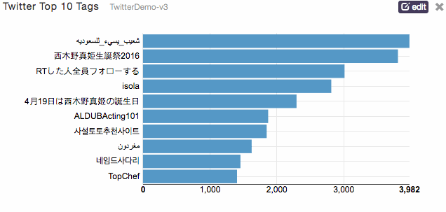
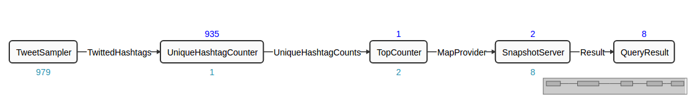
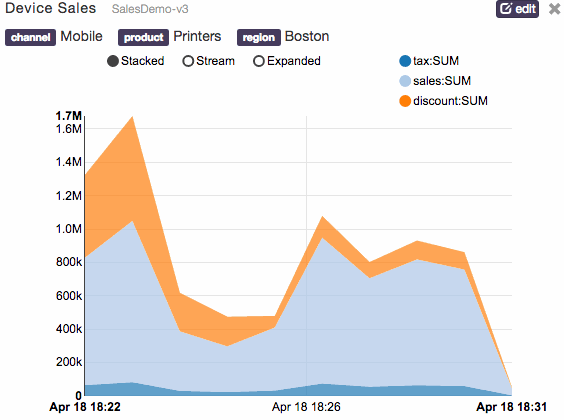
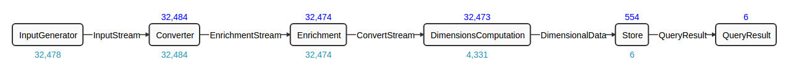

App Data Framework User Guide
=============================

## Introduction

The App Data Framework provides a way for data in Apex applications to be queried and delivered, so that the end user can easily access the application data and visualize it. 

In this document, we will first look at a simple example of how an application developer can quickly add this capability to an application. We will then explore the basic building blocks of the App Data Framework, and the data schemas that Apache Apex and DataTorrent RTS support.

This document assumes that the reader has the basic knowledge of Apache Apex.

## Examples

### A Simple Example
In Apache Apex Malhar, the Twitter example demonstrates the usage of the App Data Framework. The application calculates top 10 hashtags mentioned in tweets in the last 5 minutes across a 1% random tweet sampling on a rolling window basis.

In DataTorrent RTS, you can create a dashboard for this Twitter application that has a bar chart widget with the current top hashtags in Twitter constantly updated:




The topology of the Twitter example looks like this:



The *SnapshotServer* operator (along with a Query Operator embedded in it) and the *QueryResult* operator enable the latest Twitter top hashtags to be visualizable in the widget. 

We will explain them in the following sections.

The code of this Twitter example with App Data support is available [here](https://github.com/apache/incubator-apex-malhar/blob/master/demos/twitter/src/main/java/com/datatorrent/demos/twitter/TwitterTrendingHashtagsApplication.java)

### A More Complicated Example

In DataTorrent RTS, the Sales example demonstrates a more complicated usage of the App Data Framework. The application generates random sales events, which has dimension keys of sales channels, region and products. Then it aggregates tax, sales amount and discount across all the key combinations.



The topology of the Sales example looks like this:



Similar to the Twitter example, the *Store* operator along with the Query Operator embedded in it, and the *QueryResult* operator enable the data to be queried and be delivered to the widget for visualization.

The code of this Sales example is available [here](https://github.com/DataTorrent/examples/tree/master/dt-demo/dimensions/src/main/java/com/datatorrent/demos/dimensions/sales/generic)

## Architecture Overview

At a very high level, this is the architecture diagram for the App Data Framework. We will explain each of the components.


### App Data Source
Each App Data Source is a queryable unit, and it is represented by three operators in your application. It is possible to have multiple such App Data Sources in one application.


#### Data Source

The Data Source Operator that runs in an Apex application that processes the queries from the Query Operator and gives back the results. In the Twitter example, it is the *Snapshot Server* operator. The Java class of this operator is `com.datatorrent.lib.appdata.snapshot.AppDataSnapshotServerMap` in Apex Malhar. In the Sales example, it is the *Store* operator. The Java class of this operator is `com.datatorrent.contrib.dimensions.AppDataSingleSchemaDimensionStoreHDHT`, which is provided by DataTorrent RTS.

#### Query Operator

The Query Operator runs embedded in the Data Source Operator, listens for incoming queries from the Message Bus and hands it over to the Data Source Operator. Note that since the Query Operator is embedded within the Data Source Operator, it will not be visible in the DAG view in [dtManage](http://docs.datatorrent.com/dtmanage/). In both the Twitter and the Sales examples, the Java class that implements the Query Operator is `com.datatorrent.lib.io.PubSubWebSocketAppDataQuery`.

#### Result Operator

The Result Operator runs in an Apex application that publishes the results from the Data Source Operator to the Message Bus. In the Twitter example, it is the *QueryResult* operator. The Java class of this operator in both the Twitter and Sales examples is `com.datatorrent.lib.io.PubSubWebSocketAppDataResult`.

### Message Bus

Because the operators can run in any node in the cluster, a Message Bus with a pub-sub mechanism is used for delivery for both the queries and the results. This mechanism requires that the caller sends the query message to a topic that the Query Operator listens to, and the Result Operator sends the query result message passed from the Data Source Operator to a different topic that the caller listens to. Typically, the caller is a web browser.

In DataTorrent RTS, this mechanism is provided by [dtGateway](http://docs.datatorrent.com/dtgateway/). It uses WebSocket to achieve this so that the queries can be made and the results can be processed directly by a web browser. 

Referring back to the architecture diagram, the web browser, the Query Operator and the Result Operator all connect to dtGateway via WebSocket, with a pub-sub protocol on top of it.

### Schemas

Each App Data Source must provide a schema that describes what is a valid data query and what is a valid data response, so that the caller knows how to query and how to interpret the response from the App Data Sources. We will describe two schemas that underlie the Twitter example and the Sales example.

### UI Widgets

In order to allow the end users to visualize the result data in a web browser, we need web-based UI widgets that take user input and send the queries and display the results according to the App Data Sources’ schemas. In DataTorrent RTS, we have a number of UI widgets built in. We will also describe how a user can write their own custom widgets.

## Technical Details

### App Data Source

As described in the overview, an App Data Source consists of three operators: Data Source, Query and Result.

The Result Operator must implement this interface in `com.datatorrent.common.experimental.AppData`:

```java
interface ConnectionInfoProvider 
{
  String getAppDataUrl();
  String getTopic();
}
```

The Query Operator, which is embedded in the Data Store Operator, must implement this interface in `com.datatorrent.common.experimental.AppData`:

```java
interface EmbeddableQueryInfoProvider<QUERY_TYPE> extends Operator, ConnectionInfoProvider, Operator.ActivationListener<OperatorContext>
{
  DefaultOutputPort<QUERY_TYPE> getOutputPort();

  void enableEmbeddedMode();
}
```

The port that is returned by the embedded Query Operator’s `getOutputPort()` method will be connected to the input port of the Data Source Operator that is annotated with the marker annotation `com.datatorrent.common.experimental.AppData.QueryPort`.

On the DAG level, the Result Operator needs to connect to an output port of the Data Source Operator that is annotated with the marker annotation `com.datatorrent.common.experimental.AppData.ResultPort`. 

With this setup, the Data Source, along with the query topic and the result topic, will be discoverable by STRAM. STRAM will return the information to the caller via its REST API.

Below is the App Data Source discovery information returned by the `/ws/v2/applications/{appid}` REST call from dtGateway for the Twitter example:
```
{
  ...
  "appDataSources": [
    {
      "name": "SnapshotServer.queryResult",
      "operatorName": "SnapshotServer",
      "portName": "queryResult",
      "query": {
        "operatorName": "SnapshotServer.query",
        "topic": "TwitterHashtagQueryDemo",
        "url": "pubsub"
      },
      "result": {
        "appendQIDToTopic": true,
        "operatorName": "QueryResult",
        “topic": "TwitterHashtagQueryResultDemo",
        "url": "pubsub"
      }
    }, ... ]
  ...
}
```

The *name* field contains the name of the Data Source, and it has the following form: `<dataSourceOperatorName>.<resultPortName>`.

The *operatorName* field is the Data Source operator name.

The *portName* field is the result port name of the Data Source operator.

The *query* field describes the query mechanism, including the topic. 

The *result* field describes the result mechanism, including the topic and whether the query ID will be appended to the topic. Setting `appendQIDToTopic` to true increases the granularity of topics so that callers can receive results only for their queries. If the cost of creating such a large number of topics is high, it can be set to false; callers then will need to filter the results suitably.

### Message Bus

dtGateway has a WebSocket service that provides the pubsub mechanism required by the Message Bus. The URL is `ws://{dtGatewayAddress}/pubsub`. You can publish data with a topic by sending a WebSocket message like this:
```
{
  “type”: “publish”, “topic”: “{topic}”, “data”: {data}
}
```
The *topic* field is the topic name, and the *data* field is the payload and can be any JSON object.

All client that have subscribed to the topic will receive the data. The format is:
```
{
  “type”: “data”, “topic”: “{topic}”, “data”: {data}
}
```
And to subscribe to the topic, the client must send this message to dtGateway using WebSocket:
```
{
  “type”: “subscribe”, “topic”: “{topic}”
}
```

You can try it with dtGateway using a web browser with the help of a WebSocket client (e.g. “Simple WebSocket Client” extension in Google Chrome).

Note that dtGateway does not keep the history of the messages. 

### Interaction between Data Source and Web Browser

The web browser, the Query Operator and the Result Operator all connect to dtGateway via the Message Bus. The following describes the step-by-step interaction among them on a high level:

1. The UI widget in the browser subscribes to the result topic
2. The UI widget sends a schema query to the query topic.
3. The Data Source Operator gets the schema query and sends the schema result to the result topic, which the UI widget receives.
4. The UI widget in the browser subscribes to the result topic
5. The UI widget sends a data query
6. The Data Source Operator gets the data query and processes it and sends back the data result to the result topic.
7. The UI widget receives the data result and renders it.

Let’s look at the actual messages being exchanged for the Twitter example.

#### Snapshot Schema

The Snapshot Schema serves a simple snapshot of tabular data, which is typically constantly being updated and is used in the Twitter example. We will describe the Snapshot schema as we look at the messages.

Step 1: Browser sends Schema Response Subscribe
```json
{
  "type": "subscribe",
  "topic": "TwitterHashtagQueryResultDemo.0.20716154835833223"
}
```


In preparation for a Schema Query, the browser first subscribes to the result topic (with the query ID appended) to get the Schema Result back. In this case, the browser generates a random string, “0.20716154835833223” for the query ID, and appends the query ID to the result topic that it is subscribing to. 

Step 2: Browser sends Schema Query
```json
{
  "type": "publish",
  "topic": "TwitterHashtagQueryDemo",
  "data": {
    "id": 0.20716154835833223,
    "type": "schemaQuery"
  }
}
```

The browser sends a message with type, *schemaQuery*. This is the query that asks for the schema type and schema data. 

Step 3: Data Source sends Schema Response
```json
{
  "topic": "TwitterHashtagQueryResultDemo.0.20716154835833223",
  "data": {
    "id": "0.20716154835833223",
    "type": "schemaResult",
    "data": [
      {
        "values": [
          {
            "name": "hashtag",
            "type": "string"
          },
          {
            "name": "count",
            "type": "integer"
          }
        ],
        "schemaType": "snapshot",
        "schemaVersion": "1.0"
      }
    ]
  },
  "type": "data"
}
```

The Data Source sends back the *schemaResult*, which contains the response to *schemaQuery*, which contains schema type and schema data. In this case, schemaType is snapshot and schemaVersion is 1.0, and the available fields in the data are “hashtag”, which is a string, and “count”, which is an integer.


Step 4: Browser sends Data Result Subscribe
```json
{
  "type": "subscribe",
  "topic": "TwitterHashtagQueryResultDemo.0.6760250790172551"
}
```

Similar to the previous subscribe message, the browser subscribes to the result topic to get the response for the *dataQuery* that the browser is going to issue.


Step 5: Browser sends Data Query Request
```json
{
  "type": "publish",
  "topic": "TwitterHashtagQueryDemo",
  "data": {
    "id": 0.6760250790172551,
    "type": "dataQuery",
    "data": {
      "fields": [
        "hashtag",
        "count"
      ]
    },
    "countdown": 30,
    "incompleteResultOK": true
  }
}
```

The browser sends the *dataQuery* message that asks for actual data.

The *countdown* field expects an optional integer value. It tells the Data Source that the Data Source should return results once for subsequent {countdown} application windows. In this example, the value is 30. That means the Data Source should execute this query 30 times, once for each application window for the next 30 application windows.

The *incompleteResultOK* field is an optional boolean value default to be false. If the value is true, the Data Source should return results as soon as they are available even if they are partial results. This is useful when {countdown} is greater than 1 and the Data Source could take a long time to return the complete result set and if it is desirable for the caller to receive the results as soon as possible. If this value is false, Data Source should return the complete result set to the caller

Within the *data* field, the *fields* field tells the Data Source what fields to return in the result.


Step 6: Data Source sends Data Response
```json
{
  "topic": "TwitterHashtagQueryResultDemo.0.6760250790172551",
  "data": {
    "id": "0.6760250790172551",
    "type": "dataResult",
    "data": [
      {
        "count": "1398",
        "hashtag": "사설토토추천사이트"
      },
      {
        "count": "1415",
        "hashtag": "TopDance"
      },
      {
        "count": "1498",
        "hashtag": "isola"
      },
      {
        "count": "1521",
        "hashtag": "RTした人全員フォローする"
      },
      {
        "count": "1728",
        "hashtag": "4月19日は西木野真姫の誕生日"
      },
      {
        "count": "1787",
        "hashtag": "네임드사다리"
      },
      {
        "count": "2079",
        "hashtag": "ALDUBActing101"
      },
      {
        "count": "2280",
        "hashtag": "地震"
      },
      {
        "count": "2712",
        "hashtag": "西木野真姫生誕祭2016"
      },
      {
        "count": "2714",
        "hashtag": "شعيب_يسيء_للسعوديه"
      }
    ],
    "countdown": "29"
  },
  "type": "data"
}
```

The Data Source sends the *dataResult* message in response to the *dataQuery*. In this case, it contains a list of (hashtag, count) sets in the *data* field.

If the *countdown* field of the *dataQuery* is non-zero, there will be multiple such messages that correspond to one *dataQuery* message.  The *countdown* field in the *dataResult* message decrements every time it sends a result.  When it counts down to zero, the query has expired and the client must send another *dataQuery* message to receive further updates.

In this case, because the countdown value is 30 in the *dataQuery*, the Data Source will keep sending the latest data set for the next 29 application windows following this initial response.

For more information about the operators behind this Snapshot Schema, please refer to [this document](http://docs.datatorrent.com/operators/snapshot_server/).

#### Dimensions Schema

The Dimensions Schema is an extension of the Snapshot Schema with the notion of time and key dimensions. It is supported in DataTorrent RTS. 

We will look at the message exchange in the Sales example.

Step 1: Browser sends Schema Response Subscribe
```json
{"type":"subscribe","topic":"SalesQueryResultDemo.0.676153457723558"}
```

This is similar to the Snapshot example we saw earlier.

Step 2: Browser sends Schema Query
```json
{
   "type":"publish",
   "topic":"SalesQueryDemo",
   "data":{
      "id": 0.22710832906886935,
      "type":"schemaQuery"
   }
}
```
Again, this is similar to the Snapshot example we saw earlier.

Step 3: Data Source sends Schema Response.
```json
{
   "topic":"SalesQueryResultDemo.0.22710832906886935",
   "data":{
      "id":"0.22710832906886935",
      "type":"schemaResult",
      "data":[
         {
            "schemaType":"dimensions",
            "schemaVersion":"1.0",
            "time":{
               "buckets":["1m","1h","1d","5m"],
               "slidingAggregateSupported":true
            },
            "keys":[
               {
                  "name":"channel",
                  "type":"string",
                  "enumValues":["Mobile", "Online", "Store"]
               },
               {
                  "name":"region",
                  "type":"string",
                  "enumValues":["Atlanta", "Boston","Chicago","Cleveland","Dallas",
                     "Minneapolis","New York","Philadelphia","San Francisco","St. Louis"]
               },
               {
                  "name":"product",
                  "type":"string",
                  "enumValues":["Laptops","Printers","Routers","Smart Phones","Tablets"]
               }
            ],
            "values":[
               {
                  "name":"tax:SUM",
                  "type":"double"
               },
               {
                  "name":"sales:SUM",
                  "type":"double"
               },
               {
                  "name":"discount:SUM",
                  "type":"double"
               }
            ],
            "dimensions":[
               {
                  "combination":[

                  ]
               },
               {
                  "combination":[
                     "channel"
                  ]
               },
               {
                  "combination":[
                     "region"
                  ]
               },
               {
                  "combination":[
                     "product"
                  ]
               },
               {
                  "combination":[
                     "region",
                     "channel"
                  ]
               },
               {
                  "combination":[
                     "product",
                     "channel"
                  ]
               },
               {
                  "combination":[
                     "product",
                     "region"
                  ]
               },
               {
                  "combination":[
                     "product",
                     "region",
                     "channel"
                  ]
               }
            ]
         }
      ]
   },
   "type":"data"
}
```

Compared to the Snapshot Schema, this is considerably more complex. The response to the query describes the keys and aggregates that are provided by the data source. The basic components of the schema are the following:

**timebuckets**: These are the time buckets over which aggregations are computed. For example, 1d (one day), 1h (one hour), 1m (one minute), 1s (one second).

**keys**: These are the search parameters you need to provide when you do a query. The keys have an enumValues. This is an optional section which contains all possible values of a key. This section may be updated by the back end if new key values are encountered.

**values**: These are the results which are returned by a query. Notice that the values are of the form (name):(aggregation). The first portion of the value name describes what is being aggregated. The second portion of the value name describes the aggregation being used.

**combinations**: This describes the valid combinations of keys that can be specified when doing a query.

Step 4: Browser sends Data Result Subscribe
```json
{
  "type": "subscribe",
  "topic": "SalesQueryResultDemo.0.3180227109696716"
}
```

Step 5: Browser sends Data Query Request

Now that the valid combinations, keys, values, and timebuckets are known, we can issue a query using them. 
```json
{
   "type":"publish",
   "topic":"SalesQueryDemo",
   "data":{
      "id": "0.3180227109696716",
      "type":"dataQuery",
      "data":{
         "time":{
            "latestNumBuckets":10,
            "bucket":"1m"
         },
         "incompleteResultOK":true,
         "keys":{

         },
         "fields":[
            "time",
            "channel",
            "region",
            "product",
            "tax:SUM",
            "sales:SUM",
            "discount:SUM"
         ]
      },
      "countdown":29,
      "incompleteResultOK":true
   }
}
```
**time**: This specifies which time buckets to query. In this case the most recent 10 one minute time buckets are queried. The example above illustrates how to query the last N timebuckets, but it is also possible to do history queries by specifying a time section like the following:

```json
        "time":{
         "bucket":"1m",
         "from":1460765563547,
         "to":1460767363547
       }
```
This time section specifies a historical query starting at the “from” unix timestamp (inclusive) up until the “to” timestamp (inclusive).

**keys**: These are the search parameters. This section can be empty to query global aggregations. If there are specific key combinations you want to search for you can do this:

```
“key”: {
  “channel”: “Mobile”
  “region”: “Atlanta”
}
```
It is possible to specify a key with a list like the following:
```
“key”: {
  “channel”: “Mobile”
  “region”: [ “Atlanta”, “Dallas” ]
}
```
This will query all the data with a *channel* value of “Mobile” and a *region* value of “Atlanta” OR “Dallas”. It is also possible to specify a key with an empty array like the following:
```
“key”: {
  “channel”: “Mobile”
  “region”: []
}
```
This will query all the data with a *channel* value of “Mobile” and ANY value of *region*.
Note that this is different from not specifying the *region* value at all, in which case, the aggregated value of all regions will be returned. This is similar to the difference between the SQL queries of `SELECT SUM(sales) WHERE channel=’Mobile’` (for the case of not specifying *region*) and `SELECT SUM(sales), region WHERE channel=’Mobile’ GROUP BY region` (for the case of *region* being an empty array).

**fields**: This specifies what data to include in the query result. If the field *time* is included, then a timestamp is included for each data point. Similarly the keys can also be specified as fields with the results. Lastly aggregated values can also be specified as fields to be returned in results.


Step 6: Data Source sends Data Response.

After a query is issued, results are periodically returned:
```json
{
   "topic":"SalesQueryResultDemo.0.3180227109696716",
   "data": {
      "id":"0.3180227109696716",
      "type":"dataResult",
      "data":[
         {
            "time":"1460771580000",
            "region":"Boston",
            "product":"ALL",
            "channel":"Mobile",
            "tax:SUM":"78363.47",
            "sales:SUM":"922988.9199999997",
            "discount:SUM":"69135.71999999999"
         },
         {
            "time":"1460771640000",
            "region":"Boston",
            "product":"ALL",
            "channel":"Mobile",
            "tax:SUM":"142011.85",
            "sales:SUM":"1672677.0099999998",
            "discount:SUM":"125287.46999999999"
         },
         {
            "time":"1460771700000",
            "region":"Boston",
            "product":"ALL",
            "channel":"Mobile",
            "tax:SUM":"139069.53999999998",
            "sales:SUM":"1638011.5399999998",
            "discount:SUM":"122692.48999999999"
         },
         {
            "time":"1460771760000",
            "region":"Boston",
            "product":"ALL",
            "channel":"Mobile",
            "tax:SUM":"80699.90000000001",
            "sales:SUM":"950502.3500000003",
            "discount:SUM":"71196.95000000001"
         },
         {
            "time":"1460771820000",
            "region":"Boston",
            "product":"ALL",
            "channel":"Mobile",
            "tax:SUM":"35914.69",
            "sales:SUM":"423017.9000000001",
            "discount:SUM":"69339.05000000002"
         },
         {
            "time":"1460771880000",
            "region":"Boston",
            "product":"ALL",
            "channel":"Mobile",
            "tax:SUM":"106977.84999999998",
            "sales:SUM":"1260017.5600000003",
            "discount:SUM":"629939.14"
         },
         {
            "time":"1460771940000",
            "region":"Boston",
            "product":"ALL",
            "channel":"Mobile",
            "tax:SUM":"253243.50000000003",
            "sales:SUM":"2982796.9300000006",
            "discount:SUM":"1491234.3599999999"
         },
         {
            "time":"1460772000000",
            "region":"Boston",
            "product":"ALL",
            "channel":"Mobile",
            "tax:SUM":"161384.77999999997",
            "sales:SUM":"1900857.2300000002",
            "discount:SUM":"950325.01"
         },
         {
            "time":"1460772060000",
            "region":"Boston",
            "product":"ALL",
            "channel":"Mobile",
            "tax:SUM":"125283.99000000002",
            "sales:SUM":"1475625.3600000003",
            "discount:SUM":"737730.77"
         },
         {
            "time":"1460772120000",
            "region":"Boston",
            "product":"ALL",
            "channel":"Mobile",
            "tax:SUM":"58684.59",
            "sales:SUM":"691200.9299999999",
            "discount:SUM":"345562.2700000001"
         }
      ],
      "countdown":"297"
   },
   "type":"data"
}
```
As you can see each result represents a time bucket with the corresponding values for the fields. If the ANY value (with an empty list) query is specified for a key you will see multiple results for the same time bucket, but each result will have different values for the keys.


Detailed documentation of the dimensions operators can be found here: [http://docs.datatorrent.com/operators/dimensions_computation/](http://docs.datatorrent.com/operators/dimensions_computation/)

### Advanced Topics

#### Schema Keys

Although in most cases, a Data Source has one fixed schema, it is sometimes necessary for a Data Source to support multiple schemas. This is useful if the schemas are dynamically created depending on the incoming data to the Data Source Operator.

Schema Key is the feature we added to the App Data Framework for this purpose. If the Data Source has multiple schemas, the *schemaResult* will contain a list of schemas with the corresponding schema keys in the *context* field:
```
{
  “id”: “{client_generated_id}”,
  “type”: “schemaResult”,
  “data”: [ 
    {
      “context”: {
        “schemaKeys”: {
          “{key1}”: “{value1}”,
          “{key2}”: “{value2}”, ...
         }
      },
      {rest of the schema}
    }, ...
  ]
}
```
And if the *schemaResult* returns multiple schemas, all *dataQuery* messages must include the schema keys:
```
{
   “id”: “{client_generated_id}”,
   “type”: “dataQuery”, 
   “data”: {
     “context”: {
       “schemaKeys” { //optional
    “{keyName1}”: “{keyValue1}”,
    “{keyName2}”: “{keyValue2}” 
       }
     }
     {rest of the query}
   }
   “countdown”: “{countdown}”,
   “incompleteResultOK”: true/false
}
```
This feature is supported by the DimensionsStore operator and is being used by the App Data Tracker.

#### Dimensions Schema: Additional Values for Combinations

For the Dimensions Schema supported by the DimensionsStore operator, there can be more complex schema specifications which have results for values only for certain combinations. This is the schema for yet another example about aggregation of advertisement data in the DataTorrent RTS example repository.
```json
{
   "topic":"AdsQueryGenericResultDemo.0.08170037856325507",
   "data":{
      "id":"0.08170037856325507",
      "type":"schemaResult",
      "data":[
         {
            "schemaType":"dimensions",
            "schemaVersion":"1.0",
            "time":{
               "buckets":["1m","1h","1d"],
               "slidingAggregateSupported":true,
               "from":"1459987200000",
               "to":"1460768100000"
            },
            "keys":[
               {
                  "name":"publisher",
                  "type":"string",
                  "enumValues":["twitter","facebook","yahoo","google","bing","amazon"
                  ]
               },
               {
                  "name":"advertiser",
                  "type":"string",
                  "enumValues":["starbucks","safeway","mcdonalds","macys","taco bell",
                     "walmart","kohls","san diego zoo","pandas","jack in the box",
                     "tomatina","ron swanson"
                  ]
               },
               {
                  "name":"location",
                  "type":"string",
                  "enumValues":[
                     "N","LREC","SKY","AL","AK","AZ","AR","CA","CO","CT","DE","FL",
                     "GA","HI","ID"
                  ]
               }
            ],
            "values":[
               {
                  "name":"impressions:COUNT",
                  "type":"long"
               },
               {
                  "name":"impressions:SUM",
                  "type":"long"
               },
               {
                  "name":"impressions:AVG",
                  "type":"double"
               },
               {
                  "name":"clicks:COUNT",
                  "type":"long"
               },
               {
                  "name":"clicks:SUM",
                  "type":"long"
               },
               {
                  "name":"clicks:AVG",
                  "type":"double"
               },
               {
                  "name":"cost:COUNT",
                  "type":"long"
               },
               {
                  "name":"cost:SUM",
                  "type":"double"
               },
               {
                  "name":"cost:AVG",
                  "type":"double"
               },
               {
                  "name":"revenue:COUNT",
                  "type":"long"
               },
               {
                  "name":"revenue:SUM",
                  "type":"double"
               },
               {
                  "name":"revenue:AVG",
                  "type":"double"
               }
            ],
            "dimensions":[
               {
                  "combination":[

                  ]
               },
               {
                  "combination":[
                     "location"
                  ]
               },
               {
                  "combination":[
                     "advertiser"
                  ],
                  "additionalValues":[
                     {
                        "name":"impressions:MAX",
                        "type":"long"
                     },
                     {
                        "name":"impressions:MIN",
                        "type":"long"
                     },
                     {
                        "name":"clicks:MAX",
                        "type":"long"
                     },
                     {
                        "name":"clicks:MIN",
                        "type":"long"
                     },
                     {
                        "name":"cost:MAX",
                        "type":"double"
                     },
                     {
                        "name":"cost:MIN",
                        "type":"double"
                     },
                     {
                        "name":"revenue:MAX",
                        "type":"double"
                     },
                     {
                        "name":"revenue:MIN",
                        "type":"double"
                     }
                  ]
               },
               {
                  "combination":[
                     "publisher"
                  ],
                  "additionalValues":[
                     {
                        "name":"impressions:MAX",
                        "type":"long"
                     },
                     {
                        "name":"impressions:MIN",
                        "type":"long"
                     },
                     {
                        "name":"clicks:MAX",
                        "type":"long"
                     },
                     {
                        "name":"clicks:MIN",
                        "type":"long"
                     },
                     {
                        "name":"cost:MAX",
                        "type":"double"
                     },
                     {
                        "name":"cost:MIN",
                        "type":"double"
                     },
                     {
                        "name":"revenue:MAX",
                        "type":"double"
                     },
                     {
                        "name":"revenue:MIN",
                        "type":"double"
                     }
                  ]
               },
               {
                  "combination":[
                     "location",
                     "advertiser"
                  ]
               },
               {
                  "combination":[
                     "location",
                     "publisher"
                  ]
               },
               {
                  "combination":[
                     "advertiser",
                     "publisher"
                  ]
               },
               {
                  "combination":[
                     "location",
                     "advertiser",
                     "publisher"
                  ]
               }
            ]
         }
      ]
   },
   "type":"data"
}
```
Here you can see that a combination can also have `additionalValues` specified. Additional values are values which are only available for a specific combination of keys.

The code for the ads example is available [here](https://github.com/DataTorrent/examples/tree/master/dt-demo/dimensions/src/main/java/com/datatorrent/demos/dimensions/ads/generic).

### UI Widgets

Coming soon

### App Data Tracker

App Data Tracker is discussed [here](http://docs.datatorrent.com/app_data_tracker/).

