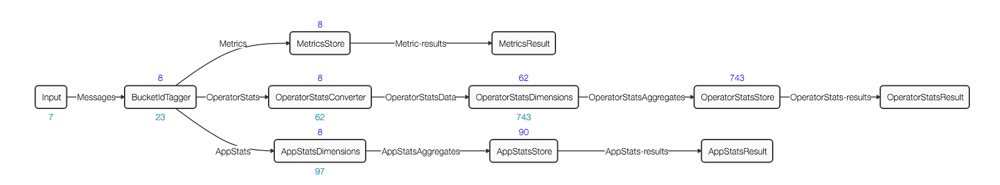

App Data Tracker
================

# Introduction
App Data Tracker, called ADT from now on for conciseness, is a system Apex application that utilizes App Data Framework for collecting and aggregating stats and auto-metrics of user Apex applications.

**Stats** are pre-defined measurements that tracks the health and performance of an application. There are 2 types of stats for each Apex application.
* Application stats - these include stats at the application level. For example - `plannedContainers`, `numOperators`, `failedContainers`, `totalTuplesProcessed`, etc.
* Operator stats - these include stats of each operator in an application. Example of per operator stats are - `totalTuplesProcessed`, `totalTuplesEmitted`, `cpuPercentageMA`, etc.

**AutoMetrics** are custom measurements that an operator developer can define for their operator. If an operator having auto-metrics is integrated to an application, then these auto-metrics become eligible
to be collected by ADT for aggregation. AutoMetrics are explained in detail [here](http://apex.apache.org/docs/apex/autometrics/).

# Interaction between ADT and user Apex Applications

After ADT has been enabled, applications will push stats and metrics to dtGateway. In this scenario, dtGateway serves as a message bus. ADT acts as a
subscriber to this message bus. The diagram below depicts the message flow among user Apex applications, dtGateway and ADT.

<a name="dtGateway-adt"></a>

# Launching ADT

ADT can be automatically launched by dtGateway if the dt-site.xml that is used by the dtGateway has the following properties:

```xml
<property>
  <name>dt.appDataTracker.enable</name>
  <value>true</value>
</property>
<property>
  <name>dt.appDataTracker.transport</name>
  <value>com.datatorrent.common.metric.AutoMetricBuiltInTransport:AppDataTrackerFeed</value>
</property>
<property>
  <name>dt.attr.METRICS_TRANSPORT</name>
  <value>com.datatorrent.common.metric.AutoMetricBuiltInTransport:AppDataTrackerFeed</value>
</property>
```

 **Note**: ADT will be shown running in dtManage as a “system app”.  It will show up if the “show system apps” button is pressed.

# ADT Topology



The input operator in ADT is a web-socket input operator which listens to the topic `AppDataTrackerFeed`. This is the topic which the
application masters of the user applications are publishing to.

Once the messages enter ADT, they are processed for aggregation and stored in HDHT.

# Aggregations

ADT aggregates only **Metrics** by time. **Stats** - application or operator level represent cumulative values and therefore are not time-aggregated.

By default, the time buckets ADT aggregates upon are one minute, one hour and one day. It can be overridden by changing the operator attribute `METRICS_DIMENSIONS_SCHEME`.

Also by default, ADT performs all these aggregations : SUM, MIN, MAX, AVG, COUNT, FIRST, LAST on all number metrics.  You can also override by changing the same operator attribute `METRICS_DIMENSIONS_SCHEME`, provided the custom aggregator is known to ADT.  (See next section)

## Custom Aggregator in ADT
Custom aggregators allow you to do your own custom computation on statistics generated by any of your applications. In order to write a Custom aggregator the implementations of the
following methods is needed:

* Combining new inputs with the current aggregation
* Combining two aggregations together into one aggregation

Let’s consider the case where we want to perform the following rolling average:

Y_n = ½ * X_n + ½ * X_n-1 + ¼ * X_n-2 + ⅛ * X_n-3 +...

This aggregation could be performed by the following Custom Aggregator:

```java
@Name("IIRAVG")
public class AggregatorIIRAVG extends AbstractIncrementalAggregator
{
  ...

  private void aggregateHelper(DimensionsEvent dest, DimensionsEvent src)
  {
    double[] destVals = dest.getAggregates().getFieldsDouble();
    double[] srcVals = src.getAggregates().getFieldsDouble();

    for (int index = 0; index < destLongs.length; index++) {
      destVals[index] = .5 * destVals[index] + .5 * srcVals[index];
    }
  }

  @Override
  public void aggregate(Aggregate dest, InputEvent src)
  {
    //Aggregate a current aggregation with a new input
    aggregateHelper(dest, src);
  }

  @Override
  public void aggregate(Aggregate destAgg, Aggregate srcAgg)
  {
    //Combine two existing aggregations together
    aggregateHelper(destAgg, srcAgg);
  }
}
```

## Discovery of Custom Aggregators
ADT searches for custom aggregator jars under the following directories statically before launching:

1. {dt\_installation\_dir}/plugin/aggregators
2. {user\_home\_dir}/.dt/plugin/aggregators

It uses reflection to find all the classes that extend from `IncrementalAggregator` and `OTFAggregator` in these jars and registers them with the name provided by `@Name` annotation (or class name when `@Name` is absent).

## Using `METRICS_DIMENSIONS_SCHEME`

Here is a sample code snippet on how you can make use of `METRICS_DIMENSIONS_SCHEME` to set your own time buckets and your own set of aggregators for certain `AutoMetric`s performed by the ADT in your application.

```java
  @Override
  public void populateDAG(DAG dag, Configuration configuration)
  {
    ...
    LineReceiver lineReceiver = dag.addOperator("LineReceiver", new LineReceiver());
    ...
    AutoMetric.DimensionsScheme dimensionsScheme = new AutoMetric.DimensionsScheme()
    {
      String[] timeBuckets = new String[] { "1s", "1m", "1h" };
      String[] lengthAggregators = new String[] { "IIRAVG", "SUM" };
      String[] countAggregators = new String[] { "SUM" };

      /* Setting the aggregation time bucket to be one second, one minute and one hour */
      @Override
      public String[] getTimeBuckets()
      {
        return timeBuckets;
      }

      @Override
      public String[] getDimensionAggregationsFor(String logicalMetricName)
      {
        if ("length".equals(logicalMetricName)) {
          return lengthAggregators;
        } else if ("count".equals(logicalMetricName)) {
          return countAggregators;
        } else {
          return null; // use default
        }
      }
    };

    dag.setAttribute(lineReceiver, OperatorContext.METRICS_DIMENSIONS_SCHEME, dimensionsScheme);
    ...
  }
```


# Dashboards
With ADT enabled, you can visualize the AutoMetrics and system metrics in the Dashboards within dtManage.   Refer back to the [diagram](#dtGateway-adt), dtGateway relays queries and query results to and from ADT.  In this way, dtManage sends queries and receives results from ADT via dtGateway and uses the results to let the user visualize the data.

Click on the visualize button in dtManage's application page.


You will see the dashboard for the AutoMetrics and the system metrics.


The left widget shows the AutoMetrics of `line` and `count` for the [LineReceiver](http://apex.apache.org/docs/apex/autometrics/#lineReceiver) operator.  The right widget shows the system metrics.

The Dashboards have some simple builtin widgets to visualize the data.  Line charts and bar charts are some examples.
Users will be able to implement their own widgets to visualize their data.


