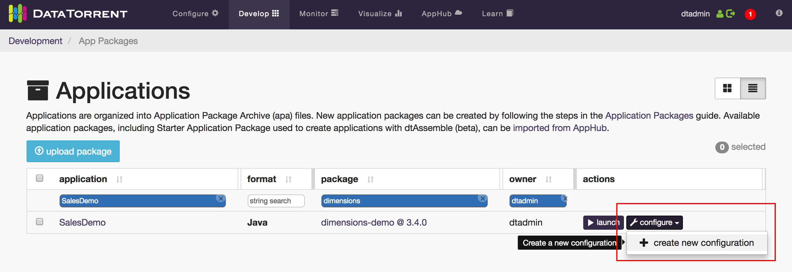
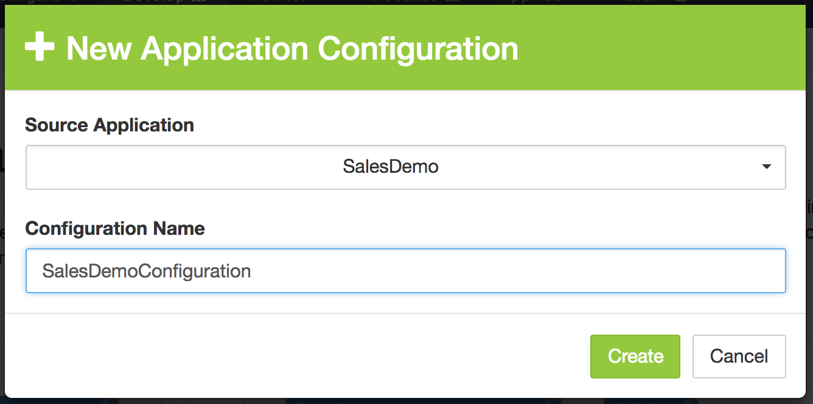
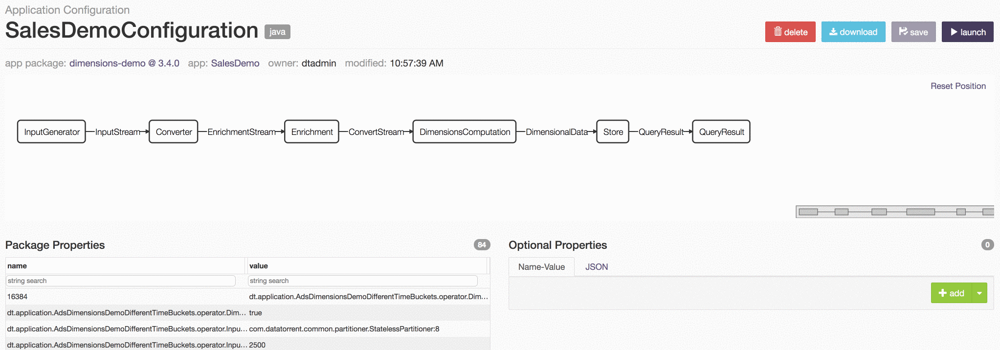
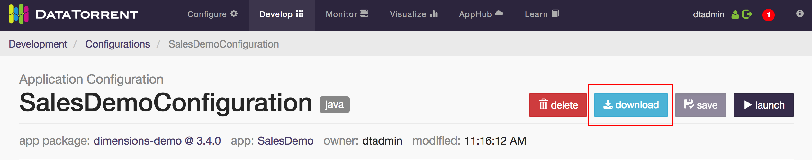
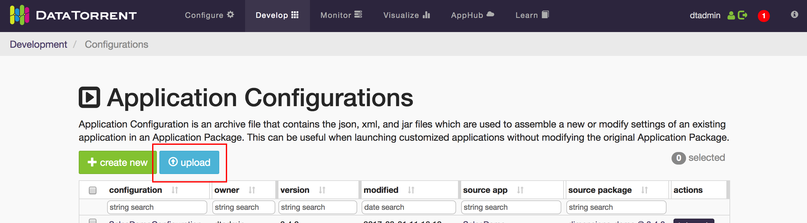

Application Configurations
========================

Application Configurations can be thought of as wrappers for Applications. You
create a Configuration with properties that override and supplement the ones
already set in the original Application.

You may find Application Configurations to be particularly useful if:

  * You use the *Specify Launch Properties* option when launching Applications
  and want the properties to persist.
  * Users want to share their Configurations of the same Application.

Creating an Application Configuration
=====================================

  1. Navigate to either the *Applications* page or the *Application Configurations*
  page in the **Develop** section.
  2. If you're on the  *Applications* page, click the **configure** button 
  next to the Application you want to configure, and then click **create new configuration**.
    
  Or if you're on the *Application Configurations* page, click on the **create new** button.
    
  3. Select the **Source Application** from the dropdown (preselected if you used
  the **configure** button), choose a unique **Configuration Name**, and click the **create** button.
    
  4. Once the Configuration is created, you will be navigated to the newly created
  Application Configuration's page.

Modifying Properties of an Application Configuration
====================================================

Properties set in an Application Configuration will override any existing properties
of the Application. These properties can be Operator level properties or even
Application Package level. To see a list of existing properties, go to the
Application Configuration's page.

  * **Package Properties**: Shows the existing properties of the Application. This table
  is useful for reference when specifying **Optional Properties**.
  * **Optional Properties**: This is where you can add/edit/remove Application property
  overrides. The properties and values you specify here will take precedence over the
  existing **Package Properties**. The JSON tab allows you to copy-and-paste properties
  in JSON format.

_NOTE_: Package Properties can be copied into your clipboard by double-clicking the **name**
field of the property. You can then paste it when creating Optional Properties.

When you have finished modifying your properties, remember to click the **save**
button in the top-right corner of the page.

Launching an Application Configuration
======================================

Application Configurations have to be launched just like Applications. 
They can be launched from the list view (table), or from the Configuration's
page itself:

  

Exporting and Importing Application Configurations
====================================================

Application Configurations can be exported and downloaded as **.apc** files.

  

Exported **.apc** files can be imported by uploading them on the Application
Configurations page.

  

JSON Application Configurations
===============================

Application Configurations of JSON Applications (dtAssemble) differ from
Application Configurations of Java Applications in several ways:

  * When creating a Configuration of a JSON Application, the entire
  JSON Application is copied into the Configuration.
  * The original JSON Application and its Configurations are decoupled. Any modifications
  to either would not affect the other. They still rely on the same Package resources
  (e.g. Operators).

Deleting Applications with Existing Application Configurations
==============================================================

If an Application with existing Application Configurations is deleted, the
Application Configuration can no longer be launched.

  

The launch functionality will be restored if you re-upload the Application.
