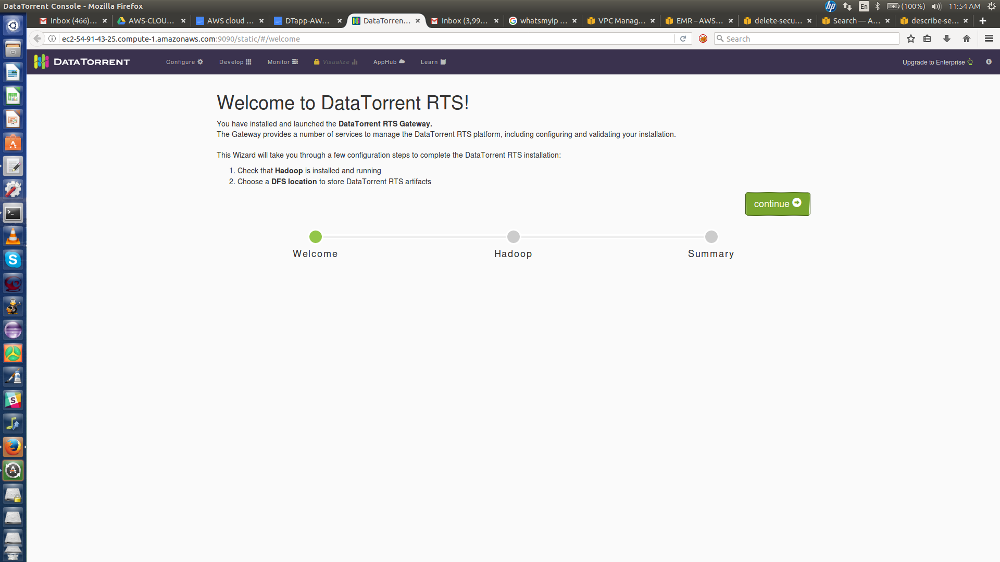
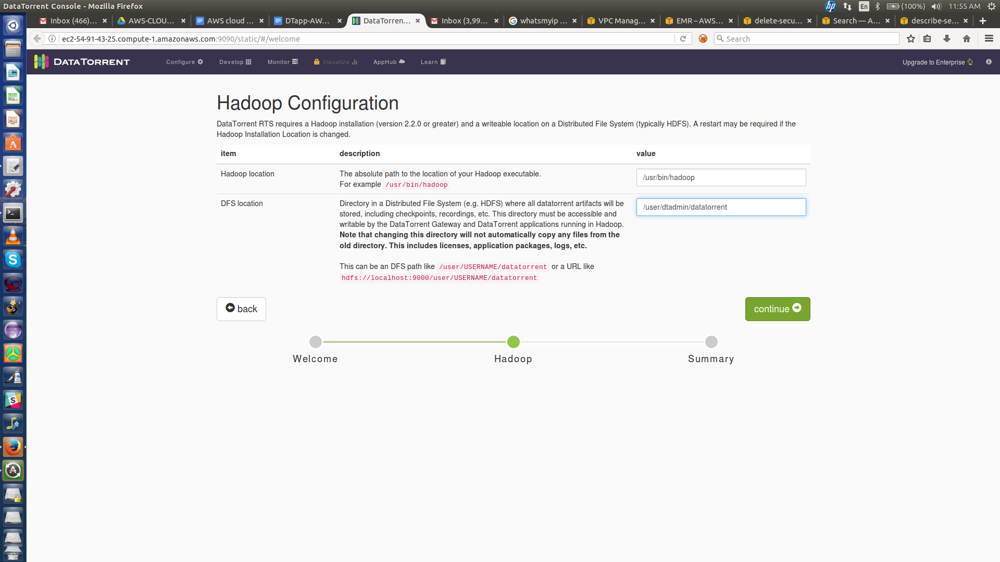
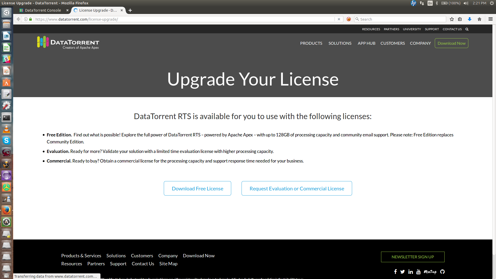
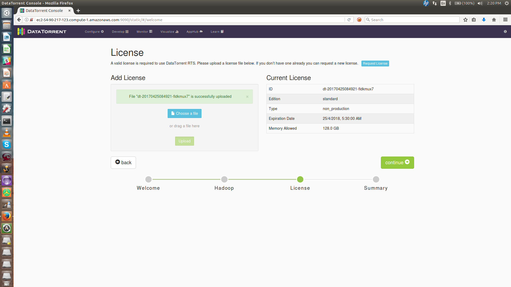
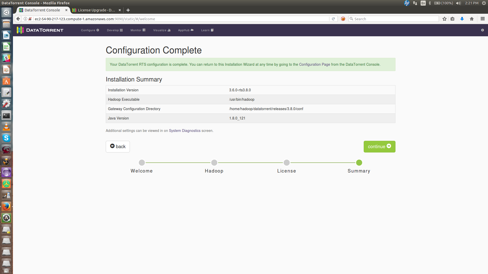

## Overview
This document describes steps to run DT apps on AWS cluster. Users can easily try out apps from the [AppHub](https://www.datatorrent.com/apphub/#/) by downloading the app installers from the DataTorrent website. A zip package containing `bash` scripts will be downloaded on user’s machine and user needs to follow the instructions below to deploy apps.

## Setup
+ Install the AWS Command Line Interface
    + Refer to the [link](http://docs.aws.amazon.com/cli/latest/userguide/installing.html) for instructions
+ Configure the AWS Command Line Interface
    +        
              $ aws configure
              AWS Access Key ID [None]: MENTION ACCESS_KEY_ID
              AWS Secret Access Key [None]: MENTION SECRET_ACCESS_KEY
              Default region name [None]: MENTION REGION
              Default output format [None]: _Press ENTER_
    + For detailed instructions, refer to the [link](http://docs.aws.amazon.com/cli/latest/userguide/cli-chap-getting-started.html#cli-quick-configuration)
+ Verify that AWS Command Line Interface is configured by ensuring the following returns correct values
    +       
            $ aws configure get aws_access_key_id
            $ aws configure get aws_secret_access_key
            $ aws configure get region

## Package contents
The zip file (see [end-to-end steps](#end-to-end-workflow) below) will contain following files:

- **DTapp-EMR-Deploy.sh** - Script that user needs to execute to set up AWS EMR Cluster. The cluster will be created and DT-RTS installed along with the app.

- **config.properties** - This file contains properties used by the script. File has sample values for the properties as mentioned below.
 (**Note:** *Sample values for the properties should be sufficient unless it needs to be changed.*)

<table>
    <colgroup>
        <col width="33%" />
        <col width="33%" />
        <col width="33%" />
    </colgroup>
    <tbody>
        <tr class="even">
            <th>Property</th>
            <th>Sample Value</th>
            <th>Description</th>
        </tr>
        <tr class="odd">
            <td align="left">SECURITY_GROUP_NAME</td>
            <td align="left">DTapp-security-group</td>
            <td align="left">Security Group with this name will be created and inbound rule with user machine’s external IP address will be added to it.</td>
        </tr>
        <tr class="even">
            <td align="left">BUCKET_NAME</td>
            <td align="left">dtapp-emr</td>
            <td align="left">S3 bucket name. A bucket with this name will be created and script that installs DT-RTS will be placed into it. This script is used as a bootstrap script during cluster launch.</td>
        </tr>
        <tr class="odd">
            <td align="left">S3_REGION</td>
            <td align="left">us-east-1</td>
            <td align="left">Region where S3 bucket is created</td>
        </tr>
        <tr class="even">
            <td align="left">LOG_URI</td>
            <td align="left">s3n://dtapp-logs</td>
            <td align="left">S3 URI where log files would be stored</td>
        </tr>
        <tr class="odd">
            <td align="left">CLUSTER_NAME</td>
            <td align="left">DTapp</td>
            <td align="left">Name of the EMR cluster</td>
        </tr>
        <tr class="even">
            <td align="left">CORE_INSTANCE_TYPE</td>
            <td align="left">m1.large</td>
            <td align="left">Type of machine for core instance</td>
        </tr>
        <tr class="odd">
            <td align="left">CORE_INSTANCE_COUNT</td>
            <td align="left">1</td>
            <td align="left">Number of core instances to be created</td>
        </tr>
        <tr class="even">
            <td align="left">MASTER_INSTANCE_TYPE</td>
            <td align="left">m1.medium</td>
            <td align="left">Type of machine for master instance</td>
        </tr>
        <tr class="odd">
            <td align="left">MASTER_INSTANCE_COUNT</td>
            <td align="left">1</td>
            <td align="left">Number of Master instances to be created</td>
        </tr>
    </tbody>
</table>

- **DTapp-EMR-Terminate.sh** - Script to terminate the cluster

- **README** - Readme file with instructions

## End to End workflow
The steps below describe the end to end flow to run any app provided in the AppHub. Let's consider that we want to run Kinesis to S3 app on the AWS cluster.

1. Download the zip file for the app.
[https://www.datatorrent.com/downloads/aws-apps/app-kinesis-to-s3.zip](https://www.datatorrent.com/downloads/aws-apps/app-kinesis-to-s3.zip)

2. Extract the zip

      `unzip app-kinesis-to-s3.zip`

3. Verify the files. The directory structure should be as follows:

        user@localhost:~/Downloads/app-kinesis-to-s3$ ls
        config.properties  DTapp-EMR-Deploy.sh  DTapp-EMR-Terminate.sh README

4. Edit `config.properties` file. Modify the properties as described in the [Package Contents](#package-contents) section.

5. Assign Execute permissions.

         user@localhost:~/Downloads/app-kinesis-to-s3$ chmod u+x /path/to/app-kinesis-to-s3/DTapp-EMR-*

6. Execute the shell script.

         user@localhost:~/Downloads/app-kinesis-to-s3$ ./DTapp-EMR-Deploy.sh

7. Wait till the EMR cluster is up. Once the cluster is up, a link to configure the DT-RTS will be provided. Click on the link. E.g  `http://ec2-54-91-43-25.compute-1.amazonaws.com:9090`

8. DT-RTS Welcome Screen will appear. Click `continue`
  

9. Default paths for Hadoop and the DFS root will be automatically populated, e.g. `/usr/bin/hadoop` and `/user/dtadmin/datatorrent`. You can leave these values alone unless you have some specific reason to change them. Click `continue`
  

10. A valid license would be needed to continue further. Click on `Request License`.
    

11. Download the appropriate license.
    

12. Upload the license. Once the license is successfully uploaded, Click Continue
    
    

13. Once the configuration is complete, Click Continue
  

14. The app is imported and is ready to launch
  
  To know more about how to configure a particular app, visit the `App Templates` section of our [documentation](http://docs.datatorrent.com)

15. To terminate the AWS cluster, execute the termination script:

         user@localhost:~/Downloads/app-kinesis-to-s3$ ./DTapp-EMR-Terminate.sh
