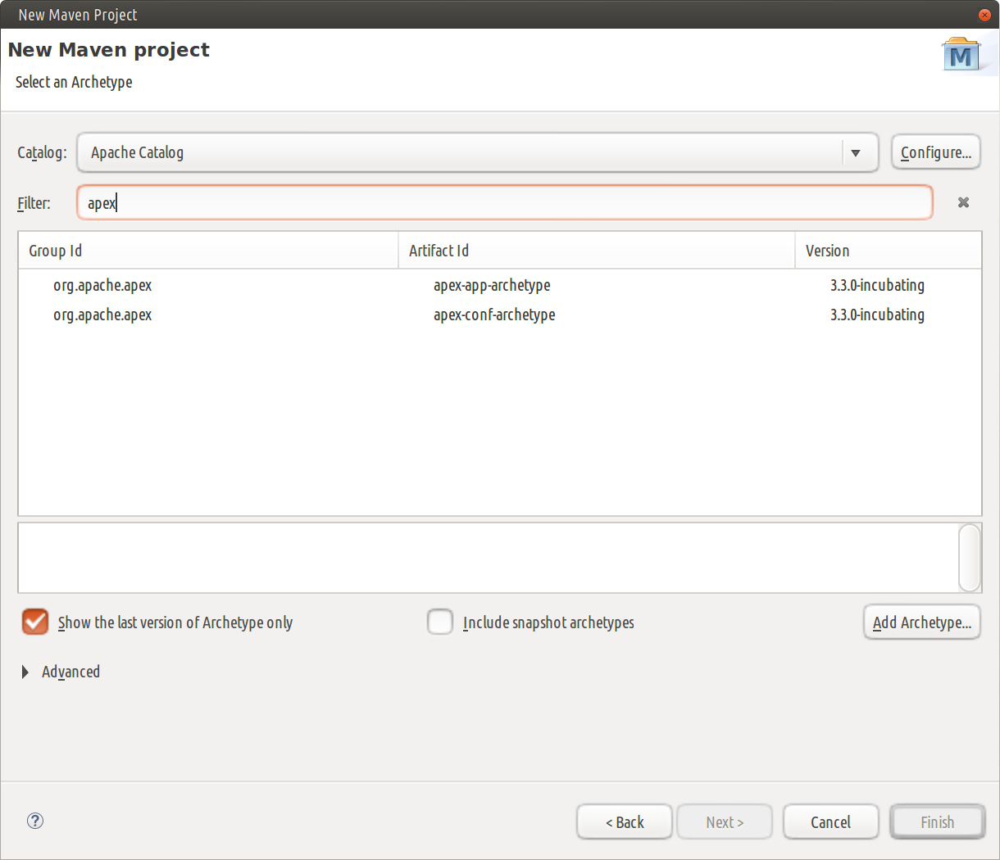

Creating a New Apache Apex Project with your IDE
===============

We describe the process for creating a new Apache Apex project for three
common IDEs: **IntelliJ IDEA**, **Eclipse** and **NetBeans**

## IntelliJ IDEA

The **IntelliJ IDEA** is available at <https://www.jetbrains.com/idea/>.

First make sure you have the _Maven Integration_ plugin enabled in the list at
_File_ &#x21e8;  Settings &#x21e8; _Plugins_.

Now, select _File_ &#x21e8; _New_ &#x21e8; _Project_. Choose `Maven` in the left pane
and check `Create from archetype` in the dialog box; at this point, you should be
able to expand the `org.apache.apex:apex-app-archetype` element in the center pane and
select a suitable version as shown below:

If the `org.apache.apex:apex-app-archetype` element in not present in the center pane,
you can click the `Add Archetype...` button and fill out the `Group ID`, `Artifact ID`,
and `Version` entries, (leave `Repository` blank), as shown below:

| Field          | Value              |
| -------------- | ------------------ |
|**Group ID**    | org.apache.apex    |
|**Artifact ID** | apex-app-archetype |
|**Version**     | 3.2.0-incubating (or any later version) |

Click `OK`. The archetype will appear in the list, selected. Note that this
`Add Archetype...` step is only required the first time you use the archetype; thereafter,
you can select the archetype directly.

Click `Next`, and fill out the rest of the required information. For example:

Click `Next`, and verify the information shown on the next screen (if you have a more
recent version of Maven installed, enter its home directory):

Click `Next`, and fill out the project name and location: 

Click `Finish`, and now you have created your own Apache Apex App Package
project, with a default unit test.  You can run the unit test, make code
changes or make dependency changes within the IDEA.

## Eclipse

The **Eclipse** IDE is downloadable from <https://eclipse.org/downloads/>.

Generate a new Maven archetype project as follows:

  * Open Eclipse.
  * Select _File_ &#x21e8; _New_ &#x21e8; _Project..._ &#x21e8;
    _Maven_ &#x21e8; _Maven Project_ and click _Next_.
    
  * Click _Next_ on the next dialog as well; you should now see a window
    where you can configure archetype catalogs:
    
  * From the _Catalog_ dropdown select a suitable remote catalog if one is present
    and enter `apex` in the _Filter_ input box; you should see one or more entries
    in the center pane with _Group Id_ of `org.apache.apex` and an _Artifact Id_
    of `apex-app-archetype`:
    
  * If a suitable remote catalog is not present, you'll need to add it by clicking
    the _Configure_ button to see a new dialog that shows a list of catalogs in
    the middle pane and a _Add Remote Catalog_ button on the right:
    
  * Click that button to get a dialog where you can enter details of a new
    catalog and enter `http://repo.maven.apache.org/maven2/archetype-catalog.xml`
    for the _Catalog File_ entry and suitable text (such as `Apache Catalog`)
    for the _Description_ entry:
    
  * In either case, you should now be able to select the `apex-app-archetype`
    entry, click _Next_ to see a window where you can enter details of the new
    project and enter values similar to those in the table below (you'll need
    to replace the default value `${archetypeVersion}` of _archetypeVersion_
    with a suitable concrete version number like `3.3.0-incubating`):
    

  <table>
  <colgroup>
  <col width="20%" />
  <col width="80%" />
  </colgroup>
  <tbody>
  <tr class="odd">
  <td align="left">
**Field**
</td>
  <td align="left">
**Value**
</td>
  </tr>
  <tr class="even">
  <td align="left">
Group ID
</td>
  <td align="left">
com.example
</td>
  </tr>
  <tr class="odd">
  <td align="left">
Artifact ID
</td>
  <td align="left">
TestApex
</td>
  </tr>
  <tr class="even">
  <td align="left">
Version
</td>
  <td align="left">
0.0.1-SNAPSHOT
</td>
  </tr>
  <tr class="odd">
  <td align="left">
Package
</td>
  <td align="left">
com.example.TestApex
</td>
  </tr>
  <tr class="even">
  <td align="left">
archetypeVersion
</td>
  <td align="left">
3.3.0-incubating
</td>
  </tr>
  </tbody>
  </table>

  * Click Finish; you should see the new project in your Package Explorer

## NetBeans

The **NetBeans** IDE is downloadable from <https://netbeans.org/downloads/>.

Generate a new Maven archetype project as follows:

  * Open NetBeans.
  * Click _File_ &#x21e8; _New Project_.
  * From the _Categories_ column select _Maven_ and from the _Projects_ column,
    select _Project from Archetype_, and click _Next_.
    

  * On the Maven Archetype window, type `apex` in the _Search_ box, and
     from the list of _Known Archetypes_, select `apex-app-archetype`.
     
  * Make sure that the values for the fields match the values shown in this
     table (except that the archetype version may be more recent):

  <table>
  <colgroup>
  <col width="20%" />
  <col width="80%" />
  </colgroup>
  <tbody>
  <tr class="odd">
  <td align="left">
**Field**
</td>
  <td align="left">
**Value**
</td>
  </tr>
  <tr class="even">
  <td align="left">
Group ID
</td>
  <td align="left">
org.apache.apex
</td>
  </tr>
  <tr class="odd">
  <td align="left">
Artifact ID
</td>
  <td align="left">
apex-app-archetype
</td>
  </tr>
  <tr class="even">
  <td align="left">
Version
</td>
  <td align="left">
3.3.0-incubating
</td>
  </tr>
  <tr class="odd">
  <td align="left">
Repository
</td>
  <td align="left">
/maven/content/repositories/releases
</td>
  </tr>
  </tbody>
  </table>

  *  Click Next.
  *  On the _Name and Location_ window, do the following:

      1. Enter a name for this project in the _Project Name_ box, for example,
        `TestApex`.
      2. Enter a location for this project in the _Project Location_ box, for
         example, `/home/dtadmin/NetBeansProjects`.
      3. Enter an ID in the _Group Id_ box, for example, `com.example`.
      4. Enter a version for this project in the _Version_ box, for example,
         `1.0-SNAPSHOT`.
      5. Enter the package name in the _Package_ box, for example,
          `com.example.testapex`.

    

  * Click Finish.

The project is generated at the specified location and should be visible in
the left panel with the name _My Apex Application_. You can right-click the
project and choose _Rename_ to provide a more descriptive name if you wish.

