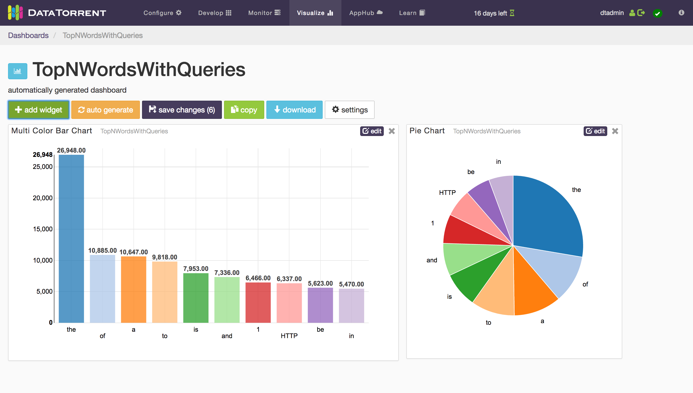

Creating Applications
=====================

Get started quickly by following the [Beginner's Guide](/beginner) and create your first Apache Apex application today!

Application Development Tutorials
=================================

Explore Apache Apex application development with one of the tutorial applications below.

* **[Top N Words](tutorials/topnwords.md)** is a complete guide to writing your first Apache Apex application using *Java* or *dtAssemble*

    

* [Sales Dimensions](tutorials/salesdimensions.md) is an introduction to assembling and visualizing sales analytics applicaiton with *dtAssemble*

    

Advanced Topics
===============

- **[Application Development](application_development.md)** - comprehensive guide to developing Apache Apex applications
- **[Application Packaging](application_packages.md)** - creating application packages, changing settings, and launching application packages
- **[Operator Development](operator_development.md)** - creating new operators for Apache Apex applications
- **[dtGateway REST API](dtgateway_api.md)** - complete listing of all services offered by dtGateway