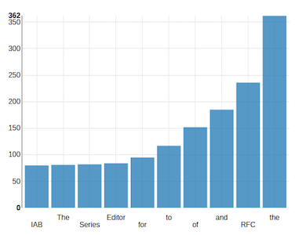

Getting Started
===============

Get started quickly by following one of these tutorials, and create your first Apache Apex application today!

## Top N Words

[Top N Words](tutorials/topnwords.md) is a complete guide to writing your first Apache Apex application using *Java* or *dtAssemble*

## Sales Dimensions

[Sales Dimensions](tutorials/sales_dimensions.md) is an introduction to assembling and visualizing sales analytics applicaiton with *dtAssemble*

----

Advanced Topics
===============

- **[Application Development](application_development.md)** - comprehensive guide to developing Apache Apex applications
- **[Application Packaging](application_packages.md)** - creating application packages, changing settings, and launching application packages
- **[Operator Development](operator_development.md)** - creating new operators for Apache Apex applications
- **[dtGateway REST API](dtgateway_api.md)** - complete listing of all services offered by dtGateway
