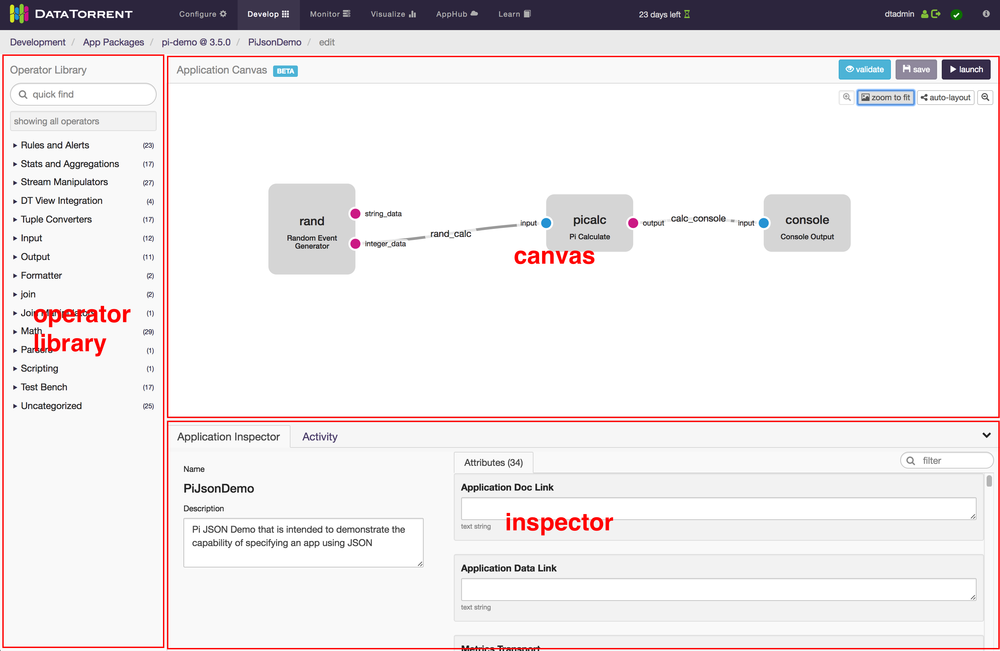
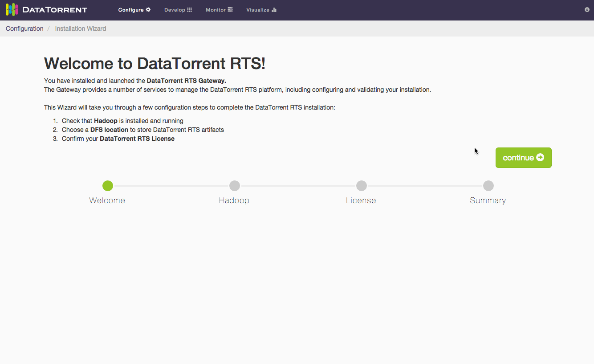
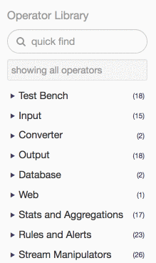
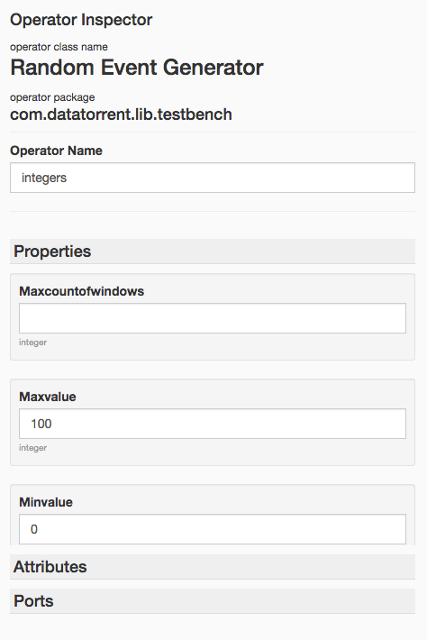

dtAssemble - Graphical Application Builder
================================================================================

## Overview

The dtAssemble Graphical Application  Builder is a UI tool that allows users to drag-and-drop operators onto a canvas and connect them together to build a DataTorrent application. 

## Accessing the Builder

To get to the App Builder, you must perform the following steps (illustrated by GIF):

1.  Create a DataTorrent Application Package
  To do this, read through the [Application Packages Guide](https://www.datatorrent.com/docs/guides/ApplicationPackages.html), which provides step-by-step instructions on how to do this.
2.  Upload it to HDFS using the Console
  Click on the [Develop](#/packages) link at the top of the DataTorrent Console, then click the “upload a package” button.
3.  Add a new application to your uploaded package
  Once your package has been uploaded, click on its name in the list of packages. Then click the “add new application” button.
4.  Drag operators onto the canvas
  Use the search field of the Operator Library panel on the left to find the operators that were found in your app package, then click and drag them out onto the “Application Canvas.”
5.  Configure the operators using the Operator Inspector
  When the operator is selected, the right side of the screen will have the Operator Inspector, where you will see some meta information about the operator as well as the interface to set initial values for operator properties and attributes.
6.  Connect the operators’ ports to form streams between operators
  Select a port by clicking on it. Ports that are compatible with the selected port will pulse green. Click and drag out a stream from one port and connect it with a compatible port of another operator.

## Using Application Builder

The Application Builder contains three main parts: the Operator Library Navigator, the Canvas, and the Inspector:

### Operator Library Navigator

Use this to quickly find and add operators that exist in the Application Package Jar. It groups operators by their Prepping Operators for the Application Builder&nbsp;section). You can search for operators using the input field at the top, which will look at the operators’ titles, descriptions, and keywords. Clicking on an operator will expand a window with more information regarding the operator.

Once you have found an operator you would like to add to your application canvas, simply click and drag it onto the canvas.

### 

### Canvas

The Application Canvas is the main area that you use to assemble applications with operators and streams. Specifically, you will be connecting output ports (shown as magenta) of some operators to input ports (shown as blue) of other operators. When you click on a port, other ports that are compatible with it will pulse green, indicating that a stream can connect the two. See the note on tuple types of ports in the Prepping Operators for the Application Builder&nbsp;section.

### 

### Inspector

The Inspector is visible when an operator, a port, or a stream is selected on the canvas. It will look different depending on what is selected.

#### Operator Inspector

When an operator is selected on the canvas, you will see the Operator Inspector on the right side. You will see the operator class name, the java package it is a part of, and a field with the name you have given to it. You will also be able to edit the initial values of the operator’s properties. 

#### Port Inspector

When a port is selected, you will see the Port Inspector on the right side. Here you can see the name of the port, the tuple type that it emits (for an output port) or accepts (for an input port). 

#### Stream Inspector

The stream inspector will appear when you have selected a stream in the canvas. You can use this to rename the stream or change the locality of the stream.

## Prepping Operators for the Application Builder

The way in which an operator shows up in the App Builder depends on how the operator is written in Java. In order to fully prep an operator so that it can be easily used in the App Builder, use the following guidelines:

1.  Operators must be a concrete class and must have a no-arg constructor
  This is actually a requirement that extends beyond app builder, but is noted here because operators that are abstract or that do not have a no-arg constructor will not appear in the Operator Library panel in the current version.
2.  Use javadoc annotations in the comment block above the class declaration statement:
  a.  @omitFromUI - Put this annotation if you do not want the operator to show up in the App Builder
  b.  @category - The high-level category that this operator should reside in. The value you put here is arbitrary; it will be placed in (or create a new) dropdown in the Operator Library Navigator on the left of the App Builder. You can have multiple categories per operator.
  c.  @tags - Space-separated list of “tags”; arbitrary strings of text that will be searchable via the Operator Library Navigator on the left of the App Builder. Tags work as filters. You can use them to enable search, project identification, etc.
  d.  @required - This is a future annotation to denote whether a property is required.

        /**
         * This is an example description of the operator It will be 
         * displayed in the app builder under the operator in the Operator 
         * Library Navigator.
         * @category Algo
         * @tags math sigma average avg
         */
        public class MyOperator extends BaseOperator { /* … */ }

3.  Every property's getter method should be preceded by a descriptive comment block that indicates what a property does, how to use it, common values, etc. This is not a must have, but very highly recommended

        /**
        * This is an example description of a property on an operator class.
        * It will be displayed in the app builder under the property name.
        * It is ok to make this long because the UI will only show the first
        * sentence or so and allow the user to expand/collapse the rest.
        */
        public String getMyProperty() { /* … */ }

4.  Utilize the @useSchema doclet annotation above properties’ getter in order to mark a property’s or subproperty’s.  
5.  When a property's type is not a primitive, wrapper class for a primitive, or a String, try to be as specific as possible with the type signature.
  For example, mark a property type as java.util.HashMap instead of java.util.Map, or, more generally, choose ConcreteSubClass over AbstractParentClassOrInterface. This will limit the assignable concrete types that the user of the app builder must choose from. For now, we only support property types that are public and either have a no-arg constructor themselves or their parent class does.
6.  Mark properties that should be hidden in the app builder with the @omitFromUI javadoc annotation in the javadoc comment block above the getter of the property. This is a critical part of what an operator developer decides to expose for customization.

        /**
         * This is an example description of a property on an operator class
         * WS
         */
        public String getMyProperty() { /* … */ }
7.  Make the tuple type of output ports strict and that of input ports liberal.
  The tuple type that an output port emits must be assignable to the tuple type of an input port in order for them to connect. In other words, the input port must either be the exact type or a parent type of the output port tuple type. Because of this, building operators with more specific output and less specific input will make them more reusable.

## App Builder Usage Examples

### Pi Demo

As an example, we will rebuild the basic Pi demo. Please note that this example is relatively contrived and is only meant to illustrate how to connect compatible ports of operators to create a new application. 

1.  First you will need to clone the malhar repository:

        git@github.com:DataTorrent/Malhar.git && cd Malhar

2.  Then, run maven install, which will create the App Package jar need to upload to your gateway.
3.  Follow steps 2,3, and 4 of the Accessing the App Builder section above, but with the app package jar located in Malhar/demos/pi/target/pi-demo-{VERSION}.apa.
5.  Add the Console Output&nbsp;operators.
7.  Connect the integer_data port of the Random Event Generator to the input port of the Pi Calculate operator, and connect the output port of the Pi Calculate operator to the input port of the Console Output operator.
9.  Click the “launch” button in the top left once it turns purple.
11.  In the resulting modal, click “Launch”, then the “View it on the Dashboard” link in the subsequent notification box.
13.  To see the output of the Console Output operator, navigate to the stdout log file viewer of the container where the operator is running.

