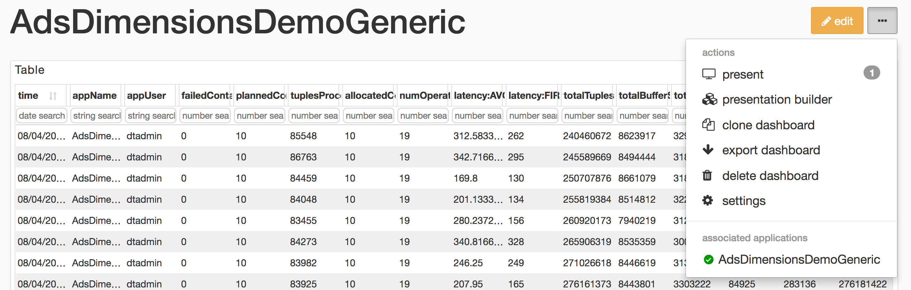
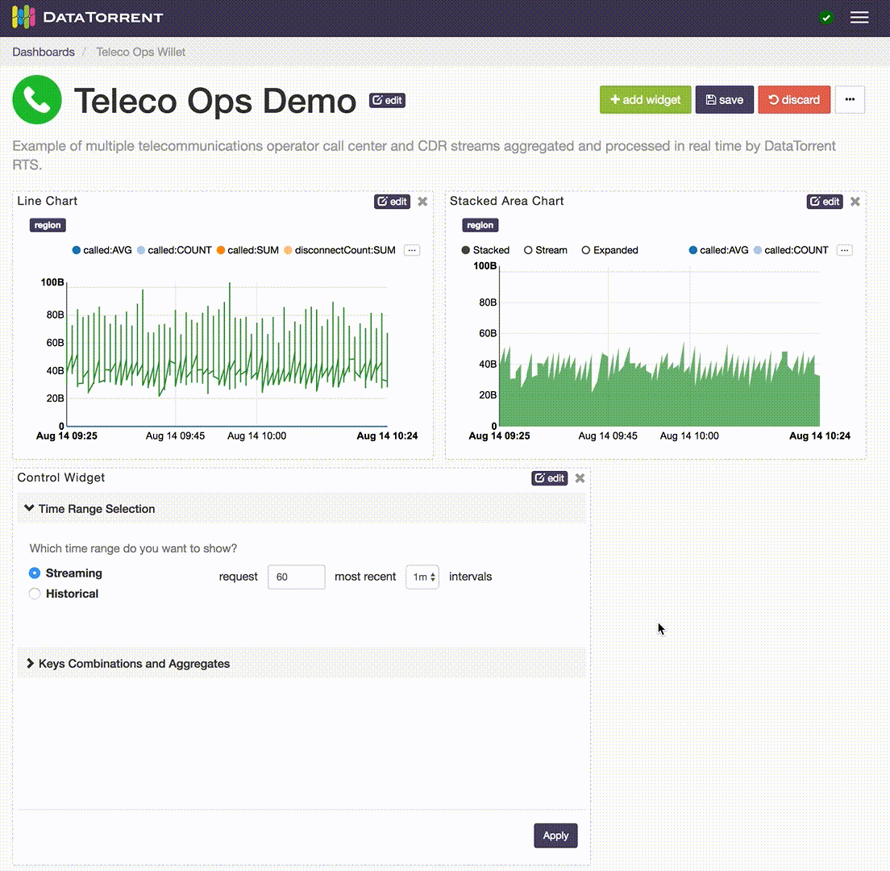
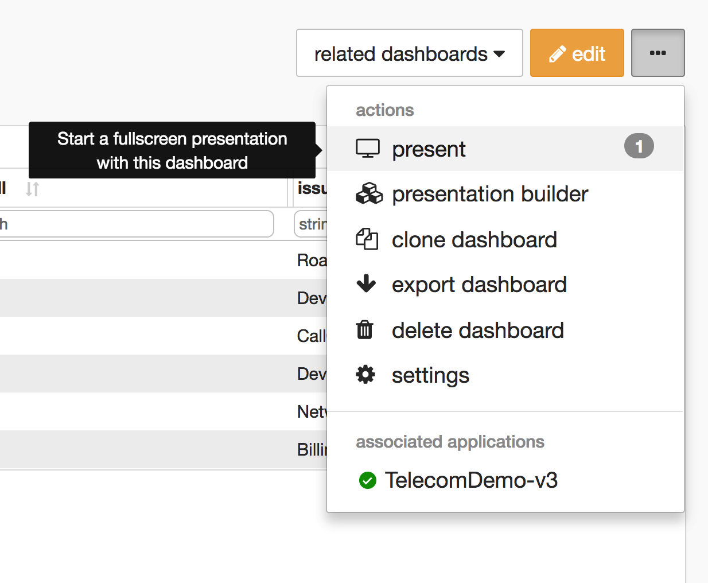

dtDashboard - Application Data Visualization
================================================================================

The App Data Framework collection of UI tools and operator APIs that allows DataTorrent developers to visualize the data flowing through their applications.  This guide assumes the reader’s basic knowledge on the DataTorrent RTS platform and the Console, and the concept of operators in streaming applications.

## Examples

### Twitter Example

The Twitter Hashtag Count Demo, shipped with DataTorrent RTS distribution, is a streaming application that utilizes the App Data Framework.  To demonstrate how the Application Data Framework works on a very high level, on the Application page in the Console, click on the **visualize** button next to the application name, and a dashboard for the Twitter Hashtag Count Demo will be created.  In it, you will see visualization of the top 10 hashtags computed in the application:

### Ads Dimension Example

The Ads Dimension Demo included in the DataTorrent RTS distribution also utilizes the App Data Framework.  The widgets for this application demonstrates more features than the Twitter one because you can issue your own queries to choose what data you want to visualize.  For example, one might want to visualize the running revenue and cost for advertiser “Starbucks” and publisher “Google”.

## Data Sources

A Data Source in the application consists of three operators.  The embedded Query Operator, the Data Source Operator and the Result Operator.  The Query Operator takes in queries from a message queue and passes them to the Data Source Operator.  The Data Source Operator processes the queries and sends the results to the Result Operator.  The Result Operator delivers the results to the message queue.  The Data Source Operator generally takes in data from other parts of the DAG.

To see how this is fit in our previous examples, below is the DAG for the Twitter Hashtag Demo:

The operators SnapshotServer (which includes embedded Query Operator) and QueryResult are the operators that serve the data being visualized in the Console.  The SnapshotServer operator takes in data from the TopCounter operator, processes incoming queries, and generates results. The Twitter Hashtag Demo application and all its operators are available in the Apache Malhar repository.

# Stats and Custom Metrics

Each application has statistics such as tuples processed per second, latency, and memory used.  Each operator in an application can contain custom metrics that are part of the application logic.  With the Application Data Framework, each application comes with Data Sources that provide historical and real-time application statistics and custom metrics data.  You can visualize these metrics the same way as custom Data Sources in an application.

# Data Visualization with Dashboards and Widgets

## Overview

DataTorrent Dashboards and Widgets are UI tools that allow users to quickly and easily visualize historical and real-time application data.  Below is an example of a visualization dashboard with Stacked Area Chart, Pie Chart, Multi Bar Chart, and Table widgets.

Dashboards are quick and easy to create, and can include data from a single or multiple applications on the same screen.  Widgets can be added, removed, rearranged, and resized at any time.  Each widget provides a unique way to visualizes the application data, and provides a number of ways to configure the content and the corresponding visualizations.

## Accessing Dashboards

Dashboards are accessible from Visualize section in the DataTorrent Console menu.

After selecting Visualize menu item, a list of available dashboards is displayed.  The list of available dashboards can be ordered or filtered by dashboard name, description, included applications, creating user, and modified timestamp.  Clicking one of the dashboard name links takes you to the selected dashboard.

An alternative way to access dashboards is from the Monitor section.  Navigate to one of the running applications, and if the application supports data visualization, using the **visualize** button will display a list of existing dashboards that are associated with the application.

Below is an example of accessing the data visualization dashboard from a running application.
You can also navigate back to the application from within the dashboard's menu.

## Creating Dashboards

There are two ways to create a new visualization dashboard

* **create new** button on the Dashboards screen
* **create new dashboard** option in the visualization menu of a compatible running DataTorrent application

Below is an illustrated example and a set of steps for creating a new dashboard from the Dashboards screen using the **create new** button

1.  Provide a unique dashboard name. Names are required to be unique for a single user.  Two different users can have a dashboard with the same name.

2.  Include optional dashboard description.  Descriptions help explain and provide context for visualizations presented in the dashboard to new users, and provide an additional way to search and filter dashboards in the list.

3.  Customize and save the dashboard.  Add, remove, resize, and customize the widgets.  Save the changes to preserve the current dashboard state.

Below is an illustrated example of creating a new dashboard with **create new dashboard** option in the visualization menu of a compatible running DataTorrent application.

1.  Locate visualize menu in the Application Summary section of a running application.  Only applications with compatible data visualization sources include visualize menu option.

2.  Choose to create new dashboard from the visualize menu drop-down list.  The new dashboard will be automatically named based on the application name and saved.

3.  Customize and save the dashboard.  Add, remove, resize, and customize the widgets.  Save the changes to preserve the current dashboard state.

## Dashboard Controls

Dashboards controls are presented as a set of buttons to the right of the dashboard title.

### View Mode

In view mode, you are not allowed to modify the layout or add/edit widgets, but certain actions
can be taken in the dashboard menu.

### Edit Mode

In edit mode, you can add/edit widgets, change the dashboard layout, and change dashboard settings.

### Dashboard Menu

The dashboard menu contains the rest of the dashboard functionality. The **actions** section is mostly self-explanatory, but see the *Presentation Mode* and *Presentation Builder* sections below for more information about presenting your dashboards. The **associated applications** section displays the status of applications associated to the current dashboard and serves as a quick way to jump to those applications. Associated applications are selected based on the data sources of your widgets.

*Note*: If an an associated application enters a non-running state (e.g. KILLED, INACTIVE), a warning icon will be displayed on the **dashboard menu** button.

### Dashboard Settings

The dashboard settings interface allows you to change the dashboard name, description, logo image, and [select replacement associated applications](#replacing-associated-applications).

It can be accessed from the [dashboard menu](#dashboard-menu) using the **settings** option.

### Replacing Associated Applications

Dashboards have widgets that rely on associated applications for data. These associated applications can be replaced in [dashboard settings](#dashboard-settings) if the replacement is compatible with the current dashboard.

The replacement application must have a compatible data source. Selecting an application with an incompatible data source will simply skip the replacement process for that application. If the data source matches, but the data schema is incompatible, the widget will attempt to reset its settings to match the new data schema.

When importing a dashboard, the interface tries its best to preselect the most compatible replacement application. Leaving fields blank means the replacement process for those applications will be skipped.

## Packaged Dashboards
### Auto Import When Launching An Application

Application packages may include packaged dashboards which can be imported. Application package developers may select some dashboards to be imported automatically when launching an application, and all packaged dashboards can be imported manually at any time from the Packaged Dashboards page.

When launching an application, the *Import Packaged Dashboards* section will appear if there are packaged dashboards. Use the checkboxes to select which dashboards to import. The dashboard name and replacement applications can be changed (see [replacing associated applications](#replacing-associated-applications)).

*Note*: Auto imports of packaged dashboards only happen if there isn't already an existing dashboard with the same name and owner. They can still be marked for import in the launch interface, but will have to be given a unique name.

### Import From A Running Application

If a running application has associated packaged dashboards, the packaged dashboards can be imported using the **visualize** button in *Application Overview*.

Clicking on a packaged dashboard in the dropdown will open an interface to change the dashboard name, description, logo image, and replacement applications before importing.

*Note*: See the [replacing associated applications](#replacing-associated-applications) section for an explanation about replacement applications.

Pressing the **import** button at the bottom of the interface imports the dashboard, and can then be accessed in the **Visualize** section.

### Import From Packaged Dashboards Page

For a list of all packaged dashboards across all your application packages, use the **import** button in the **Visualize** section.

The **import** button brings you to the following page where you can import or download individual packaged dashboards.

## Widgets Overview

Dashboard widgets receive and display data in real time from DataTorrent application data sources.  Widgets can be added, removed, rearranged, and resized at any time.  Each widget has a unique list of configurable properties, which include interactive elements displayed directly on the widget, as well as data query settings available from the widget settings.

## Adding Widgets

Widgets can be added to the dashboard by clicking the **add widget** button in edit mode, selecting one of the available data sources, selecting one or more widgets, and confirming selection by clicking add widget.

Each data source supports one or more data schema types, such as snapshot and dimensions.  Each schema type has a specific list of compatible widgets which can be selected to visualize the data.

Results are not persisted until you press the **save** button.

## Editing Widgets

Each widget has an dimensions, snapshot) and widget type (table, chart, text For snapshot schema, which represents a single point in time, the primary widget controls include

* label field selection
* quantity field selection
* sort order selection

Below is an example of changing label field and sort order for a bar chart widget.

For dimensions schema, which represents a series of points in time, with ability to configure dimensions based on key and value settings, the primary widget controls include

  *  Time ranges selection
  *  live streaming
  *  historical range
  *  Dimensions Selections
  *  key combinations and key values selection
  *  aggregate selection

For Notes widget, a text in Markdown format can be entered and should be translated to HTML look.  Below is an example of using Markdown syntax to produce headings, lists, and quoted text.

After making the widget settings changes, remember to use **save** button to persist the desired results.  If the resulting changes should not be saved, using the **discard** button will revert it to the the original state.

## Control Widget

Control widget can be used to configure settings of one or more widgets on the dashboard.  This is a convenient way to configure multiple widgets settings in one place.  It is also the only way to change widgets settings in presentation mode.  However, settings changes in presentation mode will not be saved.

### Controllable Widgets

The following widgets may be controlled by the Control Widget:

+ Dimensions Schema Data Source Widgets
    + Geo Choropleth
    + Geo Circles
    + Line Chart
    + Multi Bar Chart
    + Stacked Area Chart
+ Snapshot Schema Data Source Widgets
    + Bar Chart
    + Horizontal Bar Chart
    + Multi Color Bar Chart
    + Pie Chart

### Controllable Settings

The following settings may be controlled by the Control Widget:

+ Dimensions Schema Data Source Settings
    + Circle Size *(Geo Circle widget only)*
    + Color Intensity *(Geo Choropleth widget only)*
    + Geo Coordinates *(Geo Circle widget only)*
    + Keys Combinations and Aggregates
    + Time Range Selection
    + Tooltip Values *(Geo Choropleth and Circle widgets only)*
+ Snapshot Schema Data Source Settings
    + Field to use as label
    + Field to use as quantity
    + Sort order

### Adding Control Widget

Control Widget can be added just like any other widget.  See the [Adding Widgets](#adding-widgets) section for more details.

### Adding Widgets to Control

Click the edit button on the Control Widget to show the available widgets to control, and change the controllable widget selections.

The Cotnrol Widget does not allow selection of dimensional and snapshot schema widgets together. If users happen to choose widgets with both schema types, then the "OK" button remains disabled until only one schema type is selected.

The control widget allows selection of widgets with different data sources. Users are warned that some setting sections in the control widget may be disabled if the schemas are incompatible.

When widgets to be controlled have incompatible schemas, the incompatible sections remain disabled until mismatched widgets are removed in the control widget settings.  This issue can also be resolved if the widgets with incompatible schemas are removed from the dashboard.

### Examples of Control Widget in Action

Changing the time range selection for the line and stacked area charts.

Changing dimensional keys and aggregates.

Changing the sorting option.

Changing the geo circle settings.

Changing the geo choropleth settings in presentation mode.

## Presentation Mode

Dashboards can be viewed in a fullscreen mode with main navigation elements removed.

You can access the Presentation Mode from the dashboard menu:

*Note*: To share your presentation, share the URL while inside Presentation Mode.

## Presentation Builder

The Presentation Builder can be used to create a presentation with multiple dashboards.
The dashboard you launch the Presentation Builder from is the *home dashboard*, which means
that dashboard will serve as the starting point of your presentation. To start the presentation,
just enter Presentation Mode from the home dashboard.

