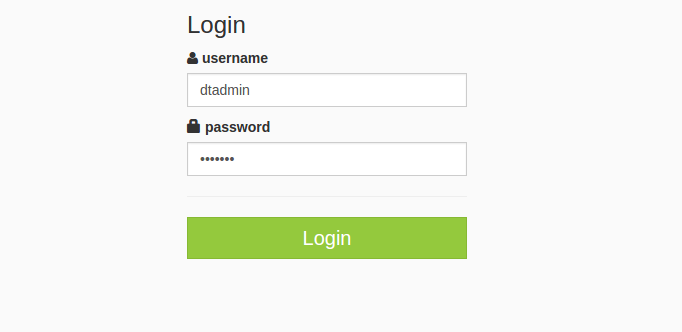
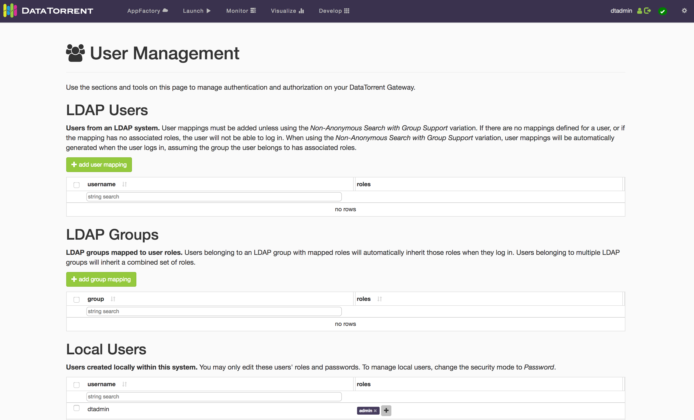
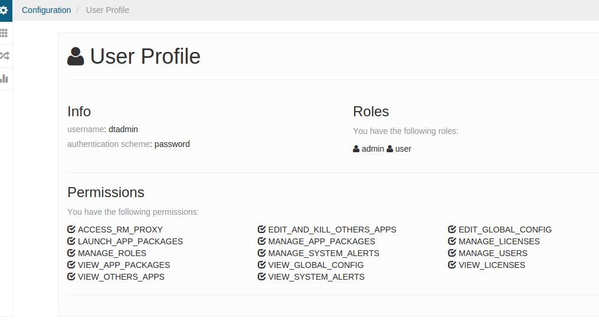
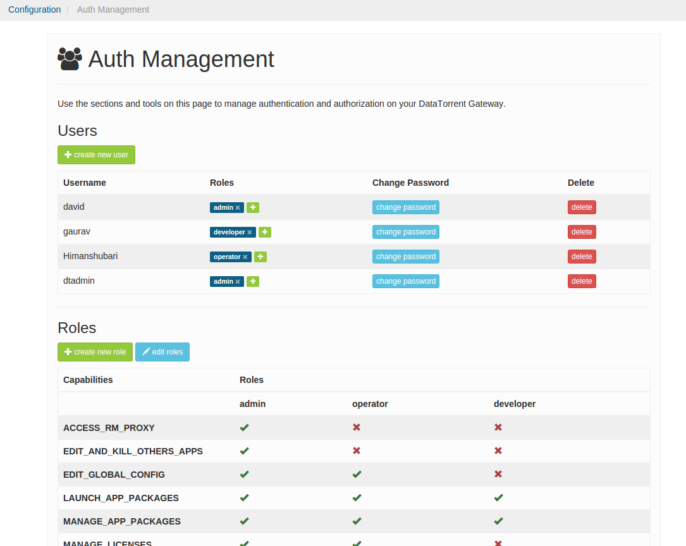

# DataTorrent Gateway Security

DataTorrent Gateway is a service that provides the backend functionality
for the DataTorrent UI Console and processes the web service requests from it. The service provides real-time information about running applications, allows changes to applications, launches new applications among various other operations. Refer to [dtGateway](dtgateway.md) for details on the Gateway service and [dtManage](dtmanage.md) for the UI Console.

Broadly security in Gateway can be classified into two categories, frontend security and backend security. Frontend security deals with access to Gateway service which mainly involves securing the web service calls. This includes aspects such as user authentication and authorization. The backend security deals with security aspects when Gateway is communicating with a secure Hadoop infrastructure.

After installation of DataTorrent RTS both these aspects can be configured manually as described in the following sections although work is being done to enable this configuration in the UI Console during installation itself and post installation.

## Kerberos Secure Mode

Kerberos is the de-facto authentication mechanism supported in Hadoop. When secure mode is enabled in Hadoop, requests from clients to Hadoop are authenticated using Kerberos. In this mode Gateway service needs Kerberos credentials to communicate with Hadoop. The credentials should match the user that the DT Gateway service is running under.

In a multi-user installation DT Gateway is typically running as
user `dtadmin` and the Kerberos credentials specified should be for this
user. They are specified in the `dt-site.xml` configuration file located in the config folder under the installation which is typically `/opt/datatorrent/current/conf` ( or `~/datatorrent/current/conf` for local install). For a single user installation where gateway is running as the user, the Kerberos credentials will be the user’s credentials.

The snippet below shows how the credentials can be specified in the
configuration file.

```xml
<property>
        <name>dt.gateway.authentication.principal</name>
        <value>kerberos-principal-of-gateway-user</value>
</property>
<property>
        <name>dt.gateway.authentication.keytab</name>
        <value>absolute-path-to-keytab-file</value>
</property>
```

### Long running applications

In secure mode, long running applications have additional requirements. Refer to the Token Refresh section in the Apache Apex security [document](https://apex.apache.org/docs/apex/security/).

## Authentication

DataTorrent Gateway has support for authentication and when it is configured users have to authenticate before they can access the UI Console. Various authentication mechanisms are supported and this gives enterprises the flexibility to extend their existing authentication mechanism already in use within the enterprise to Gateway. It also supports roles, mapping of groups or roles from the external authentication mechanism to roles and supports role based authorization.

The different authentication mechanisms supported by Gateway are

-   [Password Authentication](#password-authentication)
-   [LDAP Authentication](#ldap-authentication)
-   [Kerberos Authentication](#kerberos-authentication)
-   [JAAS Authentication](#jaas-authentication) for Active Directory, PAM, etc

JAAS is a extensible authentication framework that supports different types of authentication mechanisms by plugging in an appropriate module.

### Password Authentication

Password security is simple to set up and is ideal for a small to medium set of users. It comes with role-based access control, so users can be assigned roles, and roles can be assigned granular permissions (see [User Management](dtmanage/#user-management)). This is the only authentication mechanism available that does not depend on any external systems. The users will be managed locally by the Gateway. When enabled, all users will be presented with the login prompt before being able to use the DT Console.

To set up password security, on the [Security Configuration](dtmanage/#security-configuration) page select **Password** from the *Authentication Type* dropdown, and save. Allow the Gateway to restart.


When the Gateway has restarted, you should be prompted for username and password. Log in as the default admin user **dtadmin** with password **dtadmin**.



Once authenticated, active username and an option to log out is presented in the top right corner of the DT Console screen.


Additional users and roles can be created and managed on the [User Management](#user-management) page.

*Note*: Don't forget to change your **dtadmin** user's password!

#### Password Authentication via dt-site.xml

Password authentication can alternatively be configured outside the Console by performing following two steps:

1.  Add a property to `dt-site.xml` configuration file, typically located
    under `/opt/datatorrent/current/conf` ( or `~/datatorrent/current/conf` for local install).

        <configuration>
        ...
        	<property>
            <name>dt.gateway.http.authentication.type</name>
            <value>password</value>
        	</property>
        ...
        </configuration>

2.  Restart the Gateway. If running Gateway in local mode use `dtgateway restart` instead.

        sudo service dtgateway restart


### LDAP Authentication

LDAP is a directory based authentication mechanism used in many enterprises. If your organization uses LDAP for authentication, the LDAP security option is ideal for giving your existing users access to RTS, with the role-based access control and group mapping features.

There are four variations for configuring LDAP authentication:

  * **Identity**
    * Provide the parent DN of your users and _specify the RDN attribute of users_.
    * Users will authenticate using their RDN attribute value as their username.
  * **Anonymous & User Search Filter**
    * Provide the parent DN of your users and _specify a search filter to identify users_.
    * Users will authenticate using an appropriate username that matches the parameters defined in the search filter.
  * **Identity and Anonymous Search**
    * Provide the parent DN of your users, _specify the RDN attribute of users, and a search filter_.
    * Users will authenticate using their RDN attribute value as their username, as well as the parameters defined in the search filter.
  * **Non-Anonymous Search with Group Support**
    * Provide basic DN info for users, DN and password of a user able to perform a non-anonymous search, and optional group support info.
    * With _group support disabled_, users need to be added in User Management before logging in. Users authenticate with their RDN attribute value as their username.
    * With _group support enabled_, users do not have to be added in User Management before logging in. Users authenticate with their RDN attribute value as their username. They will be assigned roles mapped to their LDAP group. For example, user Peter is part of GroupA (admin) and GroupB (developer, operator); Peter will be assigned roles admin, developer, and operator upon login.

When group support is not configured, users must be assigned a role before they are able to log in. This means users can be restricted from logging in (blacklisted) by removing all of their roles.

*Note*: If migrating from *Password* mode, the existing users will be carried over as "local users" and can still login as if in *Password* mode. It is recommended to keep only the **dtadmin** user and delete the rest. This is because local users cannot be added or deleted once *LDAP* mode is activated.


After setting up LDAP in the Security Configuration page, the **LDAP Users** section will appear in the User Management page. If you have group support enabled, the **LDAP Groups** section will also appear. Existing users (carried over from *Password* mode), will be placed in the **Local Users** sections. Local users cannot be added or deleted in LDAP mode, but their roles and passwords can be modified.



To configure LDAP via dt-site.xml, check out the [JAAS Authentication - LDAP](#ldap) section below.


### Kerberos Authentication

Kerberos authentication can optionally be enabled for Hadoop web access.
When configured, all web browser access to Hadoop management consoles are Kerberos authenticated. Web services are also Kerberos authenticated. This authentication is performed using a protocol called SPNEGO which is Kerberos over HTTP.
Please refer to the administration guide of your Hadoop distribution on
how to enable this. The web browsers must also support SPNEGO, most
modern browsers do and should be configured to use SPNEGO for the
specific URLs being accessed. Please refer to the documentation of the
individual browsers on how to configure this. Gateway handles the SPNEGO
authentication needed when communicating with the Hadoop web-services if
Kerberos authentication is enabled for Hadoop web access.

Kerberos authentication can be enabled for UI Console as well. When it
is enabled access to the Gateway web-services is Kerberos authenticated.
The browser should be configured for SPNEGO authentication when
accessing the Console. A user typically obtains a master ticket first by logging in to kerberos system in a terminal emulator using kinit. Then, user launches a browser to access the Console URL. The browser
will use the master ticket obtained by kinit earlier to obtain the
necessary security tokens to authenticate with the Gateway.

When this authentication is enabled the first authenticated user that
accesses the system is assigned the admin role as there are no other
users in the system at this point. Any subsequent authenticated user
that access the system starts with no roles. The admin user can then
assign roles to these users. This behavior can be changed by configuring
an external role mapping. Please refer to the [External Role Mapping](#ExternalRoleMapping) in the [Authorization using external roles](#authorization-using-external-roles) section below for that.

Additional configuration is needed to enable Kerberos authentication for
the Console. A separate set of kerberos credentials are needed. These
can be same as the Hadoop web-service Kerberos credentials which are
typically identified with the principal HTTP/HOST@DOMAIN. A few other
configuration properties are also needed. These can be specified in the
same “dt-site.xml” configuration file as the DT Gateway authentication
configuration described in the Operation and Installation Guide. This
authentication can be set up using the following steps.

1.  Add the following properties to `dt-site.xml` configuration file, typically located under `/opt/datatorrent/current/conf` ( or `~/datatorrent/current/conf` for local install)

        <configuration>
        ...
          <property>
            <name>dt.gateway.http.authentication.type</name>
            <value>kerberos</value>
          </property>
          <property>
            <name>dt.gateway.http.authentication.kerberos.principal</name>
            <value>{kerberos-principal-of-web-service}</value>
          </property>
          <property>
            <name>dt.gateway.http.authentication.kerberos.keytab</name>
            <value>{absolute-path-to-keytab-file}</value>
          </property>
          <property>
            <name>dt.gateway.http.authentication.token.validity</name>
            <value>{authentication-token-validity-in-seconds}</value>
          </property>
          <property>
            <name>dt.gateway.http.authentication.cookie.domain</name>
            <value>{http-cookie-domain-for-authentication-token}</value>
          <property>
            <name>dt.gateway.http.authentication.cookie.path</name>
            <value>{http-cookie-path}</value>
          </property>
          <property>
            <name>dt.gateway.http.authentication.signature.secret</name>
            <value>{absolute-path-of-secret-file-for-signing-authentication-tokens} </value>
          </property>
        </configuration>

	Note that the kerberos principal for web service should begin with
	HTTP/…  All the values for the properties above except for the property
	`dt.gateway.http.authentication.type` should be replaced with the
	appropriate values for your setup.

2.  Restart the Gateway by running

	```sudo service dtgateway restart```
	( when running Gateway in local mode use  `dtgateway restart` command)

### JAAS Authentication

JAAS or Java Authentication and Authorization Service is a pluggable
and extensible mechanism for authentication. It is an authentication framework
where the actual authentication is performed by a JAAS login module plugin which can be configured using a configuration file. 

The general configuration steps for enabling any JAAS based authentication mechanism is described below. Subsequent sections will cover the specific configuration details for LDAP, Active Directory and PAM. However JAAS is not limited to just these three mechanisms. Any other JAAS compatible mechanism can be used by specifying the appropriate module in the configuration. Also if there isn't a JAAS module available for an authentication mechanism a new one can be developed using the JAAS API and used here.

Below are the general steps for configuring a JAAS authentication mechanism

1.  Add the following properties to `dt-site.xml` configuration file, typically located under `/opt/datatorrent/current/conf` (or `~/datatorrent/current/conf` for local install).

        <configuration>
        	...
          <property>
              <name>dt.gateway.http.authentication.type</name>
              <value>jaas</value>
          </property>
          <property>
              <name>dt.gateway.http.authentication.jaas.name</name>
              <value>name-of-jaas-module</value>
          </property>
        	...
        </configuration>

	The `dt.gateway.http.authentication.jaas.name` property specifies the login module to use with JAAS and the next step explains the process for configuring it.
	
2.	 If the login module requires a custom callback handler it needs to be specified. What a callback handler is and how it can be specified is described in the next section [Callback Handlers](#callback-handlers).

3.  The name of the login module specified above should be configured
    with the appropriate settings for the plugin. This is module
    specific configuration. This can be done in a file named
    .java.login.config in the home directory of the user Gateway is
    running under. If DataTorrent RTS was installed as a superuser,
    Gateway would typically run as dtadmin and this file path would
    typically be `/home/dtadmin/.java.login.config`, if running as a
    regular user it would be `~/.java.login.config`. The sample
    configurations for LDAP and PAM are shown in the next sections.
    
4.  The classes for the login module may need to be made available to
    Gateway if they are not available in the default classpath. This can
    be done by specifying the jars containing these classes in a
    classpath variable that is used by Gateway.

	The following step shows how to do this

	a.  Edit the `custom-env.sh` configuration file, typically located under
	    `/opt/datatorrent/current/conf` ( or `~/datatorrent/current/conf` for
	    local install) and append the list of jars obtained above to the
	    DT_CLASSPATH variable. This needs to be added at the end of the
	    file in the section for specifying local overrides to environment
	    variables. The line would look like

	  `export DT_CLASSPATH=${DT_CLASSPATH}:path/to/jar1:path/to/jar2:..`

5.  Restart the Gateway by running

	`sudo service dtgateway restart`
	(when running Gateway in local mode use  `dtgateway restart` command)
	
Similar to Kerberos when this authentication is enabled the first
authenticated user that accesses the system is assigned the admin role
as there are no other users in the system at this point. Any subsequent
authenticated user that access the system starts with no roles. The
admin user can then assign roles to these users. This behavior can be
changed by configuring an external role mapping. Please refer to the
[External Role Mapping](#ExternalRoleMapping) in the [Authorization using external roles](#authorization-using-external-roles) section below for that.	
#### Callback Handlers

In JAAS authentication, a login module may need a custom callback to be
handled by the caller. These callbacks are typically used to provide
authentication credentials to the login module. DataTorrent RTS provides a default callback handler that handles the common callbacks but it may
not be sufficient for all login modules like in the Active Directory case described below.

RTS also supports specification of a custom callback handler to handle custom callbacks of a login module. The custom callback handler can be specified using the property ```dt.gateway.http.authentication.jaas.callback.class.name``` and when this property is not specified the default callback handler is used. The property can be specified in the `dt-site.xml` configuration file and as follows

```
<configuration>
	...
	<property> 
    		<name>dt.gateway.http.authentication.jaas.callback.class.name</name>
		<value>full-class-name-of-callback</value>
	</property>
	...
</configuration>
```

Custom callback handlers can be implemented by extending the default callback handler so they get the support for the common callbacks or they can be implemented from scratch. The Jetty callback handler described below also extends the default callback handler. The default callback handler implementation is implemented in the ```com.datatorrent.lib.security.auth.callback.DefaultCallbackHandler``` class available in ```com.datatorrent:dt-library``` artifact.

#### LDAP

An alternative way to enable LDAP authentication, instead of [LDAP Authentication](#ldap-authentication) section above, is to follow the JAAS configuration steps described above with the following specific details for the individual steps.

-   For step 1 of the JAAS authentication [configuration process](#enabling-jaas-auth), pick a name for the JAAS module for LDAP. You can choose a name like ```ldap``` that is appropriate for the current scheme. This can be done by specifying the value of the ```dt.gateway.http.authentication.jaas.name``` property to be ```ldap```. This name should now be configured with the appropriate settings as described in the next step.

-   For step 2, no special callback handler needs to be specified as the default callback handler can handle the callbacks.

-   For step 3, the JAAS name specified above should be configured in the .java.login.config file with the appropriate LDAP settings. There are different JAAS authentication modules available for LDAP. One of them is supplied by default in Java. It is the Sun LdapLoginModule class. A sample configuration when using this module is shown below

        ldap {
          com.sun.security.auth.module.LdapLoginModule required
          userProvider="ldap://ldap-server-hostname"
          authIdentity="uid={USERNAME},ou=users,dc=domain,dc=com";
        };
             
	Note that the first string before the open brace, in this case
```ldap``` must match the jaas name specified in step 1. The first property
```com.sun.security.auth.module.LdapLoginModule``` specifies
the actual JAAS plugin implementation class providing the LDAP
authentication. The fields that appear next are LDAP settings specific to your
organization and could be different from ones shown above. The above
settings are only provided as a reference example.
        
    The setting ```authIdentity``` is used to derive the identity of the user that will be used for authentication with the server. Here it is specifying the pattern to derive the LDAP distinguished name (dn) for the user that will be used along with the password supplied by the user for authentication with the LDAP server. The ```{USERNAME}``` variable in the setting will be replaced by the username specified by the user. 
    
    Refer to the [javadoc](https://docs.oracle.com/javase/7/docs/jre/api/security/jaas/spec/com/sun/security/auth/module/LdapLoginModule.html) for all the configuration options available with this module.
        
-	For step 4, no extra jars are needed as the module is available in Java

-  Restart the gateway as described in step 5

#### Active Directory

Active Directory is used when authenting users in Microsoft Windows domains. The authentication protocol includes Microsoft's implementation of Kerberos as well as LDAP. In this section we will look into the configuration needed for LDAP authentication with Active Directory.

Follow the JAAS configuration steps described above with the following specific details.

- 	For step 1 of the JAAS authentication [configuration process](#enabling-jaas-auth), pick a name for the JAAS module. You can choose a name like ```ad``` that is appropriate for the current scheme. This can be done by specifying the value of the ```dt.gateway.http.authentication.jaas.name``` property to be ```ad```. This name should now be configured with the appropriate settings as described in the next step.
    
- 	For step 2, no special callback handler needs to be specified as the default callback handler can handle the callbacks. 

-  For step 3, the JAAS name specified above should be configured with
   the appropriate Active Directory settings in the .java.login.config file. 
    
    In active directory authentication the user id is typically specified as ```username@domain``` and sometimes just ```username```. Once the user is authenticated the user id needs to be mapped to the LDAP node for the user. This is done by specifying a search filter criteria which is then used to search for the user node in the directory tree starting from a specified base.
    
    Below is an example showing a sample configuration for active directory authentication with the Sun LdapLoginModule

        ad {
        	com.sun.security.auth.module.LdapLoginModule required
        	userProvider="ldap://ad.server.com/cn=users,dc=domain,dc=com"
        	userFilter="samAccountName={USERNAME}"
        	authIdentity="{USERNAME}@my.domain.com";
        };
        
    The setting ```userFilter``` specifies the search criteria to look for the user in the Active Directory tree. The ```{USERNAME}``` variable in the setting is replaced with the username supplied by the user. The setting ```authIdentity``` specifies the pattern to derive the user id with the domain from the specified username.
    
    The search filter can have more complex logical expressions like the one shown below
    
		userFilter="(&(|(samAccountName={USERNAME})(userPrincipalName={USERNAME})(cn={USERNAME}))(objectClass=user))"
		
	An Active Directory or a LDAP browser client can be used to browse the Active Directory to determine the correct filter to use find the users.
	
-	For step 4, no extra jars are needed as the module is available in Java

-  Restart the gateway as described in step 5
	
#### Jetty module & binding
	
Sometimes a single ```authIdentity``` pattern like the one used above cannot be used to identity the users because of the way they are configured in the Active Directory, for an enterprise. An example is the case where multiple domains are being used and a single domain name cannot be specified in the ```authIdentity```. 

In those cases a fixed identity called the root identity or a system identity is used to connect to the server. Then the user node is searched with the search criteria and supplied username, from the node the user directory name is extracted and it is used along with the supplied password for the authentication.

A different JAAS login module that supports the system identity is needed as the Sun LdapLoginModule does not support this functionality. Jetty implements one such login module. The steps to configure this module are as follows.

- 	For step 1 of the JAAS authentication [configuration process](#enabling-jaas-auth), the name ```ad``` can be used.

- 	For step 2, a special callback handler is needed to handle the Jetty module callbacks as they are not the common callbacks. There is an implementation of the callback handler for Jetty that is provided by DataTorrent RTS. It is the ```com.datatorrent.contrib.security.jetty.JettyJAASCallbackHandler``` class in the ```com.datatorrent:dt-contrib``` artifact.

	As explained in the [Callback Handlers](#callback-handlers) section above, the callback handler can be specified in the ```dt-site.xml``` config file using a property as shown below
		
		<configuration>
			...
			<property> 
        		<name>
        			dt.gateway.http.authentication.jaas.callback.class.name
			</name>
        		<value>
        			com.datatorrent.contrib.security.jetty.JettyJAASCallbackHandler
        		</value>
			</property>
			...  
		</configuration>

-  For step 3, the configuration for the Jetty module is specified in the ```.java.login.config``` file. A sample configuration for this module is shown below

        ad {
			org.eclipse.jetty.plus.jaas.spi.LdapLoginModule required
    		contextFactory="com.sun.jndi.ldap.LdapCtxFactory"
    		hostname="ad.server.com"
			port="389"
    		bindDn="serviceId@my.domain.com"
    	 	bindPassword="Password1"
    		forceBindingLogin="true"
			userBaseDn="DC=my,DC=domain,DC=com"
    		userIdAttribute="samAccountName"
    		userObjectClass="person";
        };
        
	The property ```org.eclipse.jetty.plus.jaas.spi.LdapLoginModule``` specifies
the actual JAAS plugin implementation class providing the LDAP authentication. The properties ```bindDn``` and ```bindPassword``` specify the directory name and password for the system identity respectively. The ```userIdAttribute``` and ```userObjectClass``` settings are used as search criteria to search for the user directory node under the ```userBaseDn``` path in the directory.

	Refer to the [javadoc](http://archive.eclipse.org/jetty/8.1.10.v20130312/apidocs/org/eclipse/jetty/plus/jaas/spi/LdapLoginModule.html) for all the configuration options available with this module.

-  The Gateway service in DataTorrent RTS 3.0 is compatible with Jetty 8. The Jetty login module in this version is in the ```jetty-plus``` jar. The following version ```jetty-plus-8.1.10.v20130312.jar``` is known to work but other compatible versions should work as well. The jar file can be obtained from the Jetty project or from [maven central](https://maven-repository.com/artifact/org.eclipse.jetty/jetty-plus/8.1.10.v20130312). 

	Along with the jetty jar the dt-contrib jar containing the callback handler and it's dependencies should also be included. It is available on the DataTorrent maven server [here](https://www.datatorrent.com/maven/content/repositories/releases/com/datatorrent/dt-contrib/).  Pick the version matching the DataTorrent RTS version you are using. The dt-contrib artifact has a dependency to ```com.datatorrent:dt-library``` artifact. It is also available on the maven server [here](https://www.datatorrent.com/maven/content/repositories/releases/com/datatorrent/dt-library/).
	
	The jars can be specified in the gateway script file described in step 4 above as follows

		export DT_CLASSPATH=${DT_CLASSPATH}:path/to/jetty-plus-8.1.10.v20130312.jar:path/to/dt-contrib-<version>.jar:path/to/dt-library-<version>.jar

-  Restart the gateway as described in step 5
		
### PAM

PAM (Pluggable Authentication Module) is a Linux system equivalent
of JAAS where applications call the generic PAM interface and the actual
authentication implementations called PAM modules are specified using
configuration files. PAM is the login authentication mechanism in Linux
so it can be used for example to authenticate and use local Linux user
accounts in Gateway. If organizations have configured other PAM modules, 
they can be used in Gateway as well.

PAM is implemented in C language and has a C API. JPam is a Java PAM bridge
that uses JNI to interface with PAM. It is available at
[JPAM website](http://jpam.sourceforge.net/) and the website also has detailed documentation on how to install and set it up. JPam has a JAAS login module and hence can be used in Gateway via JAAS. Note that any other PAM implementation can be used as long as a JAAS login module is available.

To enable JPAM follow the JAAS configuration steps described above with the following specific details.

-   JPAM has to be first installed on the system. Please follow the
    installation instructions from the JPAM website.

-   For step 1 of the JAAS authentication [configuration process](#enabling-jaas-auth), pick a name for the JPAM authentication module. You can choose a  name like ```net-sf-jpam``` which JPAM typically uses as the PAM configuration name. This can be done by specifying the value of the ```dt.gateway.http.authentication.jaas.name``` property to be ```net-sf-jpam```. This name should now be configured with the appropriate settings as described in the next step.

-	 For step 2, no special callback handler needs to be specified as the default callback handler can handle the callbacks 

-   For step 3, the JAAS name specified above should be configured in the .java.login.config file with the appropriate JPAM settings . A
    sample configuration is shown below

        net-sf-jpam {
           net.sf.jpam.jaas.JpamLoginModule required serviceName="net-sf-jpam";
        };

Note that the first string before the open brace, in this case,
```net-sf-jpam``` must match the jaas name specified in step 1. The first
property within the braces net.sf.jpam.jaas.JpamLoginModule specifies
the actual JAAS plugin implementation class providing the JPAM
authentication. The next settings are JPAM related settings. The setting ```serviceName``` specifies the PAM service which would need to be further configured in /etc/pam.d/net-sf-jpam to specify the PAM modules to use. Refer to PAM documentation on how to configure a PAM service with PAM modules. If using Linux local accounts system-auth could be specified as the PAM module in this file. The above settings are only provided as a reference example and a different name can be chosen for ```serviceName```.

-   For step 4, add the JPam jar to the DT_CLASSPATH variable. The JPam
    jar should be available in the JPam installation package and
    typically has the filename format ```JPam-<version>.jar``` where
   ```<version>``` denotes the version, version 1.1 has been tested.

        export DT_CLASSPATH=${DT_CLASSPATH}:path/to/JPam-<version>.jar
        
-  Restart the gateway as described in step 5 above    

### Group Support

For group support such as using LDAP groups for authorization refer to
the [Authorization using external roles](#authorization-using-external-roles) section below.

## Hadoop user mapping

When authentication is enabled, applications are launched on the Hadoop cluster, by default, as the user matching the user name of the authenticated user. This mapping behavior, to select the user to use on the Hadoop side, is configurable and different options are available. To configure the behavior use the following setting

```xml
<property>
  <name>dt.gateway.hadoop.user.strategy</name>
  <value>STRATEGY</value>
</property>
```

The `STRATEGY` in the property above identifies the mapping behavior and the following options are available

### Authenticated user

To specify this behavior, use `AUTH_USER` as the value for `STRATEGY`. As explained earlier, this leads to applications being launched with the same user name as the authenticated user. This is the default behavior even when the property is not specified.

In Kerberos secure mode, DT Gateway would still connect to Hadoop by using its Kerberos credentials, namely credentials of the user the DT Gateway service is running under (default `dtadmin`) but impersonate the authenticated user, to launch the application. This impersonation requires additional configuration on Hadoop side and it is explained in the Hadoop Configuration sub-section under the Impersonation section in the Apache Apex security [document](https://apex.apache.org/docs/apex/security/).

### Gateway user

To specify this behavior, use `GATEWAY_USER` as the value for `STRATEGY`. In this mode, the Hadoop user is the same as the DT Gateway service user (default `dtadmin`) and no impersonation is necessary.

### Specified user

To specify this behavior, use `SPECIFIED_USER` as the value for `STRATEGY`. In this mode, a specific user name can be specified for the Hadoop user and it is used no matter who the authenticated user is. The Hadoop user name is specified by an additional property

```xml
<property>
  <name>dt.gateway.hadoop.user.name</name>
  <value>username</value>
</property>
```

The impersonation behavior described in the [Authenticated user](#authenticated-user) section above applies here as well and so do the requirements mentioned there.

## Authorization

When any authentication method is enabled, authorization will also be
enabled.  DT Gateway uses roles and permissions for authorization.
 Permissions are possession of the authority to perform certain actions,
e.g. to launch apps, or to add users.  Roles have a collection of
permissions and individual users are assigned to one or more roles.
 What roles the user is in dictates what permissions the user has.

### Permissions

The list of all possible permissions in the DT Gateway is as follow:

#### ACCESS_RM_PROXY

Allow HTTP proxying requests to YARN’s Resource Manager REST API

#### EDIT_GLOBAL_CONFIG

Edit global settings

#### EDIT_OTHER_USERS_CONFIG

Edit other users’ settings

#### LAUNCH_APPS

Launch Apps
#### MANAGE_LICENSES

Manage DataTorrent RTS licenses

#### MANAGE_OTHER_USERS_APPS

Manage (e.g. edit, kill, etc) applications launched by other users

#### MANAGE_OTHER_USERS_APP_PACKAGES

Manage App Packages uploaded by other users  

#### MANAGE_ROLES

Manage roles (create/delete roles, or assign permissions to roles)

#### MANAGE_SYSTEM_ALERTS

Manage system alerts

#### MANAGE_USERS

Manage users (create/delete users, change password)

#### UPLOAD_APP_PACKAGES

Upload App Packages and use the app builder

#### VIEW_GLOBAL_CONFIG

View global settings   

#### VIEW_LICENSES

View DataTorrent RTS licenses

#### VIEW_OTHER_USERS_APPS

View applications launched by others

#### VIEW_OTHER_USERS_APP_PACKAGES

View App Packages uploaded by other users

#### VIEW_OTHER_USERS_CONFIG

Edit other users’ settings

#### VIEW_SYSTEM_ALERTS

View system alerts

### Default Roles

DataTorrent RTS ships with three roles by default. The permissions for
these roles have been set accordingly but can be customized if needed.

#### Admin

An administrator of DataTorrent RTS is intended to be able to install,
manage & modify DataTorrent RTS as well as all the applications running
on it. They have ALL the permissions.

#### Operator

Operators are intended to ensure DataTorrent RTS and the applications
running on top of it are always up and running optimally. The default
permissions assigned to Operators, enable them to effectively
troubleshoot the entire RTS system and the applications running on it.
Operators are not allowed however to develop or launch new applications.
Operators are also not allowed to make system configuration changes or
manage users.


Here is the list of default permissions given to operators

[MANAGE_SYSTEM_ALERTS](#ManageSystemAlerts)

[VIEW_GLOBAL_CONFIG](#ViewGlobalConfig)

[VIEW_LICENSES](#ViewLicenses)

[VIEW_OTHER_USERS_APPS](#ViewOtherUsersApps)

[VIEW_OTHER_USERS_APP_PACKAGES](#ViewOtherUsersAppPackage)

[VIEW_SYSTEM_ALERTS](#ViewSystemAlerts)

Note that VIEW_OTHER_USERS_APPS and VIEW_OTHER_USERS_APP_PACKAGES
are in the list.  This means all users in the “operator” role will have
read access to all apps and all app packages in the system.  You can
remove those permissions from the “operator” role using the Console if
this is not desirable.  

#### Developer
Developers need to have to ability to develop, manage and run
applications on DataTorrent RTS. They are not allowed to change any
system settings or manage licenses.

Here is the list of default permissions given to developers

[LAUNCH_APPS](#LaunchApps)

[UPLOAD_APP_PACKAGES](#UploadAppPackages)

[MANAGE_SYSTEM_ALERTS](#ManageSystemAlerts)

[VIEW_GLOBAL_CONFIG](#ViewGlobalConfig)

[VIEW_LICENSES](#ViewLicenses)

[VIEW_SYSTEM_ALERTS](#ViewSystemAlerts)

### App Permissions and App Package Permissions

Users can share their running application instances and their
application packages with certain roles or certain users on a
per-instance or per-package basis.  Users can specify which users or
while roles have read-only or read-write access.  In addition, users can
set their own defaults so they does not have to make permission change
every time they launch an app or uploads an app package.

The default for app and app package sharing is that the “operator” role
has read-only permission.

The Console does not yet support managing App
Permissions or App Package Permissions.  But one can manage App
Permissions and App Package Permissions using the Gateway REST API with
URI’s /ws/v2/apps/{appid}/permissions and
/ws/v2/appPackages/{user}/{name}/permissions respectively.  Please refer
to the [DT Gateway REST API document](http://docs.datatorrent.com/dtgateway_api/) and [here](#AdministeringUsingCommandLine) for examples on how to use the REST API.


## Viewing and Managing Auth in the Console

### Viewing User Profile

After you are logged in on the Console, click on the Configuration tab
on the left, and select “User Profile”.  This gives you the information
of the logged in user, including what roles the user is in, and what
permissions the user has.


### Administering Auth

From the Configuration tab, click on “Auth Management”.  On this page,
you can perform the following tasks:

-   Create new users
-   Delete users
-   Change existing users’ passwords
-   Assign roles to users
-   Create roles
-   Assign permissions to roles



DataTorrent RTS installation comes with three preset roles (admin,
operator, and developer).  You can edit the permissions for those roles
except for admin.

## Authorization using external roles 

When using an external authentication mechanism such as Kerberos or
JAAS, roles defined in these external systems can be used to control
authorization in DataTorrent RTS. There are two steps involved. First
support for external roles has to be configured in Gateway. This is
described below in the sections [Kerberos roles](#kerberos-roles) and
[JAAS roles](#jaas-roles). Then a mapping should be specified between
the external roles and DataTorrent roles to specify which role should be
used for a user when the user logs in. How to setup this mapping is
described in the [External Role Mapping](#ExternalRoleMapping) section below.
When this mapping is setup only users with roles that have a mapping are
allowed to login the rest are not. The next sections describe how to
configure the system for handling external roles.

### Kerberos roles

When Kerberos authentication is used the role for the user is derived
from the principal. If the principal is of the form *user/group@DOMAIN*
the group portion is used as the external role and no additional
configuration is necessary.

### JAAS roles

To use JAAS roles the system should be configured first to recognize
these roles. When a user is authenticated with JAAS a list of principals
is returned for the user by the JAAS plugin login module. If the module supports roles then some of these principals are for roles and these role principals need to be identified from the list. Additional configuration is needed to do
this and it is specific to the login module implementation. Specifically the Java class name identifying the role principal is needed. This can be specified using the *dt.gateway.http.authentication.jaas.role.class.name* property in the ```dt-site.xml``` configuration file as shown below

```
<configuration>
	...
  	<property>
   		<name>dt.gateway.http.authentication.jaas.role.class.name</name>
  		<value>full-class-name-of-role</value>
 	</property>
	...
</configuration>
```

#### LDAP Groups

When using LDAP with JAAS, to utilize the LDAP roles, a LDAP login module supporting roles should be used. Any LDAP module that supports roles can be used. Jetty login module has support for roles. Refer to [Jetty module & binding](#jetty-module-binding) section above for more details about this module. The configuration steps are as follows.

-  The Jetty login module returns the roles in role principal classes. The class name identifying the role is ```org.eclipse.jetty.plus.jaas.JAASRole```. This should be specified using the ```dt.gateway.http.authentication.jaas.role.class.name``` property in the ```dt-site.xml``` configuration file as described in the section above. 

	Also as described in the [Jetty module & binding](#jetty-module-binding) section a custom callback handler is needed for the Jetty login module.
	
	A sample configuration file with all the properties is shown below

        <configuration>
        ...
          <property>
                  <name>dt.gateway.http.authentication.type</name>
                  <value>jaas</value>
          </property>
          <property>
                 <name>dt.gateway.http.authentication.jaas.name</name>
                 <value>ldap</value>
          </property>
          <property>  
                <name>dt.gateway.http.authentication.jaas.role.class.name</name>
                <value>org.eclipse.jetty.plus.jaas.JAASRole</value>
          </property>
          </property>
    			<name>
        				dt.gateway.http.authentication.jaas.callback.class.name
				</name>
    			<value>
        			com.datatorrent.contrib.security.jetty.JettyJAASCallbackHandler
    			</value>
          </property>
        ...
        </configuration>

-  If the system identity is used then the Jetty login module can be used as is and the jar dependencies in the step below can be specified as described in the [Jetty module & binding](#jetty-module-binding) section. 

	However, if system identity is not used something different needs to be done. An issue was discovered with the Jetty login module supplied with Jetty 8 that prevented LDAP authentication to be successful even when the user credentials were correct. DataTorrent has a fix for this and is providing the login module with the fix in a separate package called ```dt-auth```. The class name for the module is ```com.datatorrent.auth.jetty.JettyLdapLoginModule```. The ```dt-auth``` project along with the source can be found here [Auth](https://github.com/DataTorrent/Auth). DataTorrent is working on submitting this fix back to Jetty project so that it gets back into the main source.

	The JAAS configuration file as described in [LDAP](#LDAP) section under [Enabling JAAS Auth](#JAAS) should be configured to specify the ldap settings for roles. A sample configuration containing role settings for the ```dt-auth``` login module is shown below. 
	
        ldap {
	    	com.datatorrent.auth.jetty.JettyLdapLoginModule required
        	hostname="ldap-server-hostname" port="389"
			authenticationMethod="simple" 
			userBaseDn="ou=users,dc=domain,dc=com" userIdAttribute="uid"
        	userRdnAttribute="uid" roleBaseDn="ou=groups,dc=domain,dc=com"
        	roleNameAttribute="cn"
        	contextFactory="com.sun.jndi.ldap.LdapCtxFactory";
        };
        
    The ```roleNameAttribute``` and ```roleBaseDn``` settings are used to identify the role and the ```userRdnAttribute``` setting is used the identify the users that belong to the role. The values for these settings are dependent on attributes names are being used in your LDAP directory server.
        
	Similar configuration can be used when the original Jetty login module is being used with the system id, the module class would be Jetty login module class and the binding settings would be specified as described in the [Jetty module & binding](#jetty-module-binding) section.
	
    Refer to the [javadoc](http://archive.eclipse.org/jetty/8.1.10.v20130312/apidocs/org/eclipse/jetty/plus/jaas/spi/LdapLoginModule.html) for the role and other configuration options available with this module.
    
- 	If the Jetty login module is being used as is then the path specification instructions described in the [Jetty module & binding](#jetty-module-binding) section can be used. 

	If the login module containing the DataTorrent fix, dt-auth, is being used then it's jar along with the Jetty module dependencies containing the role class, the dt-contrib jar containing the custom callback handler along with its dependencies should all be made available for Gateway. The jars can be obtained from the [DataTorrent Auth](https://github.com/DataTorrent/Auth) project.

  	Please follow the instructions in the above url to obtain the project jar files. After obtaining the jar files they can be specified in the gateway script file as
  	
    `export DT_CLASSPATH=${DT_CLASSPATH}:path/to/jar1:path/to/jar2:..`

- Restart the Gateway as described earlier

### External Role Mapping

External role mapping is specified to map the external roles to the
DataTorrent roles. For example users from an LDAP group called admins
should have the admin role when using the Console. This can be specified
by doing the following steps

1.  In the configuration folder typically located under
    `/opt/datatorrent/current/conf` ( or `~/datatorrent/current/conf` for
    local install) edit the file called external-roles or create the
    file if it not already present. In this file each line contains a
    mapping from an external role to a datatorrent role separated by a
    delimiter ‘:’ An example listing is

        admins:admin
        staff:developer

    This maps the external role admins to the DataTorrent role admin and
    external role staff to the DataTorrent role developer.

2. Restart the Gateway as described earlier

## Administering Using Command Line 

You can also utilize the [dtGateway REST API](dtgateway_api.md) (under /ws/v2/auth) to add or remove users and to change roles and passwords.
 Here are the examples with password authentication.

### Log in as admin:

    % curl -c ~/cookie-jar -XPOST -H "Content-Type: application/json" -d '{"userName":"admin","password":"admin"}' http://localhost:9090/ws/v2/login

This curl command logs in as user “admin” (with the default password
“admin”) and stores the cookie in ~/cookie-jar

### Changing the admin password:

    % curl -b ~/cookie-jar -XPOST -H "Content-Type: application/json" -d '{"newPassword":"xyz"}' http://localhost:9090/ws/v2/auth/users/admin

This uses the “admin” credential from the cookie jar to change the password to “xyz” for user “admin”.

### Adding a second admin user:

    % curl -b ~/cookie-jar -XPUT -H "Content-Type: application/json" -d '{"password":"abc","roles": [ "admin" ] }' http://localhost:9090/ws/v2/auth/users/john

This command adds a user “john” with password “abc” with admin access.

### Adding a user in the developer role:

    % curl -b \~/cookie-jar -XPUT -H "Content-Type: application/json" -d '{"password":"abc","roles": ["developer"] (http://localhost:9090/ws/v1/login) }' http://localhost:9090/ws/v2/auth/users/jane

This command adds a user “jane” with password “abc” with the developer role.

### Listing all users:

    % curl -b ~/cookie-jar http://localhost:9090/ws/v2/auth/users

### Getting info for a specific user:

    % curl -b ~/cookie-jar http://localhost:9090/ws/v2/auth/users/john

This command returns the information about the user “john”.

### Removing a user:

    % curl -b ~/cookie-jar -XDELETE http://localhost:9090/ws/v2/auth/users/jane

This command removes the user “jane”.

## Setting up SSL Keystore in Gateway

An SSL keystore is needed for your gateway to enable HTTPS in the gateway and to configure SMTP with password authentication. SMTP configuration is needed for the gateway to 
send email alerts as described in [System Alerts](dtgateway_systemalerts.md). 

Follow the steps below to set up the keystore.

1. Generate an SSL keystore if you don’t have one.  Instruction on how to generate an SSL keystore is here: [http://docs.oracle.com/cd/E19509-01/820-3503/ggfen/index.html](http://docs.oracle.com/cd/E19509-01/820-3503/ggfen/index.html).
Note down the keystore password and full path of the keystore that you need to provide in the next step.

2. Add two properties to `dt-site.xml` configuration file, typically located under `/opt/datatorrent/current/conf` (or `~/datatorrent/current/conf` for local install).

        <configuration>
        ...
          <property>
            <!-- this is the full path to the SSL keystore you created -->
              <name>dt.gateway.sslKeystorePath</name>
              <value>{/path/to/keystore}</value>
          </property>
          <property>
            <!-- this is the keystore password -->
              <name>dt.gateway.sslKeystorePassword</name>
              <value>{keystore-password}</value>
          </property>
        ...
        </configuration>

3. Perform any additional steps required for "Enabling HTTPS" or "SMTP Password Encryption" use-case as described below.

4. Restart the Gateway by running

        sudo service dtgateway restart

    (when running Gateway in local mode use `dtgateway restart` command)

### Enabling HTTPS in Gateway

To enable HTTPS in the Gateway after setting up the keystore as described above, you have to add the following
property to the `dt-site.xml` configuration file

        <configuration>
        ...
          <property>
            <name>dt.attr.GATEWAY_USE_SSL</name>
            <value>true</value>
          </property>
        ...
        </configuration>

### Setting up a Key for SMTP Password Encryption

Add another key to the keystore created above using the instructions mentioned in [http://docs.oracle.com/cd/E19509-01/820-3503/ggfen/index.html](http://docs.oracle.com/cd/E19509-01/820-3503/ggfen/index.html). For example:

```
keytool -genkey -alias smtpenc-alias -keyalg RSA -keypass <key password> -storepass <store password> -keystore gwkeystore.jks
```

Note down the alias you used for the key (smtpenc-alias in the above command). Remember to use the same key password and 
store password as the ones you used in the previous command where you created the keystore.

Add the following property to `dt-site.xml` to indicate the alias to be used for SMTP Password Encryption:

        <configuration>
        ...
         <property>
           <name>dt.gateway.ssl.alias.password.encryption</name>
           <value>smtpenc-alias</value>
         </property>
        ...
        </configuration>
