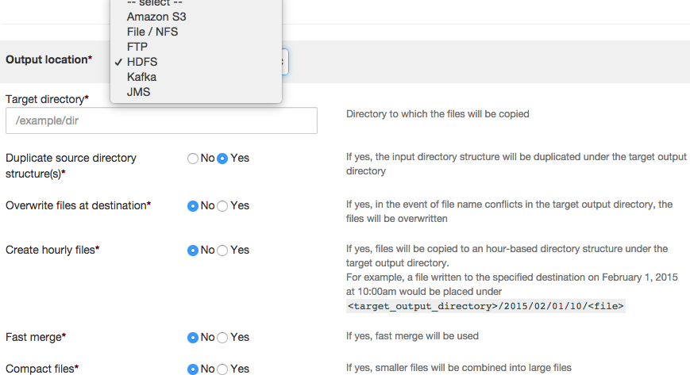
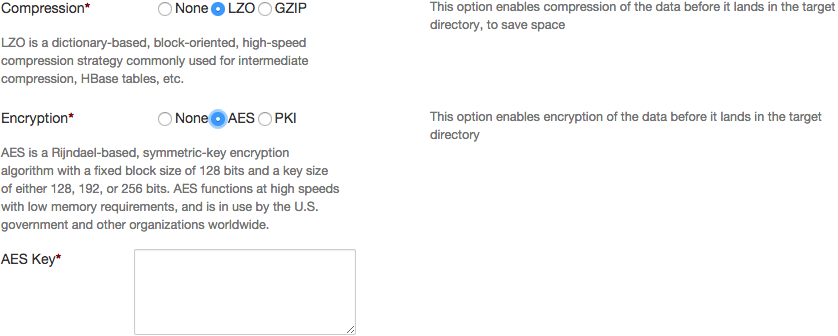

**dtIngest** - Unified Streaming & Batch Data Ingestion for Hadoop
================================================================================

The Hadoop data lake is only as good as the data in the lake. Given the variety of data sources that need to pump data into Hadoop, customers often need to set-up one-off data ingestion jobs. These one-off jobs copy files using FTP & NFS mounts or try to use standalone tools like ‘distCP’ to move data in and out of hadoop. Since these jobs stitch together multiple tools, they encounter several problems around manageability, failure recovery, ability to scale to handle data skews. The DataTorrent data ingestion & distribution application is 

## Key Features 

DataTorrent dtIngest makes configuring and running Hadoop data ingestion and data extraction a point-and-click process and includes enterprise-grade features not available in the market today:
 
*  **Apache 2.0 open-source Project Apex based** – Built on [Project Apex](https://www.datatorrent.com/project-apex/), dtIngest is a native YARN application. It is completely fault tolerant so unlike other tools like distCP, it can ‘resume’ file ingest on failure. It is horizontally scalable and support extremely high throughput and low latency data ingest.
*  **Simple to use & manage** – A point-and-click application user interface makes it easy to configure, save & launch multiple data ingestion & distribution pipelines. Centralized management, visibility, monitoring and summary logs
*  **Batch as well as stream data** -  dtIngest supports moving data between NFS, (S)FTP, HDFS, AWS S3n, Kafka and JMS so you can use one platform to exchange data across multiple endpoints.
*  **HDFS small file ingest using ‘compaction’** –  Configurable automatic compaction of small files into large files during ingest into HDFS. Helps prevent running out of HDFS namenode namespace
*  **Secure and efficient data movement** – Supports compression and encryption during ingest. Works with kerberos enabled secure Hadoop clusters.
*  **Runs in any Hadoop 2.0 Cluster** -  [Certified](https://www.datatorrent.com/product/supported-hadoop-distributions/) to run across all major Hadoop distros in physical, virtual or in the cloud deployments.


## Sample Use Cases for dtIngest

* Bulk as well as incremental data loading of large as well as small files into Hadoop
* Distributing cleansed/normalized data from Hadoop
* Ingesting change data from Kafka/JMS into Hadoop
* Selectively replicating data from one Hadoop cluster to another
* Ingest streaming event data into hadoop
* Replaying log data stored in HDFS as Kafka/JMS streams


## Using dtIngest

1.  dtIngest is free to use with all three DataTorrent [editions](https://www.datatorrent.com/product/edition-overview/) It is available under the application package named ‘dtIngest’
2.  Navigate the the ‘Develop’ tab ‘Launch’ to launch a new ingestion application
3.  dtIngest is designed to move data between any of the supported data sources & destinations. Just pick & configure the ones you need. Also, when moving data from file based sources, you can choose for the pipeline to run ‘one time’ or to continuously poll the input directories to look for files that match the filtering criteria

    

4.  When copying data to ‘file’ based destinations several useful options are available. These include being able to keep source directory structure, overwrite files on destination & automatically creating a hourly directory structure to track when data was written at the output. 

    

5. Before saving the data into the destination location, it can be compressed as well as encrypted.

    

6. When ingesting data into HDFS, small files can be combined into ‘large’ files to help work around the namenode namespace restrictions.  

    

7. After configuring the ingestion application hit the ‘Launch’ button to launch the ingestion application. All the requisite connectors like Kafka, JMS, HDFS etc. will be automatically instantiated and the right operators for compression, encryption etc will be inserted into the application to generate the ‘DAG’.  
The screenshot below shows sample of a DAG that is generated to read files from FTP and ingest them into HDFS

    

8. Once the application is launched, you can navigate the the ‘Monitor’ tab and find your application instance in the list. Clicking on the application instance will give you complete visibility into the metrics of the application. 
9. Summary logs from the application will be available under the ‘summary’ folder in the HDFS directory dedicated for the application. On the sandbox, you can substitute the ```<user-id>``` with ```dtadmin```

        /user/<user-ID>/datatorrents/apps/APP_ID/summary


