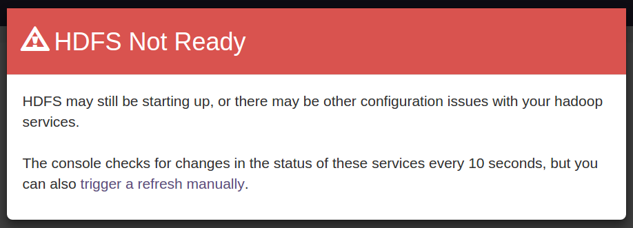
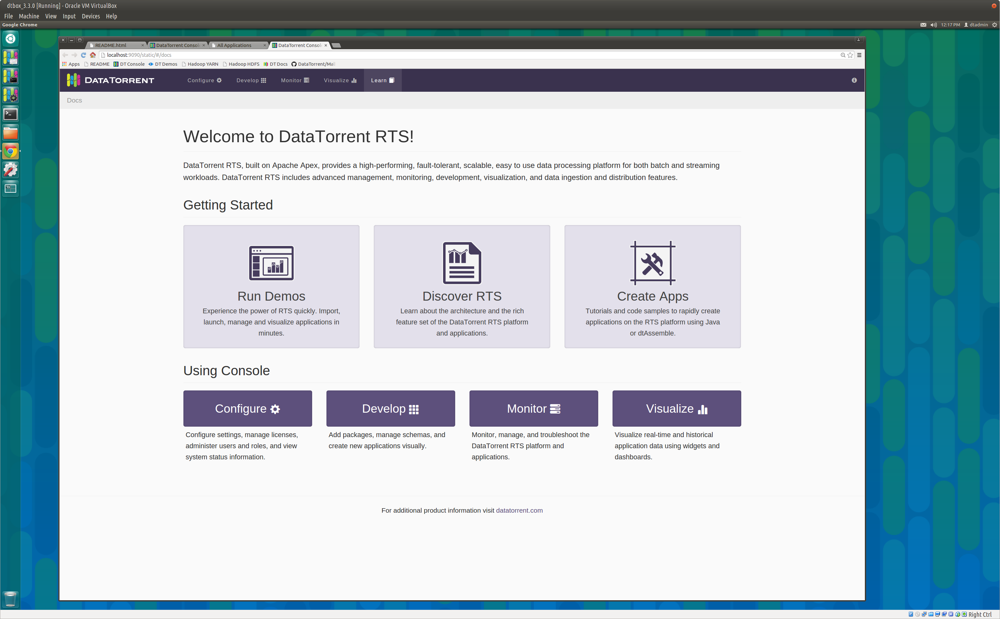

DataTorrent RTS Sandbox
================================================================================

The DataTorrent Sandbox provides a quick and simple way to experience
DataTorrent RTS without setting up and managing a complete Hadoop cluster.
The Sandbox has the latest version of DataTorrent RTS Enterprise Edition
pre-installed along with all the Hadoop services required to launch and run
the included demo applications.

Installation
--------------------------------------------------------------------------------

You'll need to install Virtual Box in order to run the sandbox.
Oracle VirtualBox is a virtual machine manager (version 4.3 or later)
and can be downloaded from [VirtualBox](https://www.virtualbox.org/wiki/Downloads).

Download the sandbox from
[datatorrent.com/download](https://www.datatorrent.com/download/) and import it
into Virtual Box. Then select the newly imported image in the left pane of the
Virtual Box console and click the `Start` button to
start the sandbox virtual machine. When the machine comes up, you should see a
browser window showing a login dialog which is discussed in the next section.

Accessing Console
--------------------------------------------------------------------------------

When accessing DataTorrent console in the sandbox for the first time, you will be required to log in.  Use username **dtadmin** and password **dtadmin**.  Same credentials are also valid for sandbox system access.

If the various HDFS services are not yet ready, you may see a red warning saying
HDFS is not ready like this:

This warning should disappear after a few minutes and the console should appear
looking something like this:

If the warning persists after several minutes, check that all required services
are running as described in the _Service Management_ section below.
Please go to [Troubleshooting](troubleshooting.md) for detailed instructions.

Inside the DataTorrent RTS Sandbox console can be accessed by opening a browser and visiting <a href="http://localhost:9090/" target="\_blank">http://localhost:9090/</a>

Configuring the Sandbox
--------------------------------------------------------------------------------
The sandbox is configured with 6GB RAM; if your development machine has 16GB or
more, you can increase the sandbox RAM to 8GB or more using the VirtualBox
console. This will yield better performance and support larger applications.

Additionally, you can change the network adapter from **NAT** to
**Bridged Adapter**; this will allow you to login to the sandbox from your
host as well as transfer files back and forth using _ssh_ and _scp_ on Linux
or _ssh_ tools like **PuTTY** and **pscp** on Windows.

A simpler option for sharing files is to mount a shared folder from the host
on the guest; this may be the only option in some environments where the
sandbox is unable to acquire a separate IP address from DHCP. See, for example,
<http://www.htpcbeginner.com/mount-virtualbox-shared-folder-on-ubuntu-linux/> or
<http://www.htpcbeginner.com/setup-virtualbox-shared-folders-linux-windows/>.

Of course all such configuration must be done when when the sandbox is not running.

Running Demo Applications
--------------------------------------------------------------------------------

Once authenticated, you can continue to [Demo Applications](demos.md) section to learn how to import, launch, and run demo applications.

Service Management 
--------------------------------------------------------------------------------

The sandbox automatically launches the following services on startup.

* Hadoop HDFS NameNode
* Hadoop HDFS DataNode
* Hadoop YARN ResourceManager
* Hadoop YARN NodeManager
* DataTorrent Gateway

Depending on the host machine capabilities, these may take from several seconds to several minutes to start up.  Until Hadoop services are active and ready, it is normal to see the warning message described above.

If the warning persists after several minutes, check the status of each of these
following services: you can do that with a shell script like this:

    #!/bin/bash
    services='hadoop-hdfs-namenode hadoop-hdfs-datanode hadoop-yarn-resourcemanager hadoop-yarn-nodemanager dtgateway'
    for s in $services; do
        sudo service "$s" status
    done

If any of these services are not running, you can start them by running a similar
script but with `status` replaced by `start`.

Support
--------------------------------------------------------------------------------

If you experience issues while experimenting with the sandbox, or have any feedback and comments, please let us know, and we will be happy to help!  Contact us using one of the methods listed on [datatorrent.com/contact](https://www.datatorrent.com/contact/) page.
