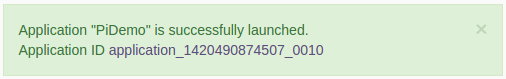
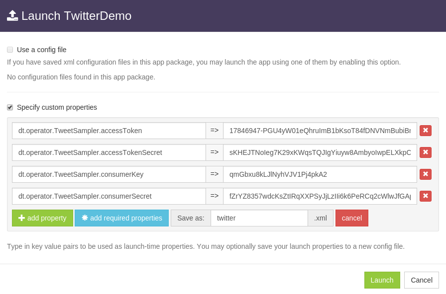

DataTorrent RTS Sandbox
================================================================================

The sandbox provides an interactive introduction to the DataTorrent real-time streaming platform.  For additional information about DataTorrent please visit https://www.datatorrent.com/

By default, this sandbox is designed to run with 6 GB of RAM. Consider reducing this amount if it exceeds host machine capabilities.  Limited resources may cause delays during Hadoop services and DataTorrent applications startup.

Basic Demo Applications
--------------------------------------------------------------------------------

These applications require minimal resources and configuration changes and can be launched with a single click.  Ensure Hadoop [YARN](http://localhost:8088/cluster/cluster) and [HDFS](http://localhost:50070/dfshealth.jsp) are active and ready before launching DataTorrent demo applications.

1.  Navigate to [App Packages](#/packages) tab of the DataTorrent console, and select one of the demo packages.  In this example we will use **PiDemo** application package.

2.  From the list of available Applications, locate PiDemo and press the launch button.
    
    

3.  Proceed with default options on launch confirmation screen by pressing the Launch button.

4.  Once launched, view the running application by following the link provided in the launch confirmation dialog, or by navigating to the [Monitor](/#/ops) section of the Console and selecting the launched application.

    

More information about using DataTorrent Console is available in [Console Guide](https://www.datatorrent.com/docs/guides/ConsoleGuide.html)

Advanced Demo Applications
--------------------------------------------------------------------------------

These applications may require additional configuration changes prior to launching.  Configuration changes can be made on the launch confirmation screen or manually applied to `~/.dt/dt-site.xml` configuration file.  These typically include adding Twitter API keys for twitter demo, or changing performance settings for larger applications.  Guides for specific demo applications can be found in the [docs](https://datatorrent.com/docs) under **Malhar Demo Guides**.

1.  Navigate to [App Packages](/#/packages) tab of the DataTorrent console, and select one of the demo packages.  In this example we will use [Twitter Demo](/#/packages) application package.

2.  From the list of Applications, select TwitterDemo and press the corresponding launch button.

3.  Retrieve Twitter API access information by registering for [Twitter Developer](https://dev.twitter.com/) account, creating a new [Twitter Application](https://apps.twitter.com/app/new), and navigating to Keys and Access Tokens tab.  Twitter Demo application requires the following to be specified by the user:

    dt.operator.TweetSampler.accessToken
    dt.operator.TweetSampler.accessTokenSecret
    dt.operator.TweetSampler.consumerKey
    dt.operator.TweetSampler.consumerSecret

4.  Select *Specify custom properties* on the launch confirmation screen, click *add required properties* button, and provide Twitter API access values.  Choose to save this configuration as `twitter.xml` file and proceed to Launch the application.

    

5.  Once launched, view the running application by following the link provided in the launch confirmation dialog, or by navigating to DataTorrent [Console](/#/ops) and selecting the launched application.

6.  View the top 10 tweeted URL's in real time on the [Twitter Demo](http://localhost:3003/#/twitterUrls) application dashboard.

Demo UI
--------------------------------------------------------------------------------

Some applications, like MobileDemo or TwitterDemo, produce real-time application output, which can be viewed in the [DataTorrent Demos](http://localhost:3003/).

Stopping Applications
--------------------------------------------------------------------------------

Applications can be shut down or killed from the [DataTorrent Console](/#ops) by selecting application from the list and clicking `shutdown` or `kill` buttons.

Managing Services
--------------------------------------------------------------------------------

DataTorrent Sandbox automatically launches following services on startup.

* Hadoop HDFS NameNode
* Hadoop HDFS DataNode
* Hadoop YARN ResourceManager
* Hadoop YARN NodeManager
* DataTorrent Gateway
* DataTorrent Demos Server

All the services can be managed by right-clicking on `DataTorrent Services` desktop launcher.

*  Start Hadoop and DataTorrent services by right-clicking on `DataTorrent Services` desktop launcher and selecting `Start Hadoop and DataTorrent`
*  Shut down Hadoop and DataTorrent services by right-clicking on `DataTorrent Services` icon and selecting `Shut down Hadoop and DataTorrent`
*  Delete hdfs, tmp, and log files and restart all services by right-clicking on DataTorrent Services icon and selecting `Rebuild HDFS and Restart Services`

Login Credentials
--------------------------------------------------------------------------------

Sandbox has authentication enabled by default, which requires initial user login when accessing [Console](/#/).  Same credentials are also valid for sandbox system user.

* Username: **dtadmin**
* Password: **dtadmin**

For more information about Console security see the [Gateway Security](https://www.datatorrent.com/docs/guides/GatewaySecurity.html) guide.

Support
--------------------------------------------------------------------------------

If you experience issues while experimenting with the sandbox, or have any feedback and comments, please let us know at [malhar-users](https://groups.google.com/d/forum/malhar-users) group.