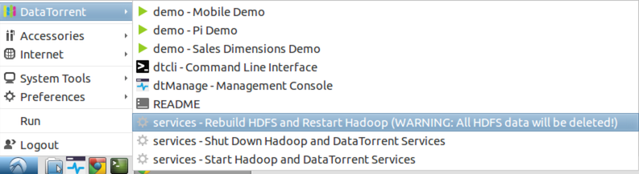

DataTorrent RTS Sandbox
================================================================================

Welcome to the DataTorrent Sandbox, an introduction to DataTorrent RTS, the industry’s only unified stream and batch processing platform.  The Sandbox provides a quick and simple way to experience DataTorrent RTS without setting up and managing a complete Hadoop cluster.  The Sandbox contains pre-installed DataTorrent RTS Enterprise Edition along with all the Hadoop services required to launch and run the included demo applications.

Installation
--------------------------------------------------------------------------------

If you have not already, sandbox can be downloaded by visiting [datatorrent.com/download](https://www.datatorrent.com/download/).  To run the DataTorrent Sandbox, ensure you have downloaded and installed [VirtualBox](https://www.virtualbox.org/) 4.3 or greater.

Accessing Console
--------------------------------------------------------------------------------

When accessing DataTorrent console in the sandbox for the first time, you will be required to log in.  Use username **dtadmin** and password **dtadmin**.  Same credentials are also valid for sandbox system access.

Inside the DataTorrent RTS Sandbox console can be accessed by opening a browser and visiting <a href="http://localhost:9090/" target="\_blank">http://localhost:9090/</a>

Running Demo Applications
--------------------------------------------------------------------------------

Once authenticated, you can continue to [Demo Applications](demos.md) section to learn how to import, launch, and run demo applications.

Service Management 
--------------------------------------------------------------------------------

The DataTorrent Sandbox automatically launches Hadoop HDFS and YARN, dtGateway, and other required services during startup.  Depending on the host machine capabilities, these may take from several seconds to several minutes to start up.  Until Hadoop services are active and ready, it is normal to see error messages about availability of HDFS and YARN in the Issues section of the DataTorrent console.  Ensure there are no errors remaining in the console by allowing sufficient time for Hadoop services startup prior to launching applications.  

> **Note**: By default, this sandbox is designed to run with 6 GB of RAM.  Limited resources may cause delays during Hadoop services and applications startup.

DataTorrent Sandbox automatically launches following services on startup.

* Hadoop HDFS NameNode
* Hadoop HDFS DataNode
* Hadoop YARN ResourceManager
* Hadoop YARN NodeManager
* DataTorrent Gateway

Following service management actions are available:

*  Start all Hadoop and DataTorrent services
*  Shut down all Hadoop and DataTorrent services
*  Rebuild HDFS (deletes all data!) and restart all services.

To manage the services following desktop launchers have been set up

* **Ubuntu Sandbox Edition** - right-click on *DataTorrent Services* desktop launcher

    

* **Lubuntu Sandbox Edition** - hover the mouse over Lubuntu launcher hidden in the bottom left corner of the sandbox screen, and navigate to DataTorrent menu

    

Support
--------------------------------------------------------------------------------

If you experience issues while experimenting with the sandbox, or have any feedback and comments, please let us know, and we will be happy to help!  Contact us using one of the methods listed on [datatorrent.com/contact](https://www.datatorrent.com/contact/) page.
