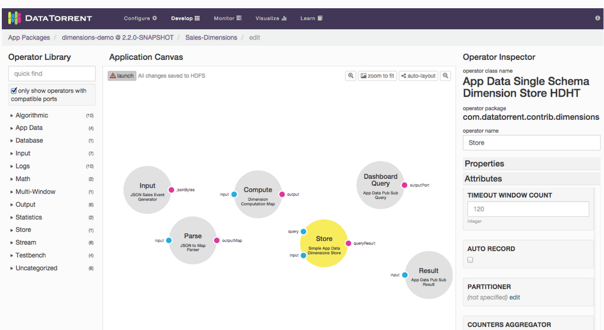
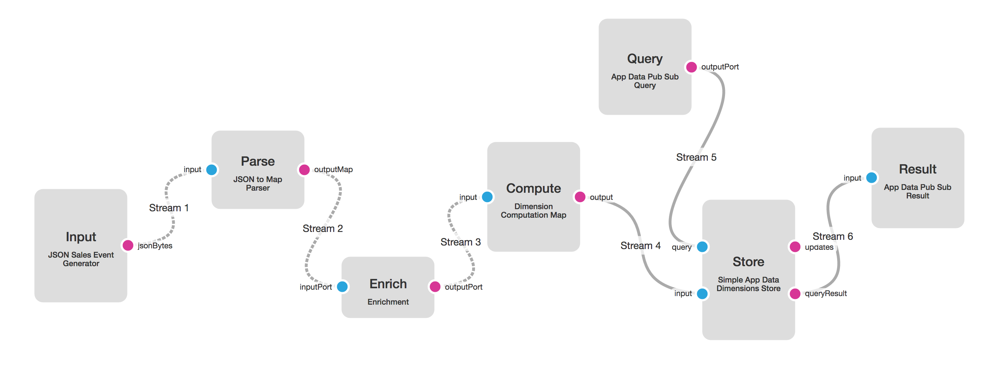
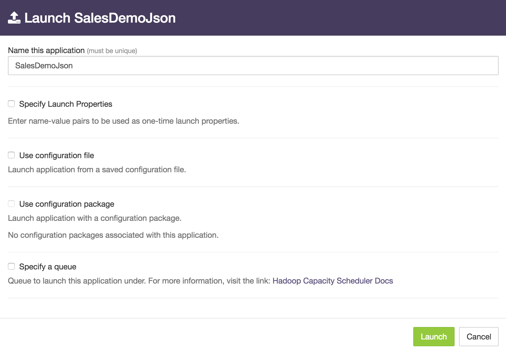

Building the Sales Dimensions application using dtAssemble
===

The DataTorrent RTS platform supports building new applications using **dtAssemble**, the Graphical
Application Builder which we will use for the Sales Dimensions application. **dtAssemble**
is an easy and intuitive tool for constructing applications,
while providing a great visualization of the logical operator connectivity and the
application data flow.

_Note_: You can also find these instructions in the UI console. Click _Learn_ in the menu
bar, and then click the first link in the left panel: _Transform, Analyze, Alert_.

Step 1: Open the Application Builder interface
---

1.  On the DataTorrent RTS console, navigate to _App Packages_.
2.  Make sure that the DataTorrent Dimensions Demos package is imported (if
    not, use the Import Demos button to import it).
3.  Click the green _Create new application_ button, and name the application
    Sales Dimensions. The Application Canvas window should open.
    

Step 2: Add and connect operators
---

1.  Under _Operator Library_ in the left panel, select the following
    operators and drag them to the Application Canvas. Rename them to
    the names given in parentheses.
    1. **JSON Sales Event Generator (Input)** – This operator generates
       synthetic sales events and emits them as JSON string bytes.
    2. **JSON to Map Parser (Parse)** – This operator transforms JSON
       data to Java maps for convenience in manipulating the sales data
       in Java code.
    3. **Enrichment (Enrich)** – This operator performs category lookup based on
       incoming product IDs, and adds the category ID to the output maps.
    4. **Dimension Computation Map (Compute)** – This operator performs dimensions
       computations, also known as cubing, on the incoming data. It
       pre-computes the sales numbers by region, product category, customer,
       and sales channel, and all combinations of the above. Having these
       numbers available in advance, allows for viewing and taking action on
       any of these combinations in real time.
    5. **Simple App Data Dimensions Store (Store)** &ndash; This operator
       stores the computed dimensional information on HDFS in an optimized manner.
    6. **App Data Pub Sub Query (Query)** &ndash; The dashboard connector for
       visualization queries.
    7. **App Data Pub Sub Result (Result)** &ndash; The dashboard connector for
       visualization data results.

2.  To connect the operators, click the output port of each upstream operator,
    and drag the connector to the input stream of the downstream operator as shown
    in the diagram below:
    

Step 3: Customize application and operator settings
---

Customize the operators and streams as described in each item below; to do that,
click the individual operator or stream and use the _Operator Inspector_ panel
on the bottom to edit the operator and stream settings as described in the item:

1.  Copy this Sales schema below into the _Event Schema JSON_ field of **Input**
    operator, and the _Configuration Schema JSON_ of the **Compute** and **Store**
    operators.

        {
          "keys": [
            {"name":"channel","type":"string","enumValues":["Mobile","Online","Store"]},
            {"name":"region","type":"string",
             "enumValues":["Atlanta","Boston","Chicago","Cleveland","Dallas","Minneapolis",
                           "New York","Philadelphia","San Francisco","St. Louis"]},
            {"name":"product","type":"string",
             "enumValues":["Laptops","Printers","Routers","Smart Phones","Tablets"]}],
          "timeBuckets":["1m", "1h", "1d"],
          "values": [
            {"name":"sales","type":"double","aggregators":["SUM"]},
            {"name":"discount","type":"double","aggregators":["SUM"]},
            {"name":"tax","type":"double","aggregators":["SUM"]}],
          "dimensions": [
            {"combination":[]},
            {"combination":["channel"]},
            {"combination":["region"]},
            {"combination":["product"]},
            {"combination":["channel","region"]},
            {"combination":["channel","product"]},
            {"combination":["region","product"]},
            {"combination":["channel","region","product"]}]
        }

2.  Set the _Topic_ property for **Query** and **Result** operators to
    `SalesDimensionsQuery` and `SalesDimensionsResult` respectively.

    _Optional_: In the _Building with Java_ section, the **App Data Pub Sub Query (PubSubWebSocketAppDataQuery)** operator was not added to the DAG. Instead, it was embedded into the **store** operator to avoid query delays which may happen when the operator is blocked upstream. You can achieve the same results in dtAssemble by filling the _Embeddable Query Info Provider_ field of the **Store** operator with the properties set in the **Query** operator, and then removing the **Query** operator.

3.  Select the **Store** operator, and edit the _File Store_ property.
    Set _Base Path_ value to `SalesDimensionsDemoStore`. This sets the HDHT
    storage path to write dimensions computation results to
    `/user/<username>/SalesDimensionsDemoStore` on HDFS.
    
4.  Click the stream, and set the Stream Locality to CONTAINER_LOCAL
    for all the streams between Input and Compute operators.

_Note_: Changing stream locality controls which container operators
get deployed to, and can lead to significant performance improvements
for an application. Once set, the connection will be represented by a
dashed line to indicate the new locality setting.

Step 4: Launch the application
---
Once the application is constructed, and validation checks are
satisfied, a launch button will become available at the top left of the
_Application Canvas_ window. Clicking this button to open the application
launch dialog box. You can use this dialog box to perform additional
configuration of the application such as changing its name or modifying
properties.

To launch the Sales Dimension application

1.  Click the launch button at the top left of the application canvas screen.
2.  Type a name for the application in the _Name this application_ box.
3.  (Optional) To configure the application using a configuration file, select
    _Use a configuration file_ checkbox.
4.  (Optional) To specify individual properties, select
    _Specify Launch Properties_ checkbox.
5.  Click Launch.

Once the application is successfully launched, you can check its
health and view some runtime statistics using the steps below.
Additional details are in the chapter entitled _Monitoring the Sales
Dimensions Application with dtManage_.

1.  Go to the Sales Dimensions application operations page under the _Monitor_ tab.
2.  Confirm that the application is launched successfully by validating that
    the state of the application under the _Application Overview_ section
    is _RUNNING_.
3.  Make sure that all the operators are successfully started under the
    _StramEvents_ widget.
4.  Navigate to the _physical_ tab, observe the Input, Parse, Enrich, or
    Compute operators, and ensure that they are deployed to a single container,
    because of the stream locality setting of CONTAINER_LOCAL.
    

_Note_: This is one of the many performance improvement techniques
available with the DataTorrent platform; in this case eliminating data
serialization and networking stack overhead between groups of adjacent
operators.
