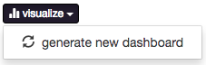
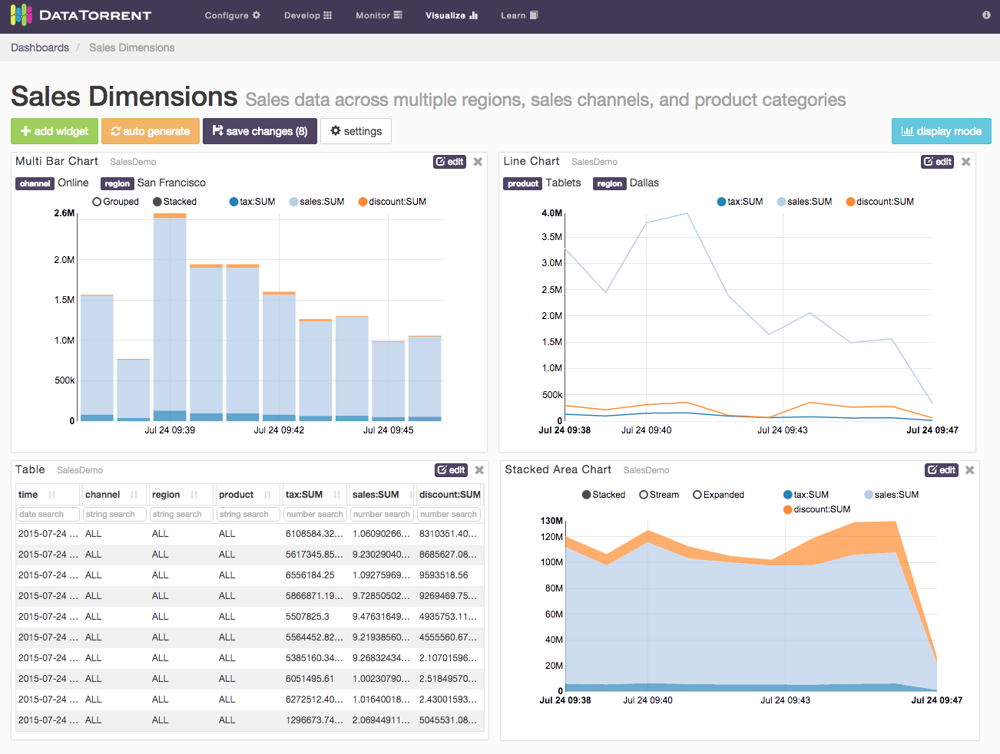
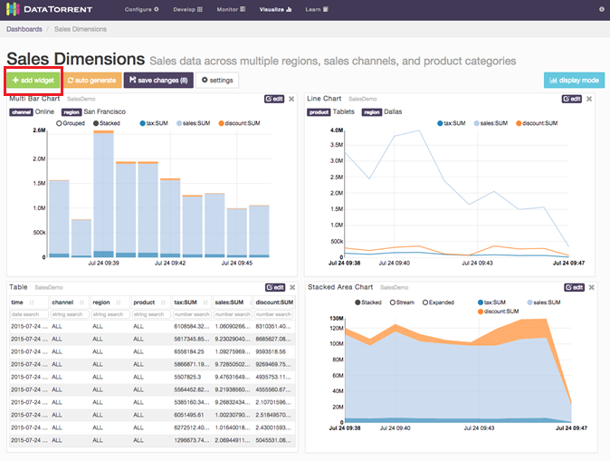
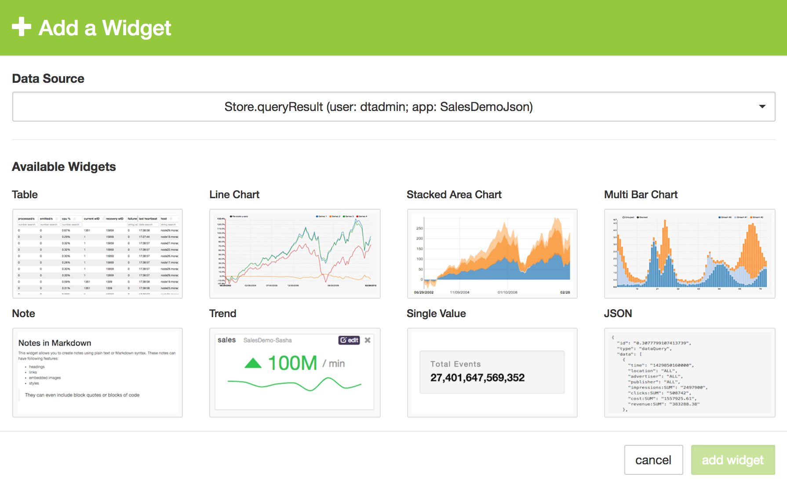
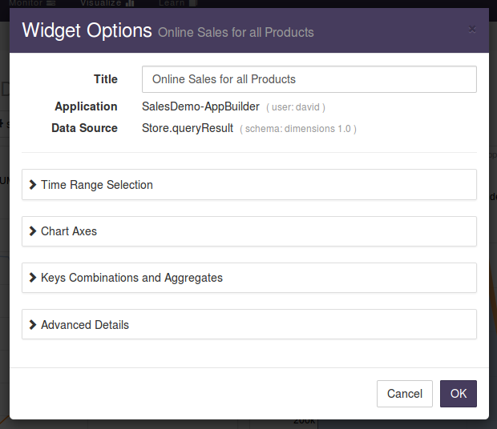

Visualizing data from the Sales Dimension application using dtDashboard
===
DataTorrent includes powerful data visualization tools, which
allow you to visualize streaming data from multiple sources in real
time. For additional details see the tutorial entitled _dtDashboard
- Application Data Visualization_ at <https://docs.datatorrent.com>.

After the application is started, a visualize button, available in
the Application Overview section, can be used to quickly generate a new
dashboard for the Sales Dimensions application.

Generate dashboards
---

If you created dashboards already, the dashboards appear in the
dropdown list. You can select one, or generate a new dashboard by
selecting the generate new dashboard option from the dropdown list.

After the dashboard is created, you can add additional widgets for
displaying dimensions and combinations of the sales data. Here is an
example:

Adding widgets
---
To derive more value out of application dashboards, you can add
widgets to the dashboards. Widgets are charts in addition to the default
charts that you can see on the dashboard. DataTorrent RTS supports five
widgets: `bar chart`, `pie chart`, `horizontal bar chart`, `table`, and
`note`.

To add a widget

1.  Click the add widget button below the name of the dashboard, for example,
    Sales Dimension.
    
2.  In the Data Source list, click a data source for your widget.
3.  Select a widget type under _Available Widgets_.
    
4.  Click _add widget_ button.

The widget is added to your dashboard.

Edit a widget
---

After you add a widget to your dashboard, you can update it at any
time. Each widget has a title that appears in gray. If you hover over
the title, the pointer changes to a hand.

To edit a widget

1.  Change the size and position of the widget:
    a. To change the size of the widget, click the
       border of the widget, and resize it.
    b. To move the widget around, click the widget, and
       drag it to the desired location.

2.  Edit the widget:
    a.  In the top-right corner of the widget, click _edit_.
    b.  Type a new title in the _Title_ box.
    c.  Use the remaining options to configure the widget.
    d.  Click _OK_.
    

3.  To remove a widget, in the top-right corner, click the _delete_ button.
