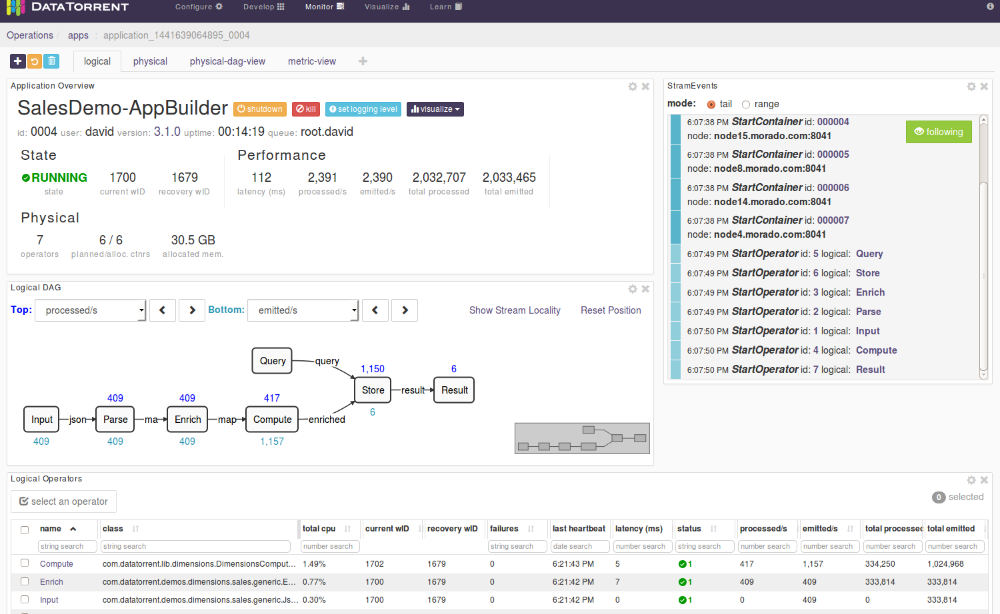
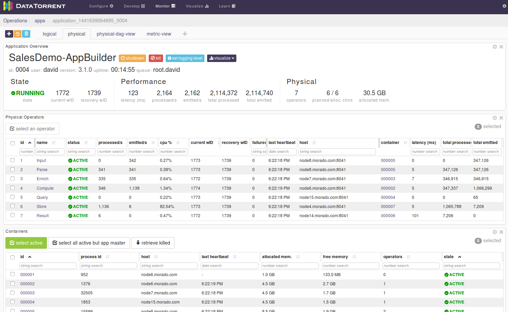
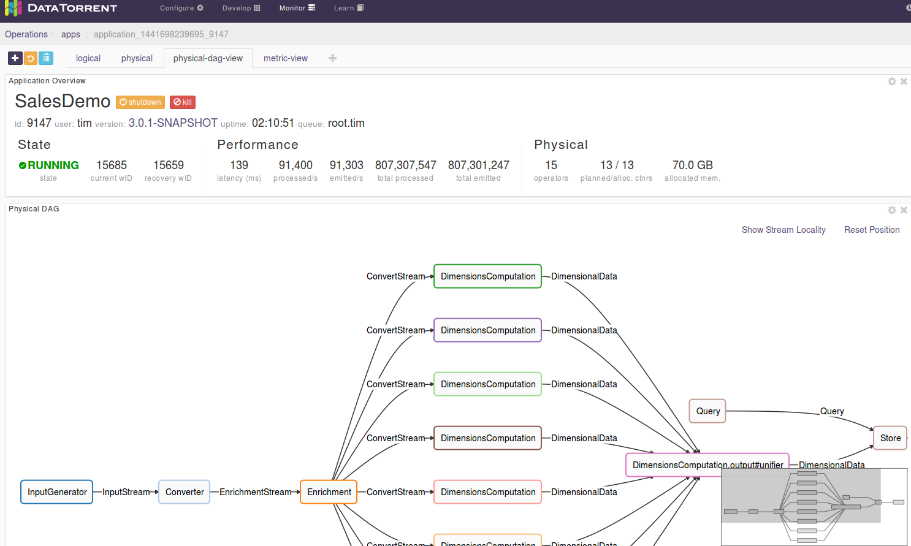
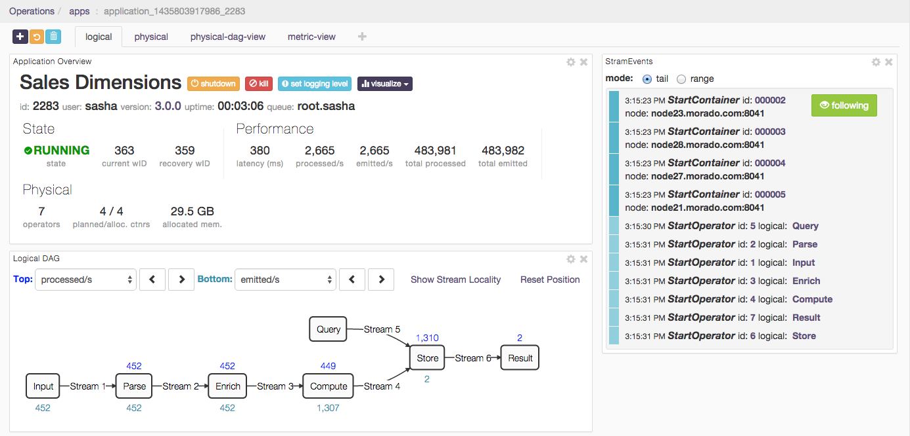
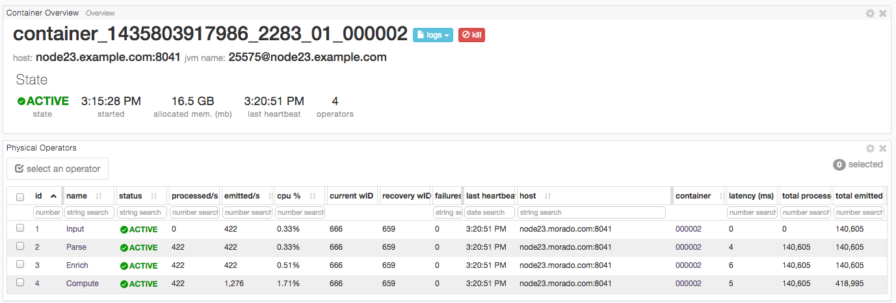

Monitoring the Sales Dimension application using dtManage
===

Recall that after the application is built and validated, it can be
launched from the _App Packages_ page as described in an earlier chapter;
applications built with **dtAssemble** can also, optionally, be launched
from the _Application Canvas_ page as described earlier. This section
describes how you can monitor the running Sales Dimension application
using **dtManage**.

The Monitor menu option
---

You can monitor the Sales Dimension application by clicking
Monitor on the menu bar. After you click _Monitor_, you can choose between
4 tabs. Under each tab, you can see multiple widgets, which you can
resize, move around, configure, or remove.

**logical**

This image of the logical tab shows 4 widgets; additional widgets can be
added by clicking the **+** button at the top-left corner and choosing
from the resulting dropdown list.

- **Application Overview**

    This widget has the shutdown and kill buttons for shutting down or
    killing an application. This widget also displays the state of the
    application, the window IDs, the number of physical operators,
    containers, allocated memory, and statistics on the number of
    events handled.

- **StramEvents**

    This widget displays all the operators, containers, and nodes that
    are running. This widget also displays additional information,
    such as errors encountered and timestamps.

- **Logical DAG**

    This widget displays operators and their
    connections in the logical dag (as defined in the application)
    without partitions, that is, if an operator is partitioned to run
    multiple copies to increase throughput, only one copy is displayed.
    The Physical DAG (the physical-dag-view) shows the actual
    physical operators. For each operator, you can choose to include
    additional statistics.

    To include additional details

    1.  Click an operator for which you want to display additional details.
    2.  To display a detail on the top of this operator representation,
        click the Top list, and select a metric.
    3.  To display a detail at the bottom of this operator representation,
        click the Bottom list, and select a metric.

- **Logical Operators**

    This widget displays a table of operators
    for: the name, the Java class, status, and additional statistics for
    latency and processed events.

- **Streams**

    This operator displays a table with one row per stream showing:
    the name, locality, source, and sinks.

- **Metrics Chart**

    This widget displays moving averages of tuples processed and latencies.

**physical**

The physical tab displays, in addition to _Application Overview_
and _Metrics Chart_, 2 more widgets:

- **Physical Operators**

    This widget displays a table of physical operators for:
    name, status, host, container ID, and some additional statistics. The
    container ID is a numeric value and a clickable link that takes you to a
    page showing additional details about that specific instance of the
    operator.

- **Containers**

    This widget displays a table of containers (the Java Virtual
    Machine processes) and for each process: the ID, the process ID,
    host, the number of hosted operators, and some additional memory
    statistics.

**physical-dag-view**

The physical-dag-view tab displays the Physical DAG widget, which
shows all the partitioned copies of operators and their
interconnections:

**metric-view**

The metric-view tab displays only the _Metrics Chart_ widget.

Monitor Sales Dimension using the Monitor menu
---
To monitor the application

1.  Click _Monitor_ on the menu bar to open the logical view of the DAG.
    
2.  Ensure that the _State_ is _Running_, indicating that the application
    is launched successfully.
3.  Under _StramEvents_, ensure that the operators from within the
    application have started.
4.  Click _physical_ tab to open the physical view.
5.  Ensure that the Input, Parse, Enrich, and
    Compute operators are deployed to a single container.
    

    Note: This is because we set the corresponding stream locality to
    `CONTAINER_LOCAL` earlier. This parameter is an example of performance
    improvement technique, which eliminates data serialization and
    networking stack overhead between a group of adjacent operators.

Create additional tabs
---

You can create custom tabs in addition to logical, physical,
physical-dag-view, and metric-view. Under each tab, you can add
widgets, and customize these widgets according to your requirements.
This enables a deeper insight into how the Sales Dimension application
works. Each tab, default or otherwise, contains the _Application
Overview_ widget.

To create additional tabs

1.  Next to the _metric-view_ tab, look for the plus sign (+) button.
2.  Click this button to create an additional tab.
3.  Provide a name for your tab.
4.  Add widgets to your tab.
