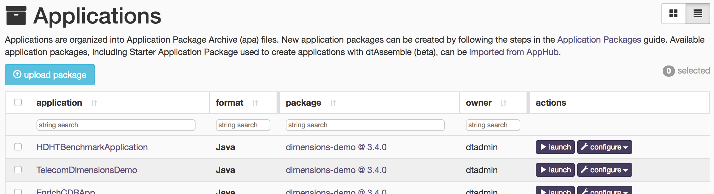
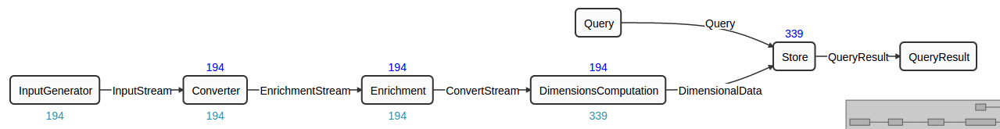

Building the Sales Dimension application in JAVA
===
The Sales Dimensions application demonstrates multiple
features of the DataTorrent RTS platform including the ability to:
- transform data
- analyze data
- act, based on analysis, in real time
- support scalable applications for high-volume, multi-dimensional computations
  with very low latency using existing library operators.

Example scenario
---
A large national retailer with physical stores and online sales
channels is trying to gain better insights to improve decision making
for their business. By utilizing real-time sales data, they would like
to detect and forecast customer demand across multiple product
categories, gauge pricing and promotional effectiveness across regions,
and drive additional customer loyalty with real time cross purchase
promotions.

In order to achieve these goals, they need to analyze large
volumes of transactions in real time by computing aggregations of sales
data across multiple dimensions, including retail channels, product
categories, and regions. This allows them to not only gain insights by
visualizing the data for any dimension, but also make decisions and take
actions on the data in real time.

The application makes use of seven operators; along with the
streams connecting their ports, these operators are discussed in the
sections that follow.

The application setup for this retailer requires:

-   Input &ndash; For receiving individual sales transactions
-   Transform &ndash; For converting incoming records into a consumable format
-   Enrich &ndash; For providing additional information for each record by
    performing additional lookups
-   Compute &ndash; For performing aggregate computations on all possible
    key field combinations
-   Store &ndash; For storing computed results for further
    analysis and visualizations
-   Analyze, Alert & Visualize &ndash; For displaying graphs
    for selected combinations, perform analysis, and take actions on
    computed data in real time.

Step I: Build the Sales Dimension application
---
This topic contains steps for creating a new maven project using
an archetype, adding the source and data files to the project, and
finally, building and deploying the Sales Dimension application. The
application sources are available online. You can use them with
appropriate modifications to save time.

To build an application

1.  Open a file in a simple text editor.
2.  Copy the following script to this file.

        #!/bin/bash
        name=salesapp
        mvn archetype:generate \
        -DarchetypeRepository=https://www.datatorrent.com/maven/content/repositories/releases \
         -DarchetypeGroupId=com.datatorrent \
         -DarchetypeArtifactId=apex-app-archetype \
         -DarchetypeVersion=3.1.1 \
         -DgroupId=com.example \
         -Dpackage=com.example.$name \
         -DartifactId=$name \
         -Dversion=1.0-SNAPSHOT

3.  Save the file as, for example, `newapp.sh`.

4.  Run the file using the `bash` command to generate a new Maven project:

    `bash` _Name of file_`.sh`

    For example, the command might look like this: `bash newapp.sh`

5.  At the prompt, press _Enter_ to create a new project under a new directory
    named `salesapp`.

6.  Delete the following generated JAVA files: `Application.java` and
    `RandomNumberGenerator.java` under `src/main/java/com/example/salesapp`
    and `ApplicationTest.java` under `src/test/java/com/example/salesapp`.

7.  Create a new directory named, say `sources`, step into it, retrieve
    the JAR file containing the source files using `wget`, and expand it:

        mkdir -p salesapp/sources; cd salesapp/sources
        repo="https://www.datatorrent.com/maven/content/repositories/releases"
        wget $repo/com/datatorrent/dimensions-demo/3.1.1/dimensions-demo-3.1.1-sources.jar"
        jar xvf dimensions-demo-3.1.1-sources.jar

8.  Copy the following files from the expanded JAR file at
    `com/datatorrent/demos/dimensions/sales/generic` to the main source directory
    of the new project at `src/main/java/com/example/salesapp`.

    <table>
    <colgroup>
    <col width="50%" />
    <col width="50%" />
    </colgroup>
    <tbody>
    <tr class="odd">
    <td align="left">
EnrichmentOperator.java
</td>
    <td align="left">
JsonSalesGenerator.java
</td>
    </tr>
    <tr class="even">
    <td align="left">
JsonToMapConverter.java
</td>
    <td align="left">
RandomWeightedMovableGenerator.java
</td>
    </tr>
    <tr class="odd">
    <td align="left">
SalesDemo.java
</td>
    <td align="left">

</td>
    </tr>
    </tbody>
    </table>

9.  Also copy these text files from the expanded jar to
    `src/main/resources` in the new project: `salesGenericDataSchema.json`,
    `salesGenericEventSchema.json`, `products.txt` . The first two files
    define the format of data for visualization queries and the last has
    data used by the enrichment operator discussed below.

10. Change the package location in each file to reflect
    its current location by changing the line

        package com.datatorrent.demos.dimensions.sales.generic;

    to

        package com.example.salesapp;

11. Add a new file called `InputGenerator.java` to the same location
    containing this block of
    code:

        package com.example.salesapp;
        import com.datatorrent.api.InputOperator;
        public interface InputGenerator<T> extends InputOperator {
            public OutputPort<T> getOutputPort();
        }

12. Remove these lines from `JsonSalesGenerator.java` (the first is
    unused, while the second is now package local):

        import com.datatorrent.demos.dimensions.ads.AdInfo;
        import com.datatorrent.demos.dimensions.InputGenerator;

13. Add these lines to the dependencies section at the end of the `pom.xml`
    file:

        <dependency>
            <groupId>com.datatorrent</groupId>
            <artifactId>dt-contrib</artifactId>
            <version>${datatorrent.version}</version>
        </dependency>
        <dependency>
            <groupId>com.datatorrent</groupId>
            <artifactId>dt-library</artifactId>
            <version>${datatorrent.version}</version>
        <dependency>

14. Build the project using the following command:

        mvn clean package -DskipTests

Assuming the build is successful, you should see the package file named
`salesApp-1.0-SNAPSHOT.jar` under the target directory. The next step
shows you how to use the **dtManage** GUI to upload the package and launch the
application from there.

Step II: Upload the Sales Dimension application package
---
To upload the Sales Dimension application package

1.  Log on to the DataTorrent Console (the default username and password are
    both `dtadmin`).
2.  On the menu bar, click _Develop_.
3.  Under _App Packages_, click on _upload a package_.
    
4.  Navigate to the location of `salesApp-1.0-SNAPSHOT.apa` and select it.
5.  Wait till the package is successfully uploaded.

Step III: Launch the Sales Dimension application
---
_Note_: Before launching the Sales Dimension application, shut down the IDE. If
your IDE is running at the time of a launch, the sandbox might hang due to
resource exhaustion.

1. Log on to the DataTorrent Console (the default username and password
   are both `dtadmin`).
2. In the menu bar, click `Develop`.
3. Under `App Packages`, locate the Sales Dimension application, and click
   _launch application_.
4. (Optional) To configure the application using a configuration file, select
   _Use a config file_. To specify individual properties, select _Specify custom properties_.
5. Click Launch.

If the launch is successful a message indicating the success of the launch
operation appears along with the application ID.

Operator base classes and interfaces
---
This section briefly discusses operators (and ports) and the relevant interfaces;
the next section discusses the specific operators used in the application.

Operators can have multiple input and output ports; they receive events on their input
ports and emit (potentially different) events on output ports. Thus, operators and ports
are at the heart of all applications. The `Operator` interface extends the `Component`
interface:

    public interface Component <CONTEXT extends Context> {
      public void setup(CONTEXT cntxt);
      public void teardown();
    }

The `Operator` interface defines `Port`, `InputPort`, and `OutputPort` as inner interfaces with
`InputPort`, and `OutputPort` extending `Port`.

    public interface Operator extends Component<Context.OperatorContext> {

      public static interface Port extends Component<Context.PortContext> {}

      public static interface InputPort<T extends Object> extends Port {
        public Sink<T> getSink();
        public void setConnected(boolean bln);
        public StreamCodec<T> getStreamCodec();
      }

      public static interface OutputPort<T extends Object> extends Port {
        public void setSink(Sink<Object> sink);
        public Unifier<T> getUnifier();
      }

      public void beginWindow(long l);
      public void endWindow();
    }

Operators typically extend the `BaseOperator` class which simply
defines empty methods for `setup`, `teardown`, `beginWindow`, and
`endWindow`. Derived classes only need to define those functions for
which they want to perform an action. For example the
`ConsoleOutputOperator` class, which is often used during testing and
debugging, does not override any of these methods.

Input operators typically receive data from some external source such
as a database, message broker, or a file system. They might also
create synthetic data internally. They then transform this data into
one or more events and write these events on one or more output ports;
they have no input ports (this might seem paradoxical at first, but is
consistent with our usage of input ports that dictates that input
ports only be used to receive data from other operators, not from an
external source).

Input ports must implement the `InputOperator` interface.

    public interface InputOperator extends Operator {
      public void emitTuples();
    }

The `emitTuples` method will typically output one or more events on
some or all of the output ports defined in the operator. For example,
the simple application generated by the maven archetype command
discussed earlier has an operator named `RandomNumberGenerator`,
which is defined like this:

    public class RandomNumberGenerator extends BaseOperator implements InputOperator {

      public final transient DefaultOutputPort<Double> out = new DefaultOutputPort<Double>();

      public void emitTuples()  {
        if (count++ < 100) {
          out.emit(Math.random());
        }
      }
    }

Finally, the `DefaultInputPort` and `DefaultOutputPort` classes are
very useful as base classes that can be extended when defining ports
in operators.

    public abstract class DefaultInputPort<T> implements InputPort<T>, Sink<T> {
      private int count;

      public Sink<T> getSink(){ return this; }

      public void put(T tuple){
        count++;
        process(tuple);
      }

      public int getCount(boolean reset) {
        try {
          return count;
        } finally {
          if (reset) {
            count = 0;
          }
        }
      }

      public abstract void process(T tuple);
    }

    public class DefaultOutputPort<T> implements Operator.OutputPort<T> {
      private transient Sink<Object> sink;

      final public void setSink(Sink<Object> s) {
        this.sink = s == null? Sink.BLACKHOLE: s;
      }

      public void emit(T tuple){
        sink.put(tuple);
      }
    }

The `DefaultInputPort` class automatically keeps track of the number
of events emitted and also supports the notion of a sink if needed in
special circumstances. The abstract `process` method needs to be
implemented by any concrete derived class; it will be invoked via the
`Sink.put` override.

The `DefaultOutputPort` class also supports a sink and forwards calls
to `emit` to the sink. The `setSink` method is called by the **StrAM**
execution engine to inject a suitable sink at deployment time.

Output operators are the opposite of input operators; they typically
receive data on one or more input ports from other operators and write
them to external sinks. They have no output ports. There is, however,
no specific interface to implement or base class to extend for output
operators, though they often end up extending `BaseOperator` for
convenience. For example, the `ConsoleOutputOperator` mentioned earlier
is defined like this:

    public class ConsoleOutputOperator extends BaseOperator {
      public final transient DefaultInputPort<Object> input = new DefaultInputPort<Object>() {
        public void process(Object t) {
          System.out.println(s); }
        };
    }

Notice that the implementation of the abstract method
`DefaultInputPort.process` simply writes the argument object to the
console (we have simplified the code in that function somewhat for the
purposes of this discussion; the actual code also allows the message
to be logged and also allows some control over the output format).

Operators in the Sales Dimensions application
---

The application simulates an incoming stream of sales events by
generating a synthetic stream of such events; these events are then
converted to Java objects, enriched by mapping numeric identifiers to
meaningful product names or categories. Aggregated data is then
computed and stored for all possible combinations of dimensions such
as channels, regions, product categories and customers. Finally, query
support is added to enable visualization. Accordingly, a number of
operators come into play and they are listed below. Within an
application, an operator can be instantiated multiple times; in order
to distinguish these instances, an application-specific name is
associated with each instance (provided as the first argument of the
`dag.addoperator` call). To facilitate easy cross-referencing with the
code, we use the actual Java class names in the list below along with
the instance name in parentheses.

This diagram represents the Sales Dimension DAG. The
ports on these operators are connected via streams.

**JsonSalesGenerator (InputGenerator)**

This class (new operator) is an input operator that generates a single
sales event defined by a class like this:

    class SalesEvent {
      /* dimension keys */
      public long time;
      public int productId;
      public String customer;
      public String channel;
      public String region;
      /* metrics */
      public double sales;
      public double discount;
      public double tax;
    }

**JsonToMapConverter (Converter)**

This operator uses some special utility classes (ObjectReader and
ObjectMapper) to transform JSON event data to Java maps for easy
manipulation in Java code; it is fairly simple:

    public class JsonToMapConverter extends BaseOperator {

    ...

      public final transient DefaultInputPort<byte\[\]> input = new DefaultInputPort<byte[]>() {
        public void process(byte\[\] message) {
          Map<String, Object> tuple = reader.readValue(message);
          outputMap.emit(tuple);
        }
      }

      public final transient DefaultOutputPort<Map<String, Object>> outputMap
         = new DefaultOutputPort<Map<String, Object>>();

    }

**EnrichmentOperator (Enrichment)**

This operator performs category lookup based on incoming numeric
product IDs and adds the corresponding category names to the output
events. The mapping is read from the text file `products.txt` that
we encountered earlier while building the application. It contains
data like this:

    {"productId":96,"product":"Printers"}
    {"productId":97,"product":"Routers"}
    {"productId":98,"product":"Smart Phones"}

The core functionality of this operator is in the `process` function of
the input port where it looks up the product identifier in the
enrichment mapping and adds the result to the event before emitting it
to the output port. The mapping file can be modified at runtime to add
or remove productId to category mapping pairs, so there is also some
code to check the modification timestamp and re-read the file if necessary.

    public class EnrichmentOperator extends BaseOperator {
      ...
      public transient DefaultOutputPort<Map<String, Object>>
        outputPort = new DefaultOutputPort<Map<String, Object>>();

      public transient DefaultInputPort<Map<String, Object>>
        inputPort = new DefaultInputPort<Map<String, Object>>() {

        public void process(Map<String, Object> tuple) {
          ...
        }
      }
    }

**DimensionsComputationFlexibleSingleSchemaMap (DimensionsComputation)**

This operator performs dimension computations on incoming data. Sales
numbers by all combinations of region, product category, customer, and
sales channel should be computed and emitted.

**AppDataSingleDimensionStoreHDHT (Store)**

This operator stores computed dimensional information on HDFS,
optimized for fast retrieval so that it can respond to queries.

**PubSubWebSocketAppDataQuery (Query)**

This is the dashboard connector for visualization queries.
This operator and the next are used respectively to send queries and
retrieve results from the Data Torrent Gateway which can act like a
message broker for limited amounts of data using a topic-based
publish/subscribe model. The URL to connect to is typically something
like `ws://`_gateway-host_:_port_`/pubsub` where
_gateway-host_ and _port_ should be replaced by appropriate values.

A publisher sends a JSON message that looks like this to the URL
where the value of the `data` key is the desired message content:

    {"type":"publish", "topic":"foobar", "data": ...}

Correspondingly, subscribers send messages like this
to retrieve published message data:

    {"type":"subscribe", "topic":"foobar"}

Topic names need not be pre-registered anywhere but obviously, the
same topic name (e.g. _foobar_ in the example above) must be used by both
publisher and subscriber; additionally, if there are no subscribers when
a message is published, it is simply discarded.

This query operator is an input operator used to send queries from
the dashboard to the store via the gateway:

    public class PubSubWebSocketAppDataQuery extends PubSubWebSocketInputOperator<String>
    implements AppData.ConnectionInfoProvider {
      ...
      protected String convertMessage(String message) {
        JSONObject jo = new JSONObject(message);
        return jo.getString("data");
      }
    }

The important method here is `convertMessage` to convert the input
string to a JSON object, get the value of the `data` key from the object
and return it. The base classes look like this:

    public class PubSubWebSocketInputOperator<T> extends WebSocketInputOperator<T> {
      ...
    }

This class simply converts a JSON event into Java maps via the
`convertMessage` method.

    public class WebSocketInputOperator<T> extends
    SimpleSinglePortInputOperator<T> implements Runnable {
      ...
    }

This code is intended to be run in an asynchronous thread to retrieve
events from an external source and emit them on the output port.

    public abstract class SimpleSinglePortInputOperator<T> extends BaseOperator
    implements InputOperator, Operator.ActivationListener<OperatorContext> {

      final public transient BufferingOutputPort<T> outputPort;

      final public void activate(OperatorContext ctx) {
      }

      public void emitTuples() {
        outputPort.flush(Integer.MAX_VALUE);
      }

      public static class BufferingOutputPort<T> extends DefaultOutputPort<T> {
        public void flush(int count) { ... }
      }

    }

The class starts a separate thread which retrieves source events and
invokes the `emit` method of the output port; the output port buffers
events until the `flush` method is called at which point all buffered
events are emitted.

**PubSubWebSocketAppDataResult (QueryResult)**

This is the dashboard connector for results of visualization queries
and is the result counterpart of the previous input query operator:

    public class PubSubWebSocketAppDataResult extends PubSubWebSocketOutputOperator<String>
    implements AppData.ConnectionInfoProvider {
      ...
    }

This class merely overrides the generic `convertMapToMessage` method of the
base class to generate the required JSON publish message.

    public class PubSubWebSocketOutputOperator<T> extends WebSocketOutputOperator<T> {
      ...
    }

This class, similarly, doesn't do much &ndash; the `convertMapToMessage`
method converts input data into a suitable JSON object for publishing to the
registered topic.

    public class WebSocketOutputOperator<T> extends BaseOperator {
      public final transient DefaultInputPort<T> input = new DefaultInputPort<T>() {
        public void process(T t) {
          ...

          connection.sendTextMessage(convertMapToMessage(t));
        }
      }
    }

The key element in this class is the input port (the rest of the code
deals with establishing a connection and reconnecting if
necessary). As usual, the key method in the input port is `process`
which converts the incoming event to a JSON message and sends it
across the connection.

Connecting the operators
---

Now that we've seen the operator details, we will look at how they are
connected in the application. An application must implement the
`StreamingApplication` interface:

    public class SalesDemo implements StreamingApplication {
      ...
      public void populateDAG(DAG dag, Configuration conf) {
        JsonSalesGenerator input
          = dag.addOperator("InputGenerator", JsonSalesGenerator.class);
        JsonToMapConverter converter
          = dag.addOperator("Converter", JsonToMapConverter.class);
        EnrichmentOperator enrichmentOperator
          = dag.addOperator("Enrichment", EnrichmentOperator.class);
        DimensionsComputationFlexibleSingleSchemaMap dimensions
          = dag.addOperator("DimensionsComputation", DimensionsComputationFlexibleSingleSchemaMap.class);
        AppDataSingleSchemaDimensionStoreHDHT store
          = dag.addOperator("Store", AppDataSingleSchemaDimensionStoreHDHT.class);

        Operator.OutputPort<String> queryPort;
        Operator.InputPort<String> queryResultPort;

        URI uri = URI.create("ws://" + gatewayAddress + "/pubsub");

        PubSubWebSocketAppDataQuery wsIn = new
        PubSubWebSocketAppDataQuery();
        wsIn.setUri(uri);
        queryPort = wsIn.outputPort;
        dag.addOperator("Query", wsIn);
        dag.addStream("Query", queryPort, store.query).setLocality(Locality.CONTAINER_LOCAL);
        PubSubWebSocketAppDataResult wsOut
          = dag.addOperator("QueryResult", new PubSubWebSocketAppDataResult());
        wsOut.setUri(uri);

        queryResultPort = wsOut.input;
        dag.addStream("InputStream", inputGenerator.getOutputPort(), converter.input);
        dag.addStream("EnrichmentStream", converter.outputMap, enrichmentOperator.inputPort);
        dag.addStream("ConvertStream", enrichmentOperator.outputPort, dimensions.input);
        dag.addStream("DimensionalData", dimensions.output, store.input);
        dag.addStream("QueryResult", store.queryResult, queryResultPort).setLocality(Locality.CONTAINER_LOCAL);
      }
    }

The key method to implement in an application is `populateDAG`; as shown
above, the first step is to create instances of all seven operators and
add them to the DAG (we have omitted some parts of the code that are
related to advanced features or are not directly relevant to the
current discussion). Once the operators are added to the DAG, their
ports must be connected (as shown in the earlier diagram) using
streams. Recall that a stream is represented by the `DAG.StreamMeta`
interface and is created via `DAG.addStream()`. The first argument is
the name of the stream, the second is the output port and the third
the input port. These statements form the second part of the
`populateDAG` function.

These two simple steps (a) adding operators to the DAG; and (b)
connecting their ports with streams are all it takes to build most
applications. Of course, additional steps may be needed to configure
suitable properties to achieve the desired performance levels but those
are often easier.
