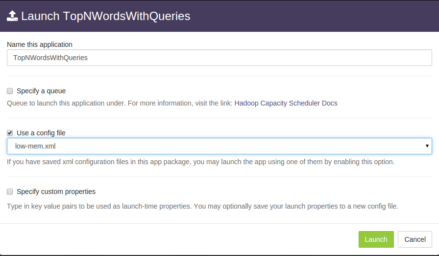
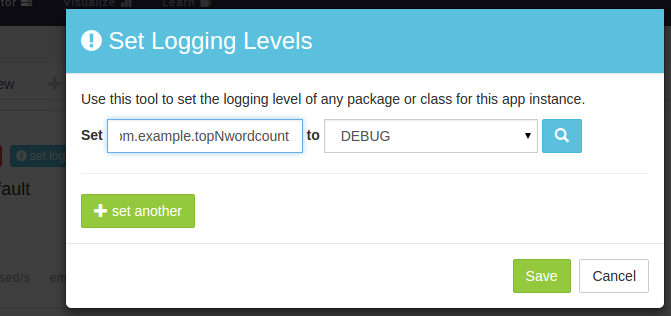
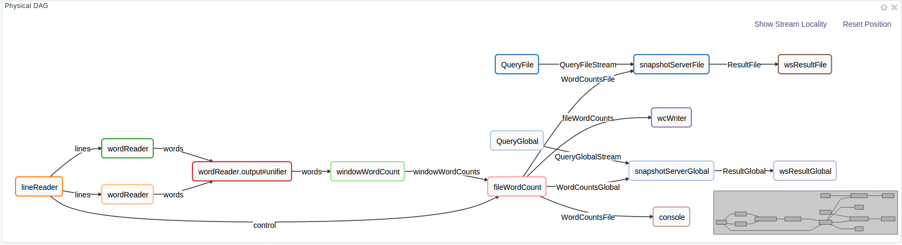
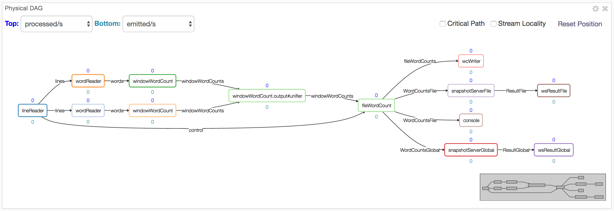

Top N Words (Advanced)
===

This section touches on some advanced features of the RTS platform in the context of the
_Top N Words_ application. Accordingly, readers are expected to be familiar with the material
of the preceding sections.

<!--
Each top-level section below should be self-contained so that we can move them out to individual
files later if need be.
-->

The first topic we'd like to discuss is partitioning of operators to increase performance.
However, partitioning increases the memory footprint of the application, so it is important
to know how to allocate available memory to containers especially in a limited environment
like a sandbox. So we begin with a brief discussion of that topic.

## Managing Memory Allocation for Containers

In this chapter we describe how to monitor and manage the amount of memory allocated to the
containers comprising the application. This is useful in an environment where the needs of
the application begins to equal or exceed the memory resources of the cluster.

Recall the following facts from the earlier sections:

  - A container (JVM process) can host multiple operators.
  - The memory requirements for an operator can be specified via a properties file.

For reference, here is the application DAG:

If we look at the information displayed in the physical tab of `dtManage` for the memory
allocated to each container, we see something like this (the actual container id will most
likely be different each time the application is relaunched but the rest of the information
should be the same):

<table>
<colgroup>
<col width="30%" />
<col width="30%" />
<col width="40%" />
</colgroup>
<tbody>
<tr class="odd">
<td align="left">
<b>Container Id</b>
</td>
<td align="left">
<b>Allocated Memory</b>
</td>
<td align="left">
<b>Hosted Operators</b>
</td>
</tr>
<tr class="odd">
<td align="left">
<tt>1</tt>
</td>
<td align="left">
1 GB
</td>
<td align="left">
None (AppMaster)
</td>
</tr>
<tr class="even">
<td align="left">
<tt>2</tt>
</td>
<td align="left">
768 MB
</td>
<td align="left">
snapshotServerGlobal, QueryGlobal
</td>
</tr>
<tr class="odd">
<td align="left">
<tt>3</tt>
</td>
<td align="left">
768 MB
</td>
<td align="left">
snapshotServerFile, QueryFile
</td>
</tr>
<tr class="even">
<td align="left">
<tt>4</tt>
</td>
<td align="left">
128 MB
</td>
<td align="left">
wsResultGlobal
</td>
</tr>
<tr class="odd">
<td align="left">
<tt>5</tt>
</td>
<td align="left">
640 MB
</td>
<td align="left">
windowWordCount
</td>
</tr>
<tr class="even">
<td align="left">
<tt>6</tt>
</td>
<td align="left">
128 MB
</td>
<td align="left">
Console
</td>
</tr>
<tr class="odd">
<td align="left">
<tt>7</tt>
</td>
<td align="left">
128 MB
</td>
<td align="left">
wsResultFile
</td>
</tr>
<tr class="even">
<td align="left">
<tt>8</tt>
</td>
<td align="left">
640 MB
</td>
<td align="left">
wordReader
</td>
</tr>
<tr class="odd">
<td align="left">
<tt>9</tt>
</td>
<td align="left">
128 MB
</td>
<td align="left">
wcWriter
</td>
</tr>
<tr class="even">
<td align="left">
<tt>10</tt>
</td>
<td align="left">
1.4 GB
</td>
<td align="left">
lineReader
</td>
</tr>
<tr class="odd">
<td align="left">
<tt>11</tt>
</td>
<td align="left">
1.9 GB
</td>
<td align="left">
fileWordCount
</td>
</tr>
</tbody>
</table>

If we now look closely at column 2 (Allocated Memory) we notice some
unexpected values, for example, the value for the App Master container should have
been 300 MB since we had 300 as the value in the `properties.xml` file for
`dt.attr.MASTER_MEMORY_MB`. The discrepancy is due to the fact that the file
`.dt/dt-site.xml` in the home directory of user `dtadmin` has a value of 1024 for
this key which overrides the application specified value.

Looking now at container 2, we notice that it hosts 2 operators: `snapshotServerGlobal`
and `QueryGlobal` and each has a value of 128 MB specified in the application properties
file; so why is the value 768 MB ? Turns out that each output port of an operator
_connected to another operator outside the container_
also has an associated _buffer-server_ which buffers tuples exiting the output port
to provide fault-tolerance. The buffer server is discussed in detail in
[Application Development](https://docs.datatorrent.com/application_development.md).
The space allocated to the buffer server is governed by properties of the form:

    dt.application.app-name.operator.op-name.port.port-name.attr.BUFFER_MEMORY_MB

where _app-name_, _op-name_ and _port-name_ can be replaced by the appropriate
application, operator and port name respectively or by a wildcard (`*`). The
default value is 512 MB. Of the two operators, only one (`snapshotServerGlobal`)
has an output port connected externally so there
is only one buffer-server involved which then explains the value of
768 (= 512 + 128 + 128).

The values for `wsResultGlobal`, `Console`, `wsResultFile`, `wcWriter` are, as
expected, 128 MB &ndash; since no output ports are involved, there is no buffer-server.
The values for `windowWordCount` and `wordReader` are also the expected values
since a single buffer-server is involved: 640 = 512 + 128. The value of 1.9 GB
for `fileWordCount` is obtained as follows: it has 3 buffer-servers since there
are 3 output ports connected externally; our properties file setting requests
300 MB for this operator which gives us a total of 3 * 512 + 300 = 1836 MB which
approximates the value shown. The value for `lineReader` can be computed
similarly.

The total amount of allocated space shown on the GUI is 6.5 GB. We can substantially
reduce the memory footprint further by make a couple changes to attributes:
Create a new file named, say, `low-mem.xml` at `src/site/conf/` with this content:

    <configuration>
      <property>
        <name>dt.attr.MASTER_MEMORY_MB</name>
        <value>512</value>
      </property> <property>
        <name>dt.application.TopNWordsWithQueries.operator.*.port.*.attr.BUFFER_MEMORY_MB</name>
        <value>128</value>
      </property>
    </configuration>

We will use this file at launch time.

The BUFFER_MEMORY_MB attribute changes the memory allocation per buffer server
to 128 MB (from the default of 512 MB).

The MASTER_MEMORY_MB attribute change sets the memory allocated to the Application Master
to 512 MB and is required for a rather obscure
reason: The existing value of 300 MB in `META-INF/properties.xml`
is actually overridden by the setting of 1024 MB for this parameter in
`~dtadmin/.dt/dt-site.xml`; however, if we use a launch-time configuration file,
values in it override those in `dt-site.xml`. A value of 300 is too
small even for simple applications; in normal use and we rarely see a case, even in production,
where a value larger than 1024 MB is needed, though it is possible if the number of
operators is large. If the App Master runs out of memory,
you'll see messages like this in the corresponding log file (see _Debugging_
section below):

    java.lang.OutOfMemoryError: GC overhead limit exceeded.

Rebuild the application, upload the package and use this file at launch time:

The allocated memory shown in the "Application Overview" panel should now drop
to around 3.1GB.

## Debugging

On the sandbox, various log files generated by YARN and Hadoop are located at
`/sfw/hadoop/shared/logs`; the `nodemanager` directory has application specific
directories with names like this: `application_1448033276100_0001` within
which there are container specific directories with names like
`container_1448033276100_0001_01_000001`. The App Master container has the `000001`
suffix and the corresponding directory will have these files:

    AppMaster.stderr  AppMaster.stdout  dt.log

The remaining container directories will have files:

    dt.log  stderr  stdout

When problems occur, all these log files should be carefully examined. For example, the
`dt.log` file contains the entire classpath used to launch each container; if an error
occurs because a particular class is not found, you can check the classpath to ensure
that the appropriate jar file is included. It also shows the command line used to
launch each container with lines like this:

2015-12-20 14:31:43,896 INFO com.datatorrent.stram.LaunchContainerRunnable: Launching on node: localhost:8052 command: $JAVA_HOME/bin/java  -Xmx234881024  -Ddt.attr.APPLICATION_PATH=hdfs://localhost:9000/user/dtadmin/datatorrent/apps/application_1450648156272_0001 -Djava.io.tmpdir=$PWD/tmp -Ddt.cid=container_1450648156272_0001_01_000002 -Dhadoop.root.logger=INFO,RFA -Dhadoop.log.dir=<LOG_DIR> com.datatorrent.stram.engine.StreamingContainer 1><LOG_DIR>/stdout 2><LOG_DIR>/stderr

You can provide your own `log4j` configuration file called, say, `log4j.properties` and place
it in the directory `src/main/resources` as described in the
[configuration](http://docs.datatorrent.com/configuration/#custom-log4j-properties-for-application-packages)
page. Alternatively, if you want to change the log level of a particular class or package
from, say `INFO` to `DEBUG` while the application is running, you can click on the blue
`set logging level` button in the `Application Overview` panel of `dtManage`. It will then
display a dialog window where you can enter the name of the class or package and the desired
log level:

Normally, the GUI can be used to navigate to the appropriate container page
and log files examined from the `logs` dropdown but sometimes using the commandline
from a terminal window may be easier.

## Partitioning
Partitioning is a mechanism to eliminate bottlenecks in your application and increase
throughput. If an operator is performing a resource intensive operation, it risks
becoming a bottleneck as the rate of incoming tuples increases. One way to cope
is to replicate the operator as many times as necessary so that the load is
evenly distributed across the replicas, thus eliminating the bottleneck. Of course,
this technique assumes that your cluster has adequate resources (CPU, memory and
network bandwidth) to support all the replicas.

Without partitioning, the DAG shown in the `logical` and `physical-dag-view` tabs
will be the same.
However, once partitioning is triggered, the latter will show multiple copies of the
partitioned operator, as well as a new operator immediately
downstream of all the copies, called a _unifier_. The job of the unifier is to join the
results emitted by all the copies, collate them in some application-specific way and
emit the result just as it would have been emitted if no partitioning were involved.
The unifier can either be one that is custom-written for the needs of the application
or a pass-through platform-generated one.

For our word counting example, we illustrate the technique by partitioning the `wordReader`
operator into 2 copies. For operators that do not maintain state, partitioning does
not require additional code: We can simply set a couple of properties -- one to use
the **StatelessPartitioner** which is part of Malhar and one to specify the number
of desired partitions. To do this, copy over the `low-mem.xml` configuration file
we created above
to a new file named `simple-partition.xml` in the same directory and add this stanza to it:

    <property>
      <name>dt.application.TopNWordsWithQueries.operator.wordReader.attr.PARTITIONER</name>
      <value>com.datatorrent.common.partitioner.StatelessPartitioner:2</value>
    </property>

When you build, upload and run the application using this configuration file, the
physical-dag-view tab should show the following DAG:

Notice the two copies of `wordReader` and the generated unifier. The `physical` tab will
also show the containers for these additional operators and their characteristics as well.

A slight variation of the above theme occurs often in practice: We would like an entire
linear sequence of operators (i.e. a fragment of the DAG) replicated in the same way.
In our case, the sequence consists of two operators: `wordReader` and the next operator
`windowWordCount`. To accomplish this, again no additional code is required: We can simply
add this stanza to our properties file:

    <property>
      <name>dt.application.TopNWordsWithQueries.operator.windowWordCount.inputport.input.attr.PARTITION_PARALLEL</name>
      <value>true</value>
    </property>

It enables the PARTITION_PARALLEL attribute on the _input port_ of the downstream operator,
thus indicating to the platform that the downstream operator must be partitioned into just
as many copies as the upstream operator so that they form parallel pipelines. Running the
application with this configuration file shows the following physical DAG:

Notice that both operators have been replicated and the unifier added; we now have 15
operators with a total of 4.8GB allocated to them.

## Streaming Windows and Application Windows

Operators receive incoming tuples and emit outgoing tuples within a small temporal window
called a _streaming window_. Its boundaries are marked by calls to `beginWindow` and
`endWindow` within which the platform repeatedly invokes either `emitTuples` (for input
adapters) or `process` on each input port for output adapters and generic operators.
These concepts are discussed in greater detail in the
[OperatorGuide](http://docs.datatorrent.com/operator_development/).

For flexibility in operator and application development, the platform allows users to
change the size of the streaming window which is defined as a number of milliseconds.
It defaults to 500ms but can be changed by setting the
value of an attribute named STREAMING_WINDOW_SIZE_MILLIS; for example, you can set it
to 5s with:

    <property>
      <name>dt.attr.STREAMING_WINDOW_SIZE_MILLIS</name>
      <value>5000</value>
    </property>

This is not a very common change but one reason for doing it might be if the stream is
very sparse, i.e. the number of incoming tuples in a 500ms window is very small; by
increasing the streaming window size, we can substantially reduce the platform bookkeeping
overhead such as checkpointing.

A second attribute is APPLICATION_WINDOW_COUNT; this is a per-operator attribute and is
a count of streaming windows that comprise a single application window. It
can be changed with an entry like this (where, as before, _app-name_ and _op-name_ should be
replaced by either wildcards or names of a specific application and/or operator):

    <property>
      <name>dt.application.app-name.operator.op-name.attr.APPLICATION_WINDOW_COUNT</name>
      <value>5</value>
    </property>

By default this value is set to 1 meaning each application window consists of a single
streaming window. The the `beginWindow` and `endWindow` are invoked once per application
window. A typical reason for increasing this value is when you have an
operator that is computing aggregates (such as sum, average, maximum, minimum) of one or
more fields of the incoming tuples: A larger application window may yield more
meaningful aggregates.
